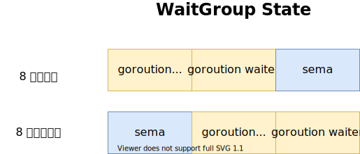

# 案例
`WaitGroup`用来解决一个主goroutine等待多个goroutine同时退出的场景，比如：后端worker启动多个消费者干活、爬虫并发爬取数据、多线程下载等。

```go
package main

import (
	"fmt"
	"sync"
)

func worker(i int) {
	fmt.Println("worker: ", i)
}

func main() {
	var wg sync.WaitGroup
	for i := 0; i < 10; i++ {
		wg.Add(1)
		go func(i int) {
			defer wg.Done()
			worker(i)
		}(i)
	}
	wg.Wait()
}
```

# 源码分析

```go
type WaitGroup struct {
	noCopy noCopy

	// 64-bit value: high 32 bits are counter, low 32 bits are waiter count.
	// 64-bit atomic operations require 64-bit alignment, but 32-bit
	// compilers do not ensure it. So we allocate 12 bytes and then use
	// the aligned 8 bytes in them as state, and the other 4 as storage
	// for the sema.
	state1 [3]uint32
}
```

`WaitGroup`由`noCopy`和`state1`两个字段组成，其中`noCopy`是用来防止复制的。

```go
type noCopy struct{}

// Lock is a no-op used by -copylocks checker from `go vet`.
func (*noCopy) Lock()   {}
func (*noCopy) Unlock() {}
```

## noCopy
由于`WaitGroup`嵌入了`noCopy`，所以在执行`go vet`时，如果检查到`WaitGroup`被复制了就会报错。所以我们的代码在push或ci/cd阶段都需要先进行lint检查，避免出现类似的错误。*注：直接go run是不会出现类似的错误*。

```shell
~/project/waitgroup/02 main*
❯ go run ./main.go

~/project/waitgroup/02 main*
❯ go vet .
# github.com/waitgroup/02
./main.go:7:9: assignment copies lock value to wg2: sync.WaitGroup contains sync.noCopy
```

## state1
state1是一个十二字节的数据，由两大块构成，counter占用8字节用于计数，sema占用4字节用于做信号量。

>64-bit value: high 32 bits are counter, low 32 bits are waiter count.
>
64-bit atomic operations require 64-bit alignment, but 32-bit compilers do not ensure it. So we allocate 12 bytes and then use the aligned 8 bytes in them as state, and the other 4 as storage for the sema.

在做64位的原子操作时，必须要保证64位（8字节）对齐，如果没有对齐的就会有问题，但是32位的编译器并不能保证64位对齐。所以这里用一个12字节的state1 字段来存储这两个状态，然后根据是否8字节对齐选择不同的保存方式。



为什么要这么设计呢？
- 如果在64位的机器上，肯定是8字节对齐了，所以是上面的第一种方式。
- 如果在32位的机器上
  - 如果恰好8字节对齐了，那么也是第一种方式取前面的8字节数据。
  - 如果没有对齐，但是32位4字节是对齐的，则我们需要后移四个字节，那么8字节就对齐了，也就是第二种方式。

所以通过`sema`信号量这四个字节的位置不同，保证了counter这个字段无论在32位还是在64位机器上都是8字节对齐的，后续做64位原子操作的时候就没问题了。这个实现是在`state`方法中实现的：
```go
func (wg *WaitGroup) state() (statep *uint64, semap *uint32) {
	if uintptr(unsafe.Pointer(&wg.state1))%8 == 0 {
		return (*uint64)(unsafe.Pointer(&wg.state1)), &wg.state1[2]
	} else {
		return (*uint64)(unsafe.Pointer(&wg.state1[1])), &wg.state1[0]
	}
}
```
`state`方法返回counter和信号量，通过`uintptr(unsafe.Pointer(&wg.state1))%8 == 0`来判断是否8字节对齐。

# Add

```go
func (wg *WaitGroup) Add(delta int) {
    // 先从 state 当中把数据和信号量取出来
	statep, semap := wg.state()

    // 在 waiter 上加上 delta 值
	state := atomic.AddUint64(statep, uint64(delta)<<32)
    // 取出当前的 counter
	v := int32(state >> 32)
    // 取出当前的 waiter，正在等待 goroutine 数量
	w := uint32(state)

    // counter 不能为负数
	if v < 0 {
		panic("sync: negative WaitGroup counter")
	}

    // 这里属于防御性编程
    // w != 0 说明现在已经有 goroutine 在等待中，说明已经调用了 Wait() 方法
    // 这时候 delta > 0 && v == int32(delta) 说明在调用了 Wait() 方法之后又想加入新的等待者
    // 这种操作是不允许的
	if w != 0 && delta > 0 && v == int32(delta) {
		panic("sync: WaitGroup misuse: Add called concurrently with Wait")
	}
    // 如果当前没有人在等待就直接返回，并且 counter > 0
	if v > 0 || w == 0 {
		return
	}

    // 这里也是防御 主要避免并发调用 add 和 wait
	if *statep != state {
		panic("sync: WaitGroup misuse: Add called concurrently with Wait")
	}

	// 唤醒所有 waiter，看到这里就回答了上面的问题了
	*statep = 0
	for ; w != 0; w-- {
		runtime_Semrelease(semap, false, 0)
	}
}
```

# Wait
```go
func (wg *WaitGroup) Wait() {
	// 先从 state 当中把数据和信号量的地址取出来
    statep, semap := wg.state()

	for {
     	// 这里去除 counter 和 waiter 的数据
		state := atomic.LoadUint64(statep)
		v := int32(state >> 32)
		w := uint32(state)

        // counter = 0 说明没有在等的，直接返回就行
        if v == 0 {
			// Counter is 0, no need to wait.
			return
		}

		// waiter + 1，调用一次就多一个等待者，然后休眠当前 goroutine 等待被唤醒
		if atomic.CompareAndSwapUint64(statep, state, state+1) {
			runtime_Semacquire(semap)
			if *statep != 0 {
				panic("sync: WaitGroup is reused before previous Wait has returned")
			}
			return
		}
	}
}
```

# Done
只是 Add 的简单封装。
```go
func (wg *WaitGroup) Done() {
	wg.Add(-1)
}
```

# 总结
- `WaitGroup`可以用于一个goroutine等待多个 goroutine干活完成，也可以多个goroutine等待一个 goroutine干活完成，是一个*多对多*的关系。
  - 多个等待一个的典型案例是[singleflight](https://pkg.go.dev/golang.org/x/sync/singleflight)。
- `Add(n>0)`方法应该在启动 goroutine 之前调用，然后在goroution内部调用`Done`方法。
- `WaitGroup`必须在`Wait`方法返回之后，才能再次使用。
- `Done`只是`Add`的简单封装，实际上是可以通过一次加一个比较大的值减少调用，或者达到快速唤醒的目的。