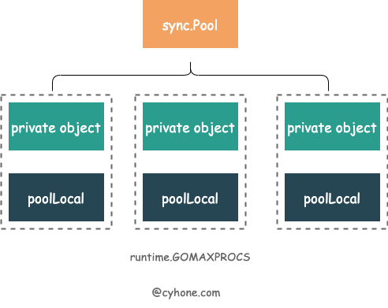

# 使用场景
保存和复用临时对象，减少内存分配，降低 GC 压力。

sync.Pool是并发安全的，且实现了lock free。
>注：sync.Pool缓存的对象随时可能被无通知的清理，所以不能将sync.Pool用于存储持久化对象的场景。比如：数据库连接等。


# 函数签名
```go
type Pool struct{...}
func (p *Pool) Get() interface{}
func (p *Pool) Put(x interface{})
```

# 底层实现
对于同一个 sync.Pool ，每个 P 都有一个自己的本地对象池 poolLocal。


## 结构体
```go
type Pool struct {
	noCopy noCopy

	local     unsafe.Pointer 
	localSize uintptr        

	victim     unsafe.Pointer 
	victimSize uintptr       
	New func() interface{}
}
```
- local：元素类型为`poolLocal`，长度为P的数组。
- localSize：代表 local 数组的长度。因为 P 可以在运行时通过调用 runtime.GOMAXPROCS 进行修改, 因此我们还是得通过 localSize 来对应 local 数组的长度。
- New：用户提供的创建对象的函数。这个选项也不是必需。当不填的时候，Get 有可能返回 nil。

# 使用

## 声明对象池
只需要实现`New`函数即可。
```go
var studentPool = sync.Pool{
    New: func() interface{} { 
        return new(Student) 
    },
}
```

## Get&Put
- Get：用于从对象池中获取对象(如果对象池中没有对象，则调用New函数创建一个)，因为返回的是`interface{}`，因此需要类型转换。
- Put：在对象使用完毕后，放回对象池。

# 例子1
```go
package main

import (
	"bytes"
	"io"
	"os"
	"sync"
	"time"
)

var bufPool = sync.Pool{
	New: func() interface{} {
		// The Pool's New function should generally only return pointer
		// types, since a pointer can be put into the return interface
		// value without an allocation:
		return new(bytes.Buffer)
	},
}

// timeNow is a fake version of time.Now for tests.
func timeNow() time.Time {
	return time.Unix(1136214245, 0)
}

func Log(w io.Writer, key, val string) {
	b := bufPool.Get().(*bytes.Buffer)
	b.Reset()
	// Replace this with time.Now() in a real logger.
	b.WriteString(timeNow().UTC().Format(time.RFC3339))
	b.WriteByte(' ')
	b.WriteString(key)
	b.WriteByte('=')
	b.WriteString(val)
	w.Write(b.Bytes())
	bufPool.Put(b)
}

func main() {
	Log(os.Stdout, "path", "/search?q=flowers")
}

```

# Reference
[深度分析 Golang sync.Pool 底层原理](https://www.cyhone.com/articles/think-in-sync-pool/)

[Go sync.Pool](https://geektutu.com/post/hpg-sync-pool.html)

[sync.Pool](https://pkg.go.dev/sync#Pool)