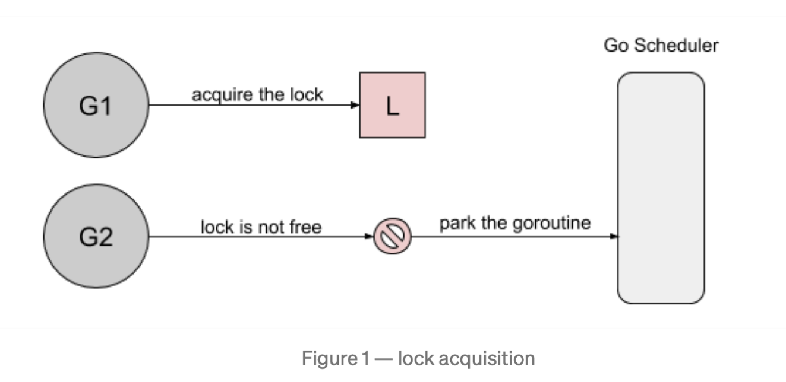

> In computer science, resource starvation is a problem encountered in concurrent computing where a process is perpetually denied necessary resources to process its work. Starvation may be caused by errors in a scheduling or mutual exclusion algorithm, but can also be caused by resource leaks, and can be intentionally caused via a denial-of-service attack such as a fork bomb.

在计算机科学中，资源Starvation是并发计算中存在的问题，在这种情况下，进程永远无法获得处理其工作所需的资源。Starvation可能是由调度或互斥算法中的错误引起的，也可能是由资源泄漏引起的，甚至可能是拒绝服务攻击引起的,例如forK轰炸。 

在Golang中,互斥锁可能会引发Starvation问题,因为某个goroutine一直试图获得一个永远无法获得的锁。

# 1.Starvation
[在Russ Cox的这个例子中](https://github.com/golang/go/issues/13086),阐述了关于Mutex Starvation的问题。
```go
func main() {
	done := make(chan bool, 1)
	var mu sync.Mutex

	// goroutine1
	go func() {
		for {
			select {
			case <-done:
				return
			default:
				mu.Lock()
				time.Sleep(100 * time.Microsecond)
				mu.Unlock()
			}
		}
	}()

	// goroutine2
	for i := 0; i < 10; i++ {
		time.Sleep(100 * time.Microsecond)
		mu.Lock()
		mu.Unlock()
	}
	done <- true
}
```
- goroutine1：长时间加锁并短暂释放锁。
- goroutine2: 短暂加锁并长时间释放锁。

两者都有100ms的周期,但由于goroutine1不断请求锁定,可以预期它会更频繁地获得锁定。基于Go 1.8循环10次,得到锁的请求分布结果如下：
>Lock acquired per goroutine:
g1: 7200216
g2: 10

goroutine1和goroutine2加锁的次数为何相差这么大？

## 原因
1. goroutine1将获得锁并休眠100ms.当goroutine2尝试获取锁时, 它将被添加到锁的队列 - FIFO顺序 - 并且goroutine将进入等待状态。
2. 

# Reference

[Starvation](https://en.wikipedia.org/wiki/Starvation_(computer_science))


