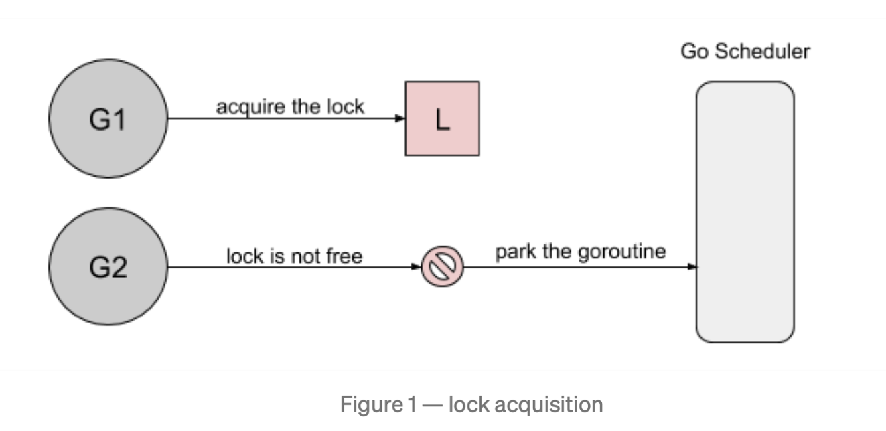
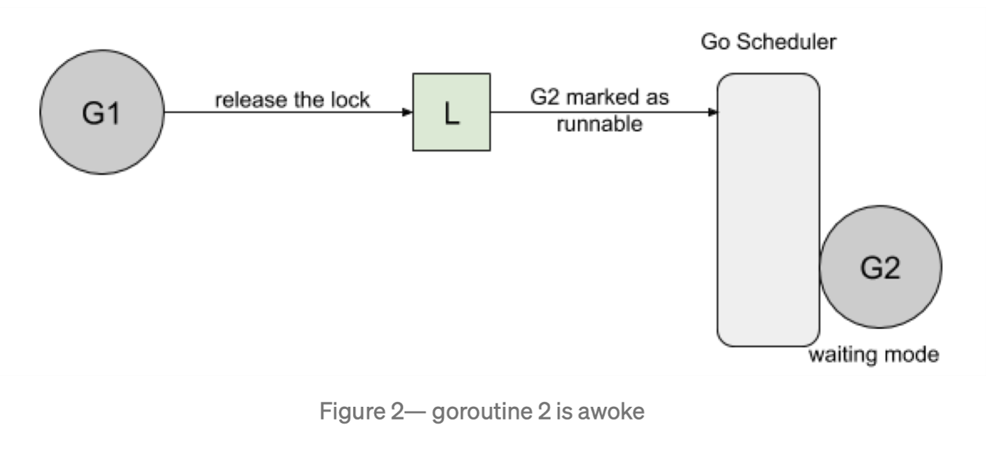
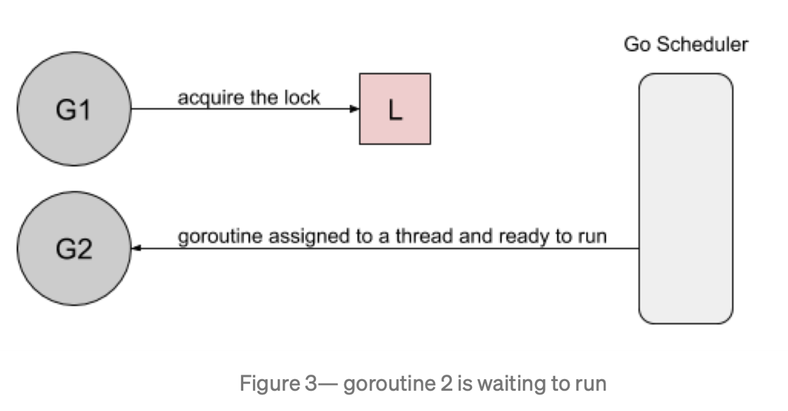
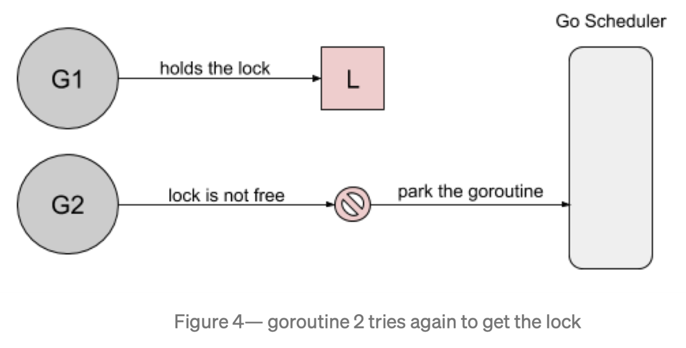
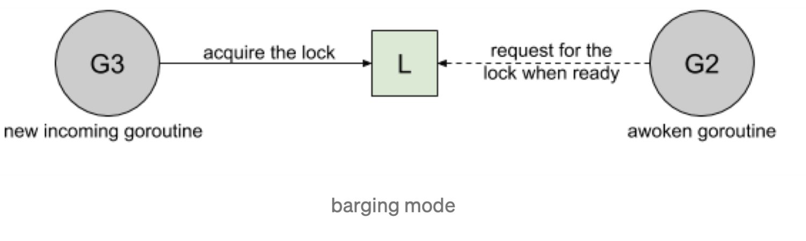

# Starvation
>computer science, resource starvation is a problem encountered in concurrent computing where a process is perpetually denied necessary resources to process its work. Starvation may be caused by errors in a scheduling or mutual exclusion algorithm, but can also be caused by resource leaks, and can be intentionally caused via a denial-of-service attack such as a fork bomb.

在计算机科学中，资源Starvation是并发计算中遇到的问题，在这种情况下，进程永远无法获得处理其工作所需的资源。Starvation可能是由调度或互斥算法中的错误引起的，但也可能是由资源泄漏引起的，也可能是通过拒绝服务攻击引起的。例如fork轰炸。

# Starvation With Mutex(饥饿互斥锁)
在 Golang 中开发时，Mutex可能会遇到starvation问题，因为它一直尝试获取永远无法获取的锁。在本文中，我们将研究Go1.8的starvation问题，该问题已在Go1.9中解决。

为了说明mutex中的starvation问题，这里以 [Russ Cox关于mutex改进问题](https://github.com/golang/go/issues/13086)的例子为例：
```go
func main() {
	done := make(chan bool, 1)
	var mu sync.Mutex

	// goroutine1
	go func() {
		for {
			select {
			case <-done:
				return
			default:
				mu.Lock()
				time.Sleep(100 * time.Microsecond)
				mu.Unlock()
			}
		}
	}()

	// goroutine2
	for i := 0; i < 10; i++ {
		time.Sleep(100 * time.Microsecond)
		mu.Lock()
		mu.Unlock()
	}
	done <- true
}
```
- goroutine1：长时间持有锁并短暂释放它。
- goroutine2：短暂持有锁并长时间释放锁。

两者都有100ms的周期，但由于goroutine1不断请求锁定,可以预期它会更频繁地获得锁定。基于Go 1.8循环10次,得到锁的请求分布结果如下：
>Lock acquired per goroutine:
>g1: 7200216
>g2: 10

goroutine1和goroutine2获取锁的次数为何相差这么大？

## 原因
1. goroutine1将获取锁并休眠100ms。当goroutine2尝试获取锁时, 它将被添加到锁的队列(FIFO顺序)，同时将进入等待状态。

1. 当goroutine1完成其工作时,它将释放锁。然后通知锁队列唤醒goroutine2。goroutine2将被标记为可运行，并等待 Go Scheduler将其调度到线程上运行。

3. 在goroutine2等待运行期间，goroutine再次获取到了锁。

4. 当goroutine2尝试获取锁时，会发现锁已经被其他goroutine持有了，所以goroutine2会再次像步骤2一样，进入等待模式。


*goroutine2对锁的获取取决于它什么时刻在线程上运行*，针对mutex的starvation问题，通常有以下几种**解决方案**：`Barging 、Handoff、Spinning`。

## Mutex的实现原理/模式
- Barging：这种模式是为了提高吞吐量，当锁被释放时。它会唤醒第一个等待者，然后把锁给*第一个等待者*或者给*第一个获取锁*的人。***Go1.8就是采用的这种实现方式***。


- Handoff：当锁释放时，锁会一直持有直到**第一个等待者**准备好获取锁。它降低了吞吐量，因为锁被持有，即使另一个 goroutine 准备获取它。*这种模式可以很好的平衡锁在两个goroutine之间的分配，但是降低了性能。*


- Spinning：
# Reference

[Starvation](https://en.wikipedia.org/wiki/Starvation_(computer_science))

[Mutex and Starvation](https://medium.com/a-journey-with-go/go-mutex-and-starvation-3f4f4e75ad50)


