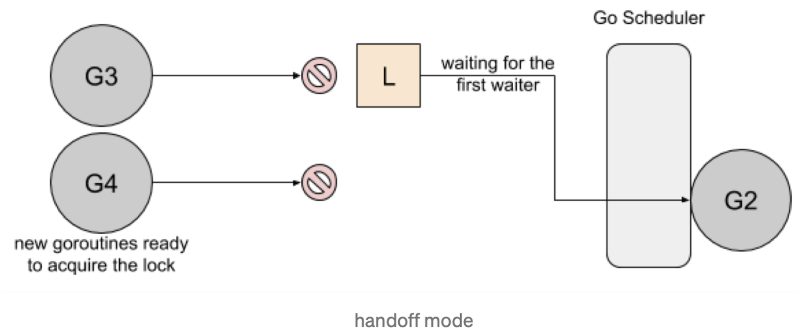
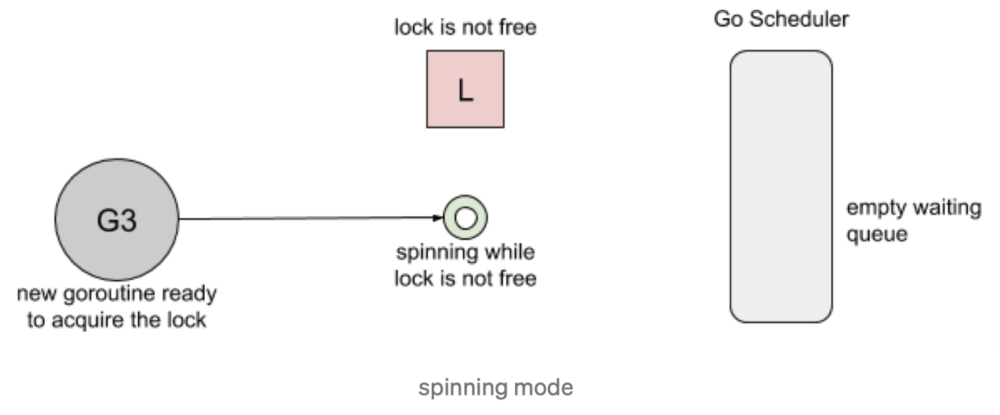
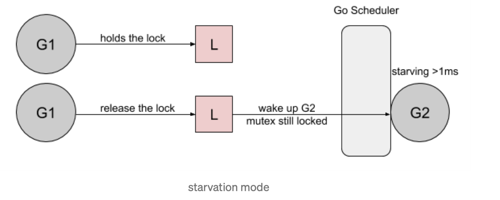

# Starvation
>computer science, resource starvation is a problem encountered in concurrent computing where a process is perpetually denied necessary resources to process its work. Starvation may be caused by errors in a scheduling or mutual exclusion algorithm, but can also be caused by resource leaks, and can be intentionally caused via a denial-of-service attack such as a fork bomb.

在计算机科学中，资源Starvation是并发计算中遇到的问题，在这种情况下，进程永远无法获得处理其工作所需的资源。Starvation可能是由调度或互斥算法中的错误引起的，但也可能是由资源泄漏引起的，也可能是通过拒绝服务攻击引起的。例如fork轰炸。

# Starvation With Mutex(饥饿互斥锁)
在 Golang 中开发时，Mutex可能会遇到starvation问题，因为它一直尝试获取永远无法获取的锁。在本文中，我们将研究Go1.8的starvation问题，该问题已在Go1.9中解决。

为了说明mutex中的starvation问题，这里以 [Russ Cox关于mutex改进问题](https://github.com/golang/go/issues/13086)的例子为例：
```go
func main() {
	done := make(chan bool, 1)
	var mu sync.Mutex

	// goroutine1
	go func() {
		for {
			select {
			case <-done:
				return
			default:
				mu.Lock()
				time.Sleep(100 * time.Microsecond)
				mu.Unlock()
			}
		}
	}()

	// goroutine2
	for i := 0; i < 10; i++ {
		time.Sleep(100 * time.Microsecond)
		mu.Lock()
		mu.Unlock()
	}
	done <- true
}
```
- goroutine1：长时间持有锁并短暂释放它。
- goroutine2：短暂持有锁并长时间释放锁。

两者都有100ms的周期，但由于goroutine1不断请求锁定,可以预期它会更频繁地获得锁定。基于Go 1.8循环10次,得到锁的请求分布结果如下：
>Lock acquired per goroutine:
>g1: 7200216
>g2: 10

goroutine1和goroutine2获取锁的次数为何相差这么大？

## 原因
1. goroutine1将获取锁并休眠100ms。当goroutine2尝试获取锁时, 它将被添加到锁的队列(FIFO顺序)，同时将进入等待状态。

1. 当goroutine1完成其工作时,它将释放锁。然后通知锁队列唤醒goroutine2。goroutine2将被标记为可运行，并等待 Go Scheduler将其调度到线程上运行。

3. 在goroutine2等待运行期间，goroutine再次获取到了锁。

4. 当goroutine2尝试获取锁时，会发现锁已经被其他goroutine持有了，所以goroutine2会再次像步骤2一样，进入等待模式。


*goroutine2对锁的获取取决于它什么时刻在线程上运行*，针对mutex的starvation问题，通常有以下几种**解决方案**：`Barging 、Handoff、Spinning`。

## 锁的实现原理/模式
- Barging：这种模式是为了提高吞吐量，当锁被释放时。它会唤醒第一个等待者，然后把锁给*第一个等待者*或者给*第一个获取锁*的人。***Go1.8就是采用的这种实现方式***。


- Handoff：当锁释放时，锁会一直持有直到**第一个等待者**准备好获取锁。它降低了吞吐量，因为锁被持有，即使另一个 goroutine 准备获取它。*这种模式可以很好的平衡锁在两个goroutine之间的分配，但是降低了性能。*


- Spinning：自旋在等待队列为空或者应用程序重度使用锁时效果不错。Parking 和 Unparking goroutines 有不低的性能成本开销，相比自旋来说要慢得多。但是自旋是有成本的，所以在 go 的实现中进入自旋的条件十分的苛刻。

Go 1.8也使用了这种策略。当尝试获取已经持有的锁时，如果本地队列为空且P的数量大于1，goroutine将spin(自旋)几次(用一个 P 旋转会阻塞程序)。自旋后，goroutine将会park。在程序高频使用锁的情况下，它充当了一个快速路径。

## Go1.9 Mutex的实现

在Go1.9之前的版本，Go结合了Barging和Spinning实现了Mutex。Go1.9通过添加一个新的饥饿模式(starvation mode)来解决先前解释的问题，该模式会在释放锁时触发handsoff。

所有等待锁超过一毫秒的goroutine(也被称为[bounded waiting](https://en.wikipedia.org/wiki/Peterson%27s_algorithm#Bounded_waiting))将标记为饥饿。当被标记为饥饿状态时，unlock方法会把锁直接扔给第一个等待者。



在饥饿模式下，spinning也被停用，因为传入的goroutines没有机会获取为下一个等待者保留的锁。

使用Go 1.9和新的饥饿模式运行上面示例代码结果如下：
>Lock acquired per goroutine:
>
g1: 57
g2: 10

# Go Mutex实现原理

## 加锁
Go 1.15版本锁的实现结合了上面三种模式，在调用Lock方法的时候。

1. 如果当前锁处于初始化状态，直接使用CAS方法尝试获取锁，这是*Fast Path*。
2. 否则进入*Slow Path*。
   1. 首先判断当前goroutine是否能够进入自旋状态，如果可以就进入自旋，最多自旋4次。
   2. 自旋完成后，就会计算当前锁的状态。
   3. 然后尝试通过CAS方法获取锁。
   4. 如果获取锁失败，就调用`runtime_SemacquireMutex`方法休眠当前goroutine并且尝试获取信号量。
   5. goroutine被唤醒之后，会先判断是否处于饥饿状态(goroutine超过1ms没有获取到锁就会进入饥饿状态)
      1. 如果处于饥饿状态，goroutine将会获得锁，同时如果等待队列中只存在当前goroutine，还会退出饥饿模式。
      2. 如果不是处于饥饿模式，goroutine就会被设置唤醒和饥饿标记、重置迭代次数并重新执行获取锁的循环。

>CAS 方法指的是 atomic.CompareAndSwapInt32(addr, old, new) bool 方法，这个方法会先比较传入的地址的值是否是 old，如果是的话就尝试赋新值，如果不是的话就直接返回 false，返回 true 时表示赋值成功。

饥饿模式是 Go 1.9 版本之后引入的优化，用于解决公平性的问题。


## 解锁


# 源码分析

## Mutex 基本结构
```go
type Mutex struct {
	state int32
	sema  uint32
}
```
`Mutex`结构体由`state`、`sema`两个 4 字节成员组成，其中`state`表示了当前锁的状态，`sema`是用于控制锁的信号量。


`state`字段的最低三位表示三种状态，分别是 `mutexLocked`、`mutexWoken`、`mutexStarving`，剩下的用于统计当前在等待锁的 goroutine 数量。
- mutexLocked：表示是否处于锁定状态。
- mutexWoken：表示是否处于唤醒状态。
- mutexStarving：表示是否处于饥饿状态。

# Reference

[Starvation](https://en.wikipedia.org/wiki/Starvation_(computer_science))

[Mutex and Starvation](https://medium.com/a-journey-with-go/go-mutex-and-starvation-3f4f4e75ad50)


