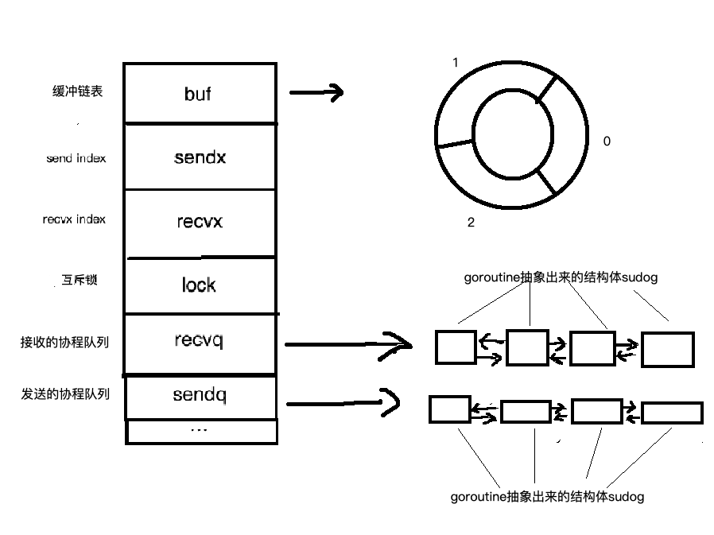

# 整体结构


# 数据结构
Go 语言的 Channel 在运行时使用 [runtime.hchan](https://github.com/golang/go/blob/41d8e61a6b9d8f9db912626eb2bbc535e929fefc/src/runtime/chan.go#L32) 结构体表示。我们在 Go 语言中创建新的 Channel 时，实际上创建的都是如下所示的结构：
```go
type hchan struct {
    qcount   uint           // total data in the queue
    dataqsiz uint           // size of the circular queue
    buf      unsafe.Pointer // points to an array of dataqsiz elements
    elemsize uint16
    closed   uint32
    elemtype *_type // element type
    sendx    uint   // send index
    recvx    uint   // receive index
    recvq    waitq  // list of recv waiters
    sendq    waitq  // list of send waiters

    // lock protects all fields in hchan, as well as several
    // fields in sudogs blocked on this channel.
    //
    // Do not change another G's status while holding this lock
    // (in particular, do not ready a G), as this can deadlock
    // with stack shrinking.
    lock mutex
}
```
- qcount：channel中元素的个数。
- dataqsiz：channel环形队列的长度。
- **_buf_**：是有缓冲的channel所特有的结构，用来存储缓存数据，是个循环链表。
- **_sendx和recvx_**：用于记录buf循环链表中的index。
- **_recvq和sendq_**：分别是接收(<-channel)或者发送(channel <- xxx)goroutine抽象出来的结构体([sudog](https://github.com/golang/go/blob/41d8e61a6b9d8f9db912626eb2bbc535e929fefc/src/runtime/runtime2.go#L345))的队列，是个双向链表。

```go
type waitq struct {
    first *sudog
    last  *sudog
}
```

# Reference
[图解Go的channel底层实现](https://i6448038.github.io/2019/04/11/go-channel/)

[channel设计原理](https://draveness.me/golang/docs/part3-runtime/ch06-concurrency/golang-channel/)