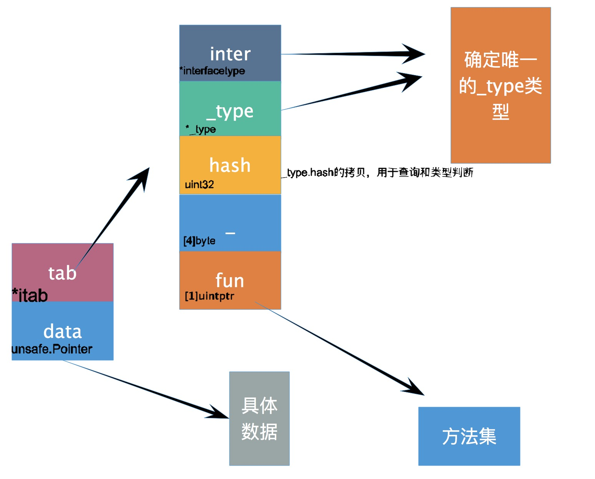

# interface
Go语言根据接口类型**是否包含一组方法**将接口类型分成了两类：
- 不带任何方法的`interface{}`。
- 带有一组方法的`interface`。


在实现上分别使用[runtime.iface](https://github.com/golang/go/blob/6c64b6db6802818dd9a4789cdd564f19b70b6b4c/src/runtime/runtime2.go#L203)和[runtime.eface](https://github.com/golang/go/blob/6c64b6db6802818dd9a4789cdd564f19b70b6b4c/src/runtime/runtime2.go#L208)来表示。


## eface结构体
```go
type eface struct { // 16字节
    _type *_type
    data  unsafe.Pointer
}
```
由两个属性构成，一个是类型信息`_type`，一个是数据信息`data`。

`_type`可以认为是Go语言中所有类型的公共描述，Go语言中几乎所有的数据结构都可以抽象成`_type`，是所有类型的表现，可以说是万能类型，
`data`是指向具体数据的指针。
```go
type _type struct {
    size       uintptr      // 类型占用的内存空间
    ptrdata    uintptr      
    hash       uint32       // 用于快速确定类型是否相等
    tflag      tflag
    align      uint8
    fieldAlign uint8
    kind       uint8
    equal      func(unsafe.Pointer, unsafe.Pointer) bool
    gcdata     *byte
    str        nameOff
    ptrToThis  typeOff
}
```


## iface结构体

```go
type iface struct { // 16字节
    tab  *itab
    data unsafe.Pointer
}

type itab struct {
    inter *interfacetype // interface的公共描述
    _type *_type         
    hash  uint32         // _type.hash的拷贝，当想将interface类型转换成具体类型时，可以快速判断目标类型和具体类型runtime._type是否一致
    _     [4]byte
    fun   [1]uintptr    // 动态变化的数组，存储一组函数指针
}
```



# 接口实现
接口的实现可以采用`结构体`和`指针`。
```go
type Duck interface{
    Eat()
}

type Cat strut{}
func (c Cat) Eat(){}    // 使用结构体实现接口

type Dog struct{}
func (d *Dog)Eat(){}    // 使用指针实现接口
```
***实现接口的类型***和***变量初始化类型***两个维度共构成了4种情况，但是并不是所有情况都能通过编译检查。

|          | 结构体实现 | 指针实现 |
|----------|-----|-----|
| 结构体初始化变量 | 通过  | 不通过 |
| 指针初始化变量  | 通过  | 通过  |


```go
type Duck interface {
    Quack()
}

type Cat struct{}

func (c *Cat) Quack() {
    fmt.Println("meow")
}

func main() {
    var c Duck = Cat{}
    c.Quack()
}

$ go build interface.go
./interface.go:20:6: cannot use Cat literal (type Cat) as type Duck in assignment:
	Cat does not implement Duck (Quack method has pointer receiver)
```

针对以上问题，主要原因在于Go语言在传递参数时都是***传值而非指针***。


如上图所示，上述代码中初始化的变量`c`无论是`Cat{}`还是`&Cat{}`，使用 c.Quack() 调用方法时都会发生值拷贝：
- 上图左侧，对于初始化变量`c = &Cat{}`来说，在调用`c.Quack()`时，相当于复制了一个新的`&Cat{}`指针，这个指针与原来的指针指向同一个结构体，所以编译器可以隐式的对变量解引用（dereference）获取指针指向的结构体。
- 上图右侧，对于初始化变量`c = Cat{}`来说，在调用`c.Quack()`时，相当于复制了一个全新的`Cat{}`，因为方法的参数是`*Cat`，编译器不会无中生有创建一个新的指针；即使编译器可以创建新指针，这个指针指向的也不是最初调用该方法的结构体。

# 易错知识
例子1：
```go
func main() {
	var v interface{}
	v = (*int)(nil)     // 将nil强制转换成*int类型
	fmt.Println(v == nil)
}
```
```shell
output: false 
```

例子2：
```go
func main() {
	var data *type
	var in interface{}
	
	fmt.Println(data,data == nil)
	fmt.Println(in,in == nil)
	
	in = data 
	fmt.Println(in,in == nil)
}
```
```shell
output: <nil> true
        <nil> true
        <nil> false
```

# Reference
[Go语言interface底层实现](https://i6448038.github.io/2018/10/01/Golang-interface/)

[Go语言接口的原理](https://draveness.me/golang/docs/part2-foundation/ch04-basic/golang-interface/)
