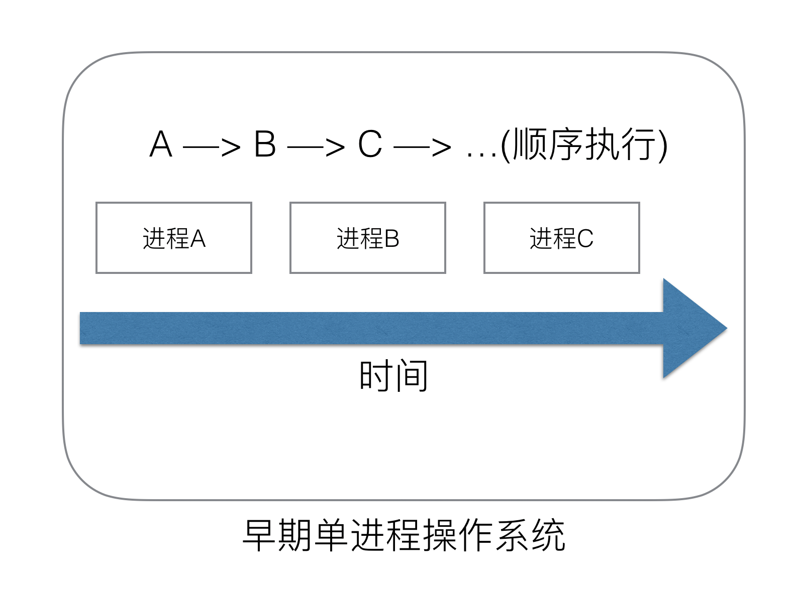
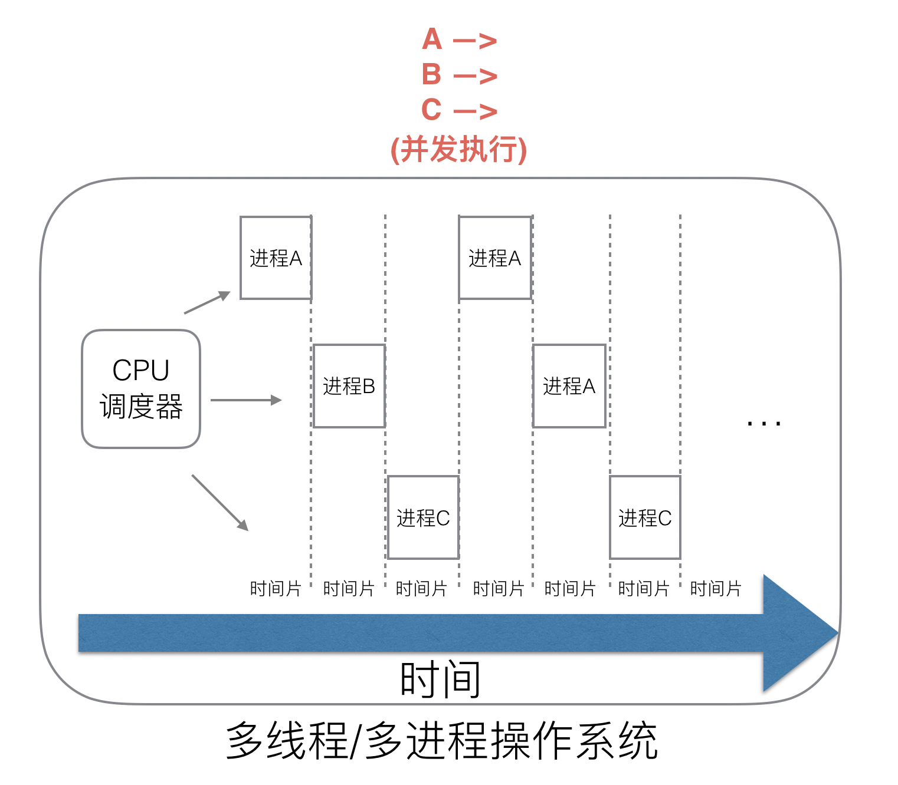
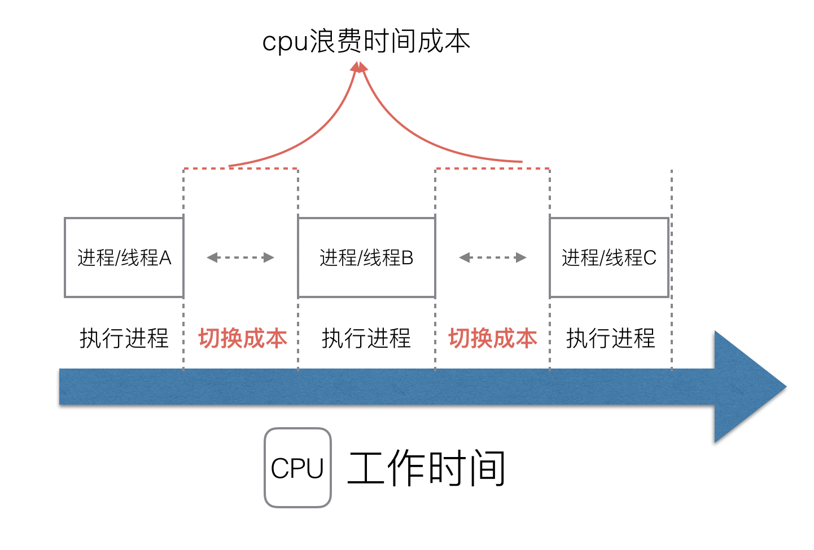
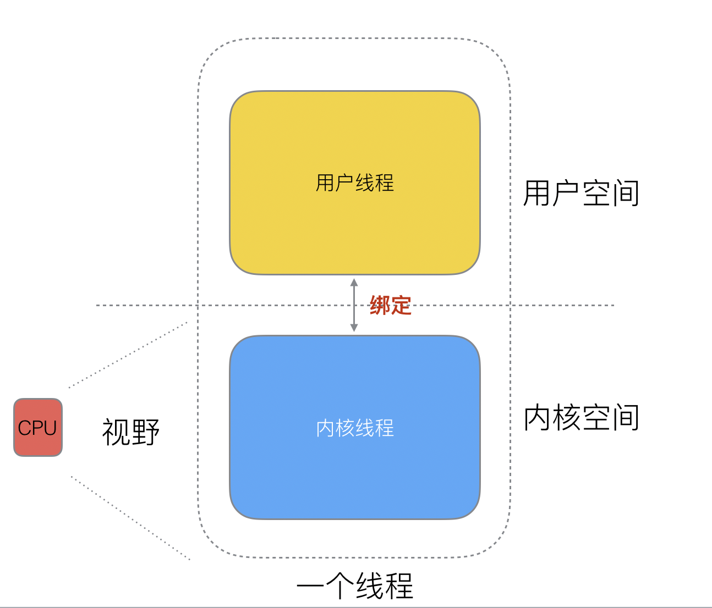
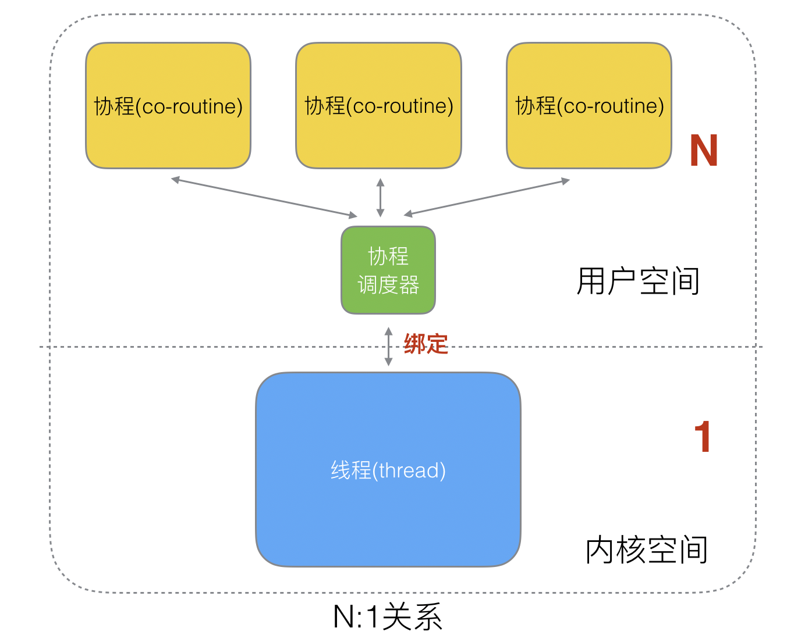
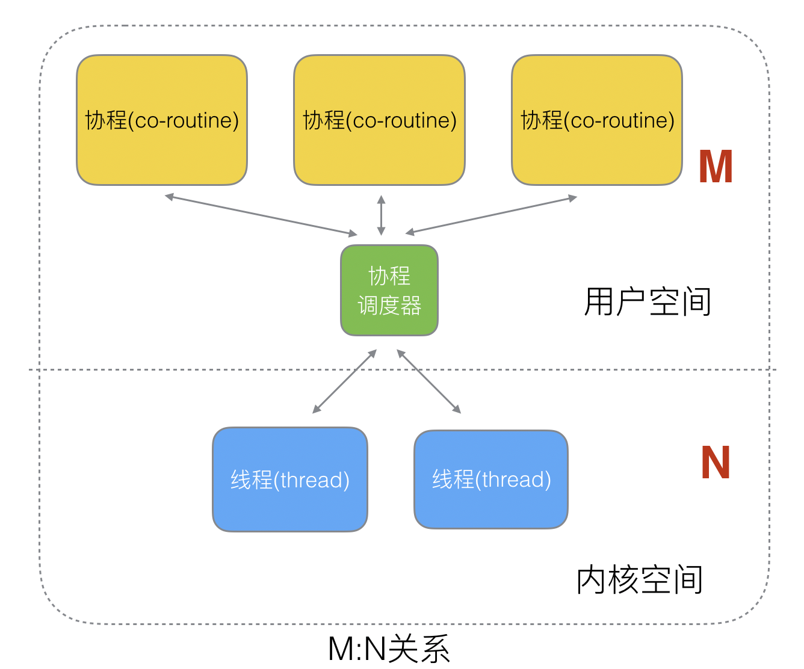
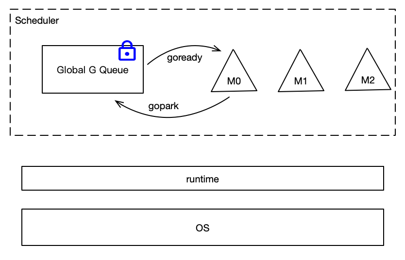
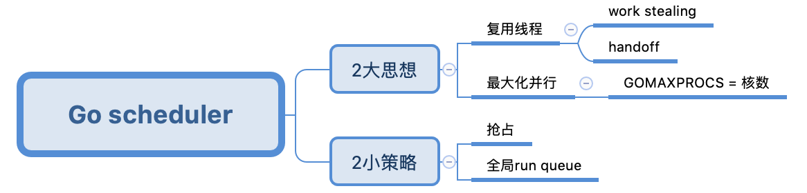

# Golang“调度器”的由来？
## 01.远古时代
ENIAC是世界上第一台计算机，但它没有操作系统，更别提进程、线程和协程了。

## 02.单进程时代——不需要调度器
后来，计算机拥有了操作系统，每个程序都是一个进程，但操作系统在*同一时刻只能运行一个进程*，直到这个进程运行完成，才能运行下一个进程，这个时期被称为**单进程时代——串行时代**。

## 03.多进程/多线程时代——需要调度器
### 多进程时代：
通过调度算法解决进程间的阻塞问题：**当一个进程阻塞时，CPU可以立刻切换到其他进程中去执行**。同时调度算法可以保证在运行的**进程都可以分配到CPU的运行时间片**。这样就能充分利用CPU，并且宏观上看是多个进程在同时运行。

### 多线程时代(内核态线程)：
由于进程占有资源太多，对进程进行创建、切换、销毁都会占用CPU大量时间。当进程比较多时，CPU会花费很多时间来进行进程间的调度。

所以引入了更轻量的线程，一个进程可以由多个线程组成。CPU在执行调度时，优先切换线程，如果下一个线程也是当前进程的，就只有线程切换，“很快”就能完成；如果下一个线程不是当前的进程，就需要切换进程，这就得费点时间了。**这个时代，CPU的调度切换是进程和线程**。

## 04.协程时代(用户态线程)
虽然多进程、多线程提高了系统的并发能力，但在当今互联网高并发场景下，为每个任务都创建一个线程是不现实的，因为会消耗大量的内存(进程虚拟内存会占用4GB[32位操作系统], 而线程也要大约4MB)。大量的进程/线程会引入新的问题：
- 内存消耗大
- 消耗大量CPU的时间进行调度

一个线程其实分为`内核态线程`和`用户态线程`。CPU无法感知用户态线程的存在，只能感知内核态线程的存在，`用户态线程必须要绑定到内核态线程才能被执行`。所以工程师们将**提升CPU利用率**的视野转移到了用户态线程，进行了如下设计：
- 协程切换在用户空间进行：不会像线程切换那样消耗资源。
- 协程占用更少的资源。

### 协程和线程的3种映射关系：
- **1:1关系**：1个协程绑定在1个线程。
    - 优点：简单易实现。
    - 缺点：协程的调度(创建、切换、销毁)都由CPU完成，代价昂贵。
- **N:1关系**： N个协程绑定到1个线程上。
  - 优点：协程间的切换在用户态完成，不会陷入内核态，切换非常的轻量快速。
  - 缺点：1个进程的所有协程都绑定在1个线程上。
    - 无法利用多核CPU的优势。
    - 某个协程阻塞——>线程阻塞——>进程中的所有协程阻塞——>无并发能力

    
- **M:N关系**：M个协程绑定N个线程，是N:1和1:1类型的结合，克服了以上2种模型的缺点，但实现起来最为复杂。

## 05.Go语言的协程goroutine
goroutine的概念来自于协程，目的是让一组`可复用`的函数运行在`一组线程之上`，**即使有协程阻塞，该线程上的其它协程也可以被`runtime`调度到其它可运行的线程之上**。

## 06.goroutine调度器
调度器的任务是**在用户态完成goroutine的调度**，而调度器的实现好坏，对并发实际有很大的影响，并且**Go的调度器就是M:N类型**，实现起来也是最复杂。

## Go1.1之前的调度器(GM模型)
最下面是操作系统，中间是runtime，runtime在Go中很重要，许多程序运行时的工作都由runtime完成，**调度器就是runtime的一部分**，虚线圈出来的为调度器，它有两个重要组成：
- M：代表线程，它要运行goroutine。
- Global G Queue：全局goroutine队列，所有的goroutine都保存在这个队列中，goroutine用G进行代表。

M想要执行、放回goroutine都必须**访问全局G队列**，由于M有多个，即多线程访问同一资源需要加锁进行保证互斥/同步，所以全局G队列是有`互斥锁`进行保护的。

GM模型的缺点：
- 创建、销毁、调度goroutine都需要每个M获取锁，`存在激烈的锁竞争`。
- M转移goroutine会造成`延迟和额外的系统负载`。比如当G创建新协程G’时，为了继续执行G，需要把G’交给M’执行，也造成了`很差的局部性`，因为G’和G是相关的，最好放在M上执行，而不是其他M'。
- 系统调用(CPU在M之间的切换)导致频繁的线程阻塞和取消阻塞操作增加了系统开销。

## Go1.1及之后的调度器(GPM模型)
由于GM调度器存在非常多的问题，所以Go1.1设计了新的调度器 [go11sched](https://golang.org/s/go11sched) 。

新调度器引入了：
- **P**：Processor，**它包含了运行goroutine的资源**，如果线程M想运行goroutine，必须先获取P，P中包含了可运行的G队列。

### Go调度器设计原则

**两大思想**：
- 复用线程：协程是运行在一组线程之上，不需要频繁创建、销毁线程，而是对线程进行复用。在调度器中复用线程有2种实现：
  - work stealing：当本线程无可运行的G时，`尝试从其它线程绑定的P中偷取G`，而不是销毁线程。
  - hand off：当本线程因为G进行系统调用(syscall)阻塞时，`线程释放绑定的P，把P转移给其它空闲的线程执行`。
- 最大化并行：GOMAXPROCS设置P的数量，最多有`GOMAXPROCS`个线程分布在多个CPU上同时运行。

**两大策略**：
- 抢占：在coroutine中要等待一个协程主动让出CPU才执行下一个协程，在Go中，`一个goroutine最多占用CPU 10ms，防止其它goroutine饿死`，这就是goroutine不同于coroutine的一个地方。
- 全局G队列：在新的调度器中依然有全局G队列，但功能已经被弱化了，`当M执行work stealing从其它P偷不到G时，它可以从全局G队列获取G`。

#Reference

[Go调度器系列（1）起源](https://lessisbetter.site/2019/03/10/golang-scheduler-1-history/)

[设计方案](https://golang.org/s/go11sched)

[代码中关于调度器的描述](https://golang.org/src/runtime/proc.go)

[引用最多的调度器文章](https://morsmachine.dk/go-scheduler)

[讲调度最好的PPT](https://speakerdeck.com/kavya719/the-scheduler-saga)
