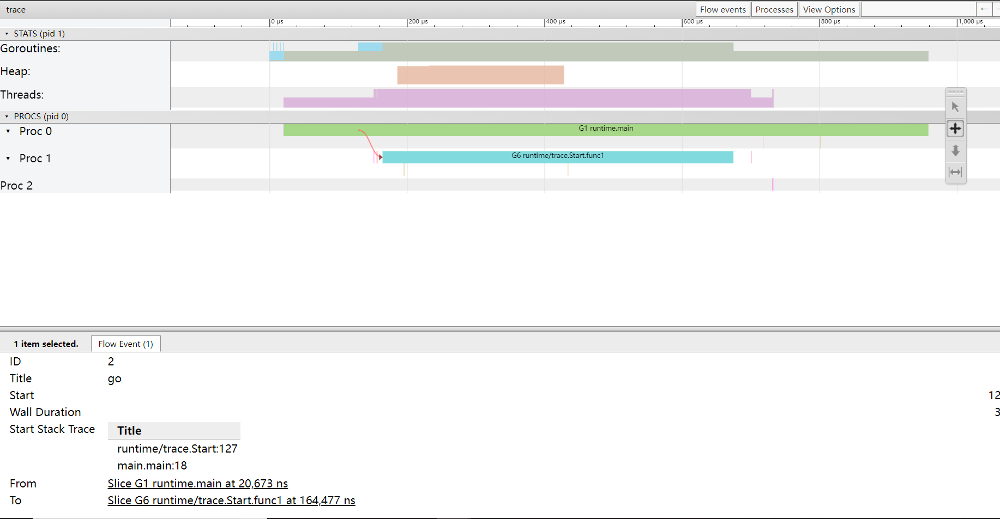

# 01.调度器的功能
在Go中，**线程是运行goroutine的实体，调度器的功能是把可运行的goroutine分配到工作线程上**。

>1.0版本：发布了最初的、最简单的调度器，即G-M模型，存在很多问题。
>
>1.1版本：重新设计，修改为G-P-M模型，奠定当前调度器基本模样。
> 
>1.2版本：加入抢占式调度，防止协程不让出CPU导致其它G饿死。

# 02.调度器的宏观组成
下图展示了`goroutine调度器和OS调度器的关系`，而不是把二者割裂开来，并且从宏观的角度展示了调度器的重要组成。


- 全局队列(Global Queue)：存放等待运行的goroutine。
- P的本地队列：和全局队列类似，存放等待运行的goroutine，最多能存放**256个**。`当新建一个G'时，G'会优先加入到P的本地队列，如果队列满了，则会把本地队列中一半的G转移到全局队列`。
- P列表：所有的P都是在程序启动时创建，并保存在数组中，最多有GOMAXPROCS个。
- M：线程M想要运行任务需要获取P，然后从P的本地队列中获取G；如果P的本地队列为空，M先从全局队列`拿一批G`放到P的本地队列，否则从其它P的本地队列`偷一半`放到P的本地队列，。

**Goroutine调度器和OS调度器是通过M结合起来的，每个M都代表了1个内核线程，OS调度器负责把内核线程分配到CPU的核上执行。**

## 关于P和M的个数问题
1. P的数量：
- 由启动时环境变量`$GOMAXPROCS`或者是由`runtime`的方法`GOMAXPROCS()`决定。这意味着在程序执行的任意时刻都只有`$GOMAXPROCS`个goroutine在同时运行。
2. M的数量：
- Go语言本身的限制：go程序启动时，会设置M的最大数量，`默认10000`。但是内核很难支持这么多的线程数，所以这个限制可以忽略。
- runtime/debug中的SetMaxThreads函数，设置M的最大数量
- 一个M阻塞了，会创建新的M。

## P和M何时会被创建
1. P何时创建：
- 在确定了P的最大数量n后，`runtime`会根据这个数量创建n个P。
2、M何时创建：
- `没有足够的M来关联P并运行其中的可运行的G`。比如所有的M此时都阻塞住了，而P中还有很多就绪任务，就会去寻找空闲的M，而没有空闲的，就会去创建新的M。


# 03.调度器的生命周期


### m0
m0是`runtime`创建的第一个系统线程，一个Go程序只有一个m0，也叫主线程。负责执行初始化操作和启动第一个g。

### g0
每个M(包括m0)都会有且只有一个g0，g0仅用于调度G，g0不指向任何可执行的函数。g0 上的栈是系统分配的栈，在linux上栈大小默认固定8MB，不能扩展，也不能缩小。而普通g一开始只有2KB大小，可扩展。

```go
package main

import "fmt"

func main() {
    fmt.Println("Hello world")
}
```
1. runtime创建最初的线程m0和g0，并把2者关联。 
2. 调度器初始化：初始化m0、栈、垃圾回收，以及创建和`初始化由GOMAXPROCS个P构成的P列表`。 
3. 示例代码中的main函数是`main.main`，runtime中也有1个main函数——`runtime.main`，代码经过编译后，`runtime.main会调用main.main`，程序启动时会**为runtime.main创建goroutine，称为main goroutine**，然后把main goroutine加入到P的本地队列。 
4. 启动m0，m0已经绑定了P，会从P的本地队列获取G，获取到`main goroutine`。 
5. G拥有栈，M根据G中的栈信息和调度信息设置运行环境 
6. M运行G 
7. G退出，再次回到M获取可运行的G，这样重复下去，直到`main.main`退出，`runtime.main`执行Defer和Panic处理，或调用`runtime.exit`退出程序。

### 可视化感受
```go
package main

import (
	"fmt"
	"os"
	"runtime/trace"
)

func main() {
    // 创建trace文件
    f, err := os.Create("trace.out")
    if err != nil {
        panic(err)
    }
    defer f.Close()

    // 启动trace goroutine
    err = trace.Start(f)
    if err != nil {
        panic(err)
    }
    defer trace.Stop()

    // main
    fmt.Println("Hello trace")
}

// D:\Go_Code\src\Study-go>go run main.go
// Hello trace

/*
 D:\Go_Code\src\Study-go>go tool trace trace.out
 2022/01/09 15:01:56 Parsing trace...
 2022/01/09 15:01:56 Splitting trace...
 2022/01/09 15:01:56 Opening browser. Trace viewer is listening on http://127.0.0.1:65420
*/
```

从上至下分别是goroutine（G）、堆、线程（M）、Proc（P）的信息，从左到右是时间线。用鼠标点击颜色块，最下面会列出详细的信息。

可以发现： 
- `runtime.main`的goroutine是g1，这个编号应该永远都不变的，runtime.main是在g0之后创建的第一个goroutine。 
- g1中调用了`main.main`，创建了trace goroutine g6。g1运行在P0上，g6运行在P1上。
# Reference
[也谈goroutine调度器](https://tonybai.com/2017/06/23/an-intro-about-goroutine-scheduler/)

[详解 Go 程序的启动流程，你知道 g0，m0 是什么吗？](https://segmentfault.com/a/1190000040181868)

[深入golang runtime的调度](https://zboya.github.io/post/go_scheduler/)