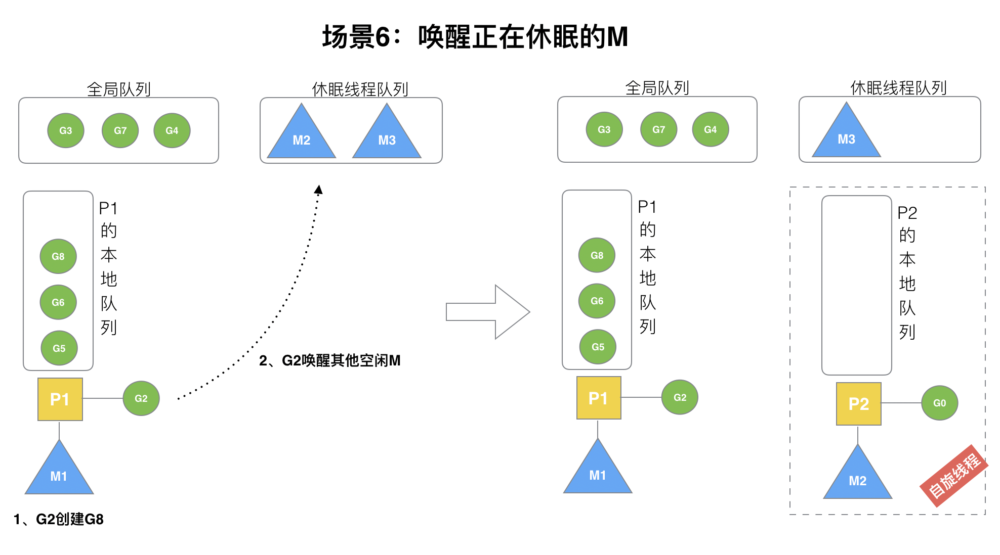

# 场景1：
p1拥有g1，m1获取p1后开始运行g1，g1使用`go func()`创建了g2，为了局部性g2优先加入到p1的本地队列。

# 场景2
G1运行完成后(函数：goexit)，M上运行的goroutine切换为G0，G0负责调度时协程的切换（函数：schedule）。从P的本地队列取G2，从G0切换到G2，并开始运行G2(函数：execute)。实现了线程M1的复用。

# 场景3
假设每个p的本地队列只能存4个g。g2要创建了6个g，前4个g（g3, g4, g5, g6）已经加入p1的本地队列，p1本地队列满了。

# 场景4
G2在创建G7的时候，发现P1的本地队列已满，需要执行**负载均衡**(把P1中本地队列中前一半的G，还有新创建G转移到全局队列)，这些g被转移到全局队列时，会被打乱顺序。所以g3,g4,g7被转移到全局队列。

# 场景5
g2创建g8时，p1的本地队列未满，所以g8会被加入到p1的本地队列。

# 场景6
运行的G在创建G'时，会尝试唤醒其它空闲的`P和M组合`去执行。

假定G2唤醒了M2，M2绑定了P2，并运行g0，但P2本地队列没有G，M2此时为**自旋线程**(没有g但为运行状态的线程，不断寻找g)。

# 场景7
M2尝试从全局队列(简称“GQ”)取一批G放到P2的本地队列（函数：findrunnable()）。M2从全局队列取的G数量符合下面的公式：
>n = min(len(GQ)/GOMAXPROCS + 1, len(GQ/2))

至少从全局队列取1个g，但每次不要从全局队列移动太多的g到p本地队列，给其他p留点。这是`从全局队列到P本地队列的负载均衡`。

假定我们场景中一共有4个P，所以m2只从能从全局队列取1个g（即g3）移动p2本地队列，然后完成从g0到g3的切换，运行g3。

# 场景8
假设g2一直在m1上运行，经过2轮后，m2已经把g7、g4也挪到了p2的本地队列并完成运行，全局队列和p2的本地队列都空了，如图左边。

**全局队列已经没有G，那m就要执行work stealing(偷取)**：从其它有G的P那里偷取一半G过来，放到自己的P本地队列。P2从P1的本地队列尾部取一半的G，本例中一半则只有1个G8，放到P2的本地队列并执行。

# 场景9
P1本地队列G5、G6已经被其它M偷走并运行完成，当前M1和M2分别在运行G2和G8，M3和M4没有goroutine可以运行，M3和M4处于`自旋状态`，它们不断寻找goroutine。

为什么要让m3和m4自旋，自旋本质是在运行，线程在运行却没有执行G，就变成了浪费CPU。为什么不销毁现场，来节约CPU资源？因为创建和销毁CPU也会浪费时间，我们希望当有新goroutine创建时，立刻能有M运行它，如果销毁再新建就增加了时延，降低了效率。当然也考虑了过多的自旋线程是浪费CPU，所以系统中**最多有GOMAXPROCS个自旋的线程**(当前例子中的GOMAXPROCS=4，所以一共4个P)，多余的没事做线程会让他们休眠。

# 场景10
**阻塞调用**

假定当前除了M3和M4为自旋线程，还有M5和M6为空闲的线程(没有得到P的绑定，注意我们这里最多就只能够存在4个P，所以P的数量应该永远是M>=P, 大部分都是M在抢占需要运行的P)，G8创建了G9，G8进行了**阻塞的系统调用**，M2和P2立即解绑，P2会执行以下判断：`如果P2本地队列有G、全局队列有G或有空闲的M，P2都会立马唤醒1个M和它绑定，否则P2则会加入到空闲P列表，等待M来获取可用的p`。本场景中，P2本地队列有G9，可以和其他空闲的线程M5绑定。

# 场景11
**非阻塞调用**

g8创建了g9，假如g8进行了非阻塞系统调用（CGO会是这种方式，见cgocall()），m2和p2会解绑，但m2会记住p，然后g8和m2进入系统调用状态。当g8和m2退出系统调用时，会尝试获取p2，如果无法获取，则获取空闲的p，如果依然没有，g8会被记为可运行状态，并加入到全局队列。

# go func()调度流程

# Goroutine的状态
- _Gidle：表示G刚刚新建, 仍未初始化。
- _Gdead：表示G未被使用, 可能已执行完毕(并在freelist中等待下次复用)
- _Grunnable：表示G在运行队列中, 等待M取出并运行。
- _Grunning： 表示M正在运行这个G, 这时候M会拥有一个P。
- _Gsyscall：表示M正在运行这个G发起的系统调用, 这时候M并不拥有P。
- _Gwaiting：表示G在等待某些条件完成, 这时候G不在运行也不在运行队列中(可能在channel的等待队列中)。
- _Gcopystack：表示G正在获取一个新的栈空间并把原来的内容复制过去(用于防止GC扫描)

# P的状态
- _Pidle：当M发现无待运行的G时会进入休眠, 这时M拥有的P会变为空闲并加到空闲P链表中。
- _Prunning：当M拥有了一个P后, 这个P的状态就会变为运行中, M运行G会使用这个P中的资源。
- _Pdead：当P的数量在运行时改变, 且数量减少时多余的P会变为此状态。
- _Psyscall：当go调用原生代码, 原生代码又反过来调用go代码时, 使用的P会变为此状态。
- _Pgcstop：被线程 M 持有，由于垃圾回收被停止。

# M的状态
M并没有像G和P一样的状态标记, 但可以认为一个M有以下的状态:
- spinning自旋：M正在从运行队列获取G, 这时候M会拥有一个P。
- 执行go代码中: M正在执行go代码, 这时候M会拥有一个P。
- 休眠中: M发现无待运行的G时会进入休眠, 并添加到空闲M链表中, 这时M并不拥有P。
- 执行原生代码中: M正在执行原生代码或者阻塞的syscall, 这时M并不拥有P。

# Reference

[Golang的协程调度器原理及GMP设计思想？](https://www.kancloud.cn/aceld/golang/1958305)

[6.5 调度器](https://draveness.me/golang/docs/part3-runtime/ch06-concurrency/golang-goroutine/#g)

[GMP调度详解](https://segmentfault.com/a/1190000023869478?utm_source=sf-similar-article)