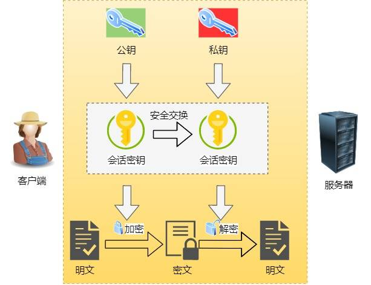
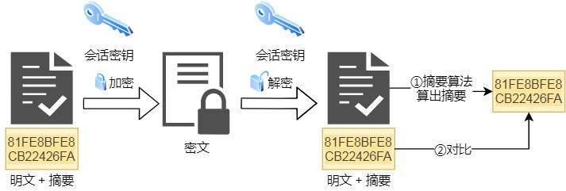
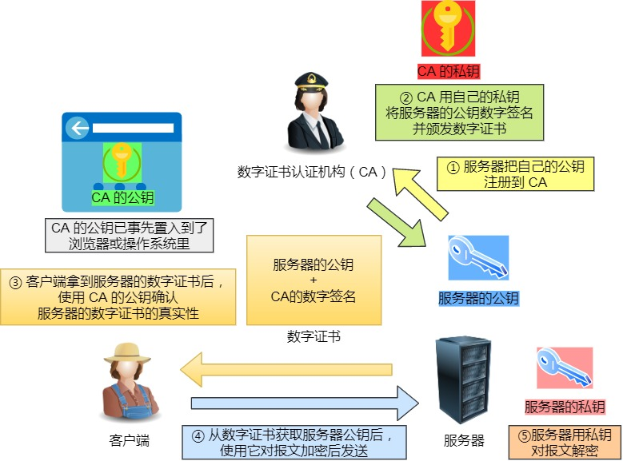

## 在浏览器输入baidu.com,整个渲染过程?
浏览器DNS缓存——>hosts文件——>本机DNS缓存——>DNS服务器——>三次握手——>发起HTTP请求——>Server响应——>浏览器解码并缓存——>请求嵌入在HTML中资源(图片、音乐...)。

# HTTP基础知识
## 常见状态码
- 1xx:
- 2xx:成功，报文已收到并被正确处理。
- 3xx:重定向，资源位置发生变动，需要客户端重新发送请求。
  - 301:Moved Permanently **永久重定向**。资源已经不存在了，需改用新的URL再次访问。
  - 302:Found **临时重定向**。资源还在，但暂时需要用另一个URL来访问。
- 4xx:客户端错误，请求报文有误，服务器无法处理。
  - 400:Bad Request
  - 403:Forbidden 服务器禁止访问资源，并不是客户端的请求出错。
- 5xx:服务器错误，服务器在处理请求时内部发生了错误。
  - 500:Internal Server Error
  - 502:**Bad Gateway** 通常是服务器作为网关或代理时返回的错误码，表示服务器自身工作正常，访问**后端服务器发生了错误**。
  - 503:Service Unavailable 服务器当前很忙，暂时无法响应服务器，类似“网络服务正忙，请稍后重试”的意思。

# HTTP与HTTPS
## HTTP与HTTPS有哪些区别？
- HTTP是明文传输，存在安全风险；HTTPS在TCP和HTTP层之间加入了SSL/TLS安全协议，使报文加密传输。
- HTTP建立连接简单，三次握手后便可进行报文传输；HTTPS在三次握手后，还需要进行SSL/TLS握手过程后，才能进行报文的加密传输。
- HTTP的端口号是80；HTTPS的端口号是443。
- HTTPS需要向CA申请数字证书，来保证服务器的身份是可信的。
## HTTPS解决了HTTP的哪些问题？
- 窃听风险：通信链路上窃取数据报文。
- 篡改风险：篡改数据(比如强行植入广告)。
- 冒充风险：冒充淘宝网站(钓鱼网站)。
## HTTPS是如何解决HTTP不安全的问题的？
- 信息加密：HTTPS采用**对称加密和非对称加密**结合的「混合加密」方式： 
  - 在通信建立前采用**非对称加密**的方式交换「会话秘钥」，后续就不再使用非对称加密。 
  - 在通信过程中全部使用**对称加密**的「会话秘钥」的方式加密明文数据。
  
- 校验机制：**摘要算法**实现数据的完整性。
  - 客户端在发送明文之前会通过**摘要算法算出明文的「摘要」**，发送的时候把「摘要 + 明文」一同加密成密文后，发送给服务器，服务器解密后，用相同的摘要算法算出发送过来的明文，通过比较客户端携带的「摘要」和当前算出的「摘要」做比较，若「指纹」相同，说明数据是完整的。
  
- 数字证书：**将服务器公钥放在数字证书**（由数字证书认证机构颁发）中，只要**证书是可信的，公钥就是可信的**。
  
## HTTPS是如何建立的？期间交互了什么？

# HTTP的发展历史
## HTTP/1.1相比HTTP/1.0提高了什么性能？
- 使用 TCP 长连接的方式改善了 HTTP/1.0 短连接造成的性能开销。
- 支持管道（pipeline）网络传输，只要第一个请求发出去了，不必等其回来，就可以发第二个请求出去，可以减少整体的响应时间。
## HTTP/2.0针对HTTP/1.1做了哪些优化？
## HTTP/2.0有哪些缺陷？HTTP/3.0做了哪些优化？
