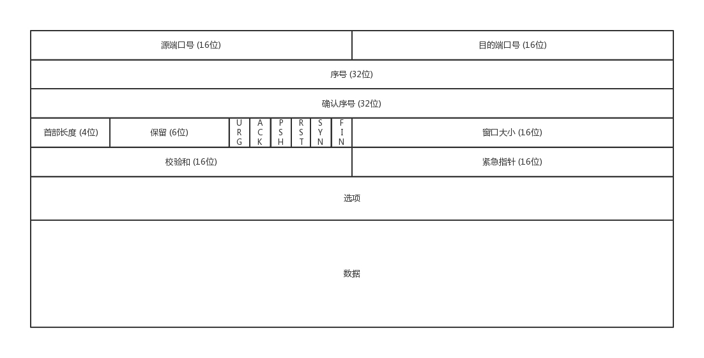
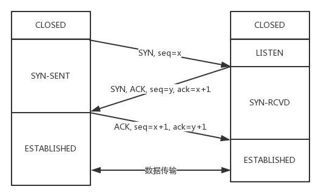

# TCP 包头

- 序号：**解决乱序问题**。 
- 确认序号：**解决丢包问题**。发出去的包应该有确认，这样才能知道对方是否收到，如果没收到就应该重发(什么时候重发？？？)。 
- 状态位：
  - SYN：发起一个连接
  - ACK：回复
  - RST：重新连接
  - FIN：结束连接
- 窗口大小：标识自己当前的处理能力。

# 特点
- 面向连接：指在发送数据之前两端必须建立连接，建立连接的方法就是三次握手。
- 可靠：保证数据不重、不乱、不丢。
- 基于字节流：应用程序对数据的发送和接收没有边界限制，不像UDP那样独立传输一个个数据包。比如发送一个666字节的数据，针对tcp协议：可能先收到600，再收到66；针对udp协议：收到的肯定是666字节的数据包。

# TCP 核心
- 乱序问题
- 丢包问题
- 流量控制
- 拥塞控制

# TCP 三次握手
三次握手除了`建立连接`外，主要还是为了沟通`TCP包的序号`问题。

# Connection timed out

