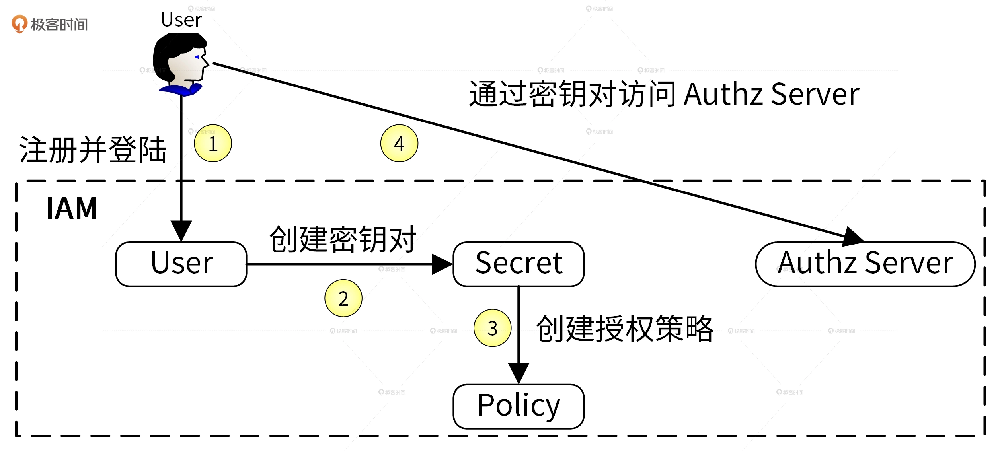
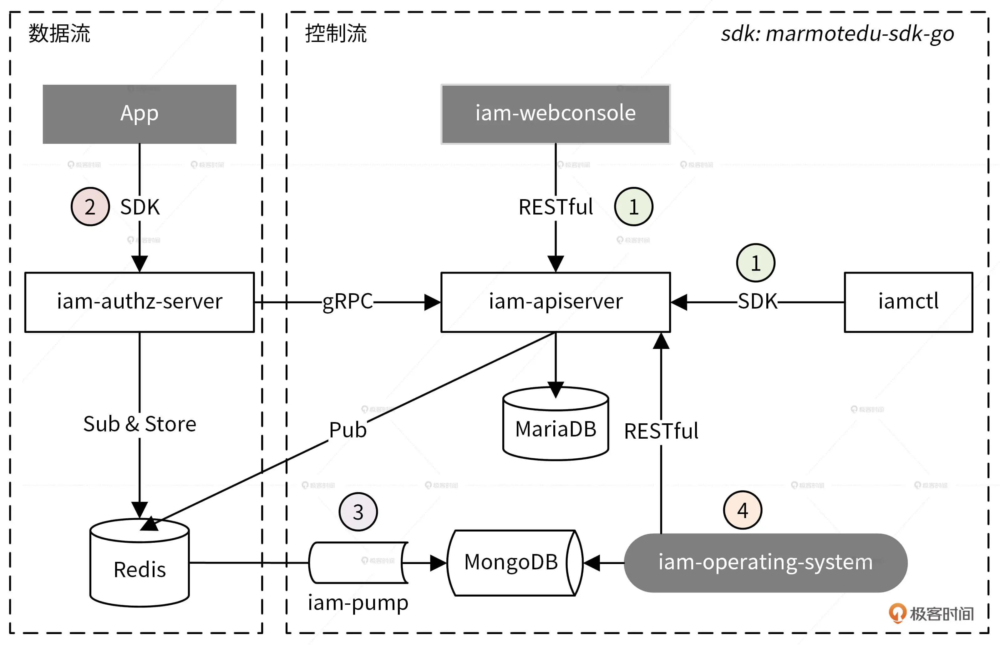

# Go应用安全
主要从`认证`和`授权`两方面考虑。

- 认证：
    - 硬件层面：物理隔离、网络隔离、防火墙等(运维团队)
    - 软件层面：HTTPS、用户认证(JWT)等(开发团队)
- 鉴权：

# IAM系统(授权webhook)
IAM（Identity and Access Management，身份识别与访问管理）系统是用 Go 语言编写的一个 Web 服务，用于给第三方用户提供访问控制服务。
IAM 系统可以帮用户解决的问题是：**在特定的条件下，谁能够 / 不能够对哪些资源做哪些操作**（Who is able to do what on something given some context），也即完成资源授权功能。

# 授权流程

1. 用户注册并登陆到IAM系统，这里以username/password作为唯一身份标识符。
2. 用户在IAM系统中创建属于自己的密钥对(secretID/secretKey)，第三方系统访问IAM系统的资源，通过密钥对进行认证。
3. 赋予密钥对相应的权限。
4. 根据请求内容和提供密钥对来决定请求是否被允许。

## 资源抽象
- 用户(User)
- 密钥(Secret)
- 策略(Policy)

# 架构设计

## 组件说明

| 序号  | 分类   | 组件                   | 功能                                                                                                                                                    |
|-----|------|----------------------|-------------------------------------------------------------------------------------------------------------------------------------------------------|
| 1   | 核心组件 | iam-apiserver        | 通过RESTful API完成用户、密钥和授权策略的CRUD                                                                                                                        |
| 2   |      | iam-authz-server     | 授权服务，从iam-apiserver拉取密钥和授权策略，并缓存在内存中，用户通过请求iam-authz-server提供的/v1/authz接口来完成资源的授权。/v1/authz接口会查询缓存的授权策略，根据这些策略决定是否通过。iam-authz-server也会将授权日志上报给Redis。 |
| 3   |      | iam-pump             | 从Redis中拉取缓存的授权日志，分析后存入MongoDB中。                                                                                                                       |
| 4   |      | marmotedu-sdk-go     | IAM系统的golang-sdk，参考Kubernetes的client-go实现，封装了iam-apiserver和iam-authz-server的所有RESTful API接口，方便用户调用。                                                   |
| 5   |      | iamctl               | IAM系统的客户端，参考kubectl实现，通过marmotedu-sdk-go访问iam-apiserver和iam-authz-server。                                                                             |
| 6   | 旁路组件 | app                  | 第三方应用，是IAM系统的使用方，通过RESTful API或者marmotedu-sdk-go调用iam-authz-server提供的/v1/authz接口完成资源的授权。                                                              |
| 7   |      | iam-webconsole       | IAM系统的前端，通过RESTful API调用iam-apiserver实现用户、密钥和策略的CRUD。                                                                                                 |   
 | 8   |      | iam-operating-system | IAM运营系统，展示运营数据或对IAM进行运营类管理。                                                                                                                           |
 | 9   |      | Loadbalance          | 负载均衡器，可以是Nginx、Haproxy或API网关，后端挂载多个iam-apiserver和iam-authz-server实例，实现其高可用。                                                                           |

## 数据库说明

| 数据库   | 功能说明                                 |
|-------|--------------------------------------|
| Redis | 缓存密钥对和授权策略，降低访问时延；缓存授权日志作为运营系统的数据来源。 |
| MySQL | 持久存储用户、密钥和授权策略信息。                    |
 | MongoDB | 存储授权日志，供后期运营系统展示和分析。                 |

## 使用流程

### 第 1 步，创建平台资源。
用户通过 iam-webconsole（RESTful API）或 iamctl（sdk marmotedu-sdk-go）客户端请求 iam-apiserver 提供的 RESTful API 接口完成用户、密钥、授权策略的增删改查，iam-apiserver 会将这些资源数据持久化存储在 MySQL 数据库中。而且，为了确保通信安全，客户端访问服务端都是通过 HTTPS 协议来访问的。

### 第 2 步，请求 API 完成资源鉴权。
用户可以通过请求 iam-authz-server 提供的 /v1/authz 接口进行资源鉴权，请求 /v1/authz 接口需要通过密钥认证，认证通过后 /v1/authz 接口会查询授权策略，从而决定资源请求是否被允许。
为了提高 /v1/authz 接口的性能，iam-authz-server 将密钥和策略信息缓存在内存中，以便实现快速查询。那密钥和策略信息是如何实现缓存的呢？
首先，iam-authz-server 通过调用 iam-apiserver 提供的 gRPC 接口，将密钥和授权策略信息缓存到内存中。同时，为了使内存中的缓存信息和 iam-apiserver 中的信息保持一致，当 iam-apiserver 中有密钥或策略被更新时，iam-apiserver 会往特定的 Redis Channel（iam-authz-server 也会订阅该 Channel）中发送 PolicyChanged 和 SecretChanged 消息。这样一来，当 iam-authz-server 监听到有新消息时就会获取并解析消息，根据消息内容判断是否需要重新调用 gRPC 接来获取密钥和授权策略信息，再更新到内存中。

### 第 3 步，鉴权日志数据分析。
iam-authz-server 会将鉴权日志上报到 Redis 高速缓存中，然后 iam-pump 组件会异步消费这些授权日志，再把清理后的数据保存在 MongoDB 中，供运营系统 iam-operating-system 查询。
这里还有一点你要注意：iam-authz-server 将授权日志缓存在 Redis 高性能 key-value 数据库中，可以最大化减少写入延时。不保存在内存中是因为授权日志量我们没法预测，当授权日志量很大时，很可能会将内存耗尽，造成服务中断。

### 第 4 步，运营平台授权数据展示。
iam-operating-system 是 IAM 的运营系统，它可以通过查询 MongoDB 获取并展示运营数据，比如某个用户的鉴权失败次数、鉴权失败时的授权信息等。此外，我们也可以通过 iam-operating-system 调用 iam-apiserver 服务来做些运营管理工作。比如，以上帝视角查看某个用户的授权策略供排障使用，或者调整用户可创建密钥的最大个数，再或者通过白名单的方式，让某个用户不受密钥个数限制的影响等等。

# 补充
### IAM系统与API网关的区别？
- 认证功能：一致 
- 鉴权功能：IAM对资源鉴权，API网关对接口鉴权。