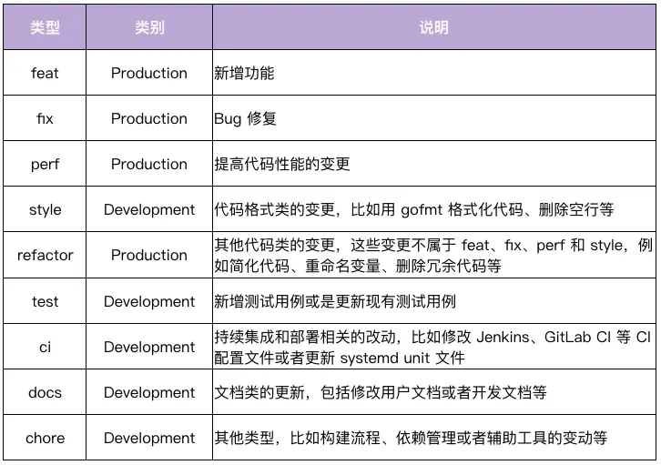
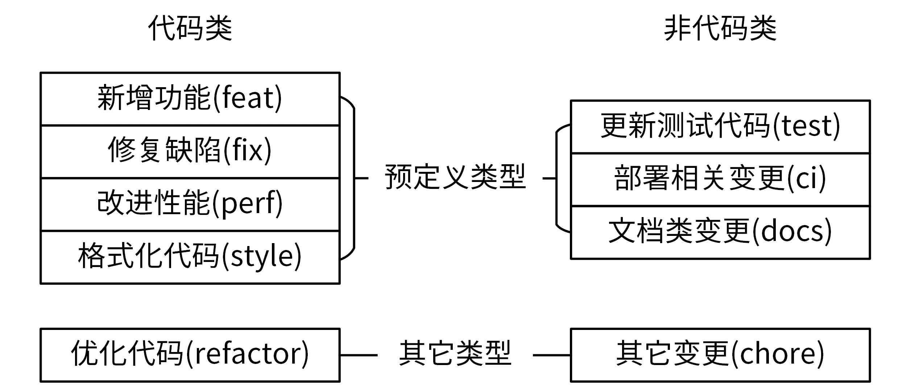
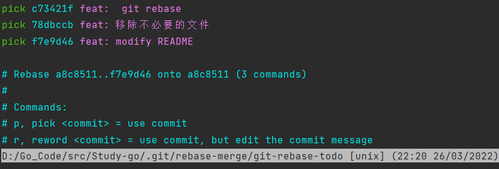
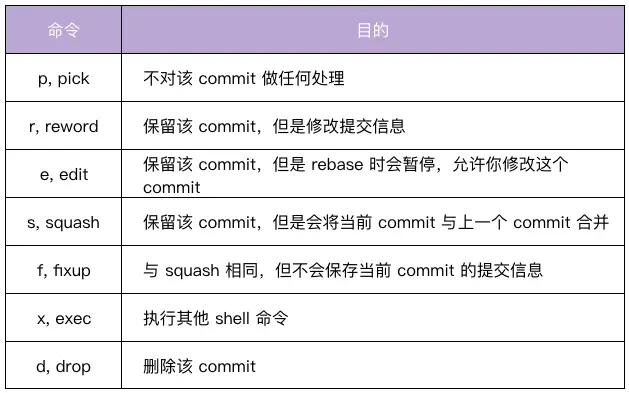
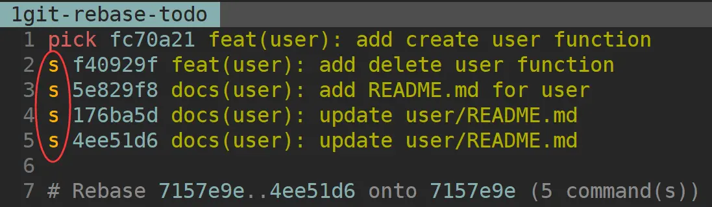
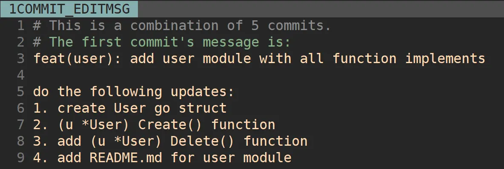
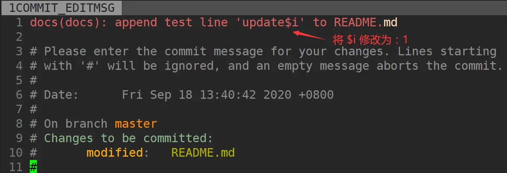
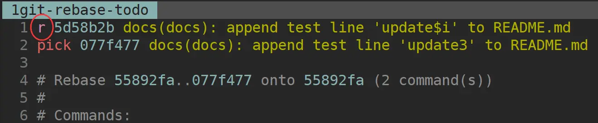
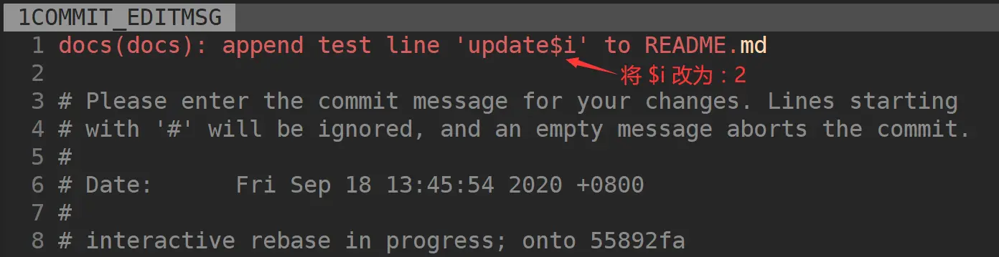

# Commit Message作用

- 清晰地知道每个commit的变更内容。
- 可以基于规范化的Commit Message **生成Change Log**。
- 可以依据某些类型的Commit Message **触发构建或者发布流程**，比如当type类型为feat、fix才触发CI流程。
- **确定语义化版本的版本号**。比如fix类型可以映射为PATCH版本，feat类型可以映射为MINOR版本。带有BREAKING CHANGE的commit可以映射为MAJOR版本。

# Commit Message规范
业界使用最多的是Angular规范，该规范定义Commit Message由三部分构成：Header、Body和Footer。
```shell
<type>[optional scope]: <description> #<scope>必须用括号()括起来，<type>[<scope>]后必须紧跟冒号，冒号后必须紧跟空格。
// 空行
[optional body]
// 空行
[optional footer(s)]
```

## Header(必选)：
**对本次commit的高度概括**。

### Type
用来说明commit的类型，主要分为Development和Production两类。
- Development：一般是项目管理类的变更，不会影响最终用户和生产环境的代码，比如CI流程、构建方式等的修改。这类修改通常也意味着可以免测发布。
- Production：会影响最终用户和生产环境的代码。这种变动，在提交前需要做好充分的测试。



怎样确认一个commit所属的type:变更了应用代码，如果不属于预定义的4类，就都归为refactor类。


### scope
用来说明commit的影响范围，它必须是名词。不同项目会有不同的scope，比如可以按照组件或功能来设置：apiserver、authzserver、user。

scope不宜设置太具体的值。过于具体一方面会导致项目有太多的scope，难以维护。另一方面，开发者也难以确认commit属于哪个具体的scope。

在指定scope时，也需要遵循预先规划的scope，所以需要将scope文档化，放在类似devel文档中。

### description
是commit的简短描述，必须以动词开头、使用现在时，而且这个动词的第一个字母必须是小写，结尾不能加句号。


## Body(可选)：
对本次commit的详细描述，以动词开头，使用现在时。还必须要包括修改的动机，和跟上一版本相比的改动点。
```shell
The body is mandatory for all commits except for those of scope "docs". When the body is required it must be at least 20 characters long.
```
## Footer(可选）：
说明本次commit导致的后果。在实际应用中，通常用来**说明不兼容的改动和关闭的Issue列表**。
```shell
BREAKING CHANGE: <breaking change summary>
// 空行
<breaking change description + migration instructions>
// 空行
// 空行
Closes #<issue number>
```
- 不兼容的改动：如果当前代码跟上一个版本不兼容，需要在Footer部分，以BREAKING CHANGE:开头，后面跟上不兼容改动的摘要。Footer的其他部分需要说明变动的描述、变动的理由和迁移方法，例如：
```shell
BREAKING CHANGE: isolate scope bindings definition has changed and
    the inject option for the directive controller injection was removed.
    To migrate the code follow the example below:
    Before:
    scope: {
      myAttr: 'attribute',
    }
    After:
    scope: {
      myAttr: '@',
    }
    The removed `inject` wasn't generaly useful for directives so there should be no code using it.
```
- 关闭的Issue列表：关闭的Bug需要在Footer部分新建一行，并以Closes开头列出，例如：Closes #123。如果关闭了多个Issue，可以这样列出Closes #123,#432,#886。例如:
```shell 
Closes #1137
```
符合Angular规范的Commit Message：
```shell
fix($compile): couple of unit tests for IE9
# Please enter the Commit Message for your changes. Lines starting
# with '#' will be ignored, and an empty message aborts the commit.
# On branch master
# Changes to be committed:
# ...

Older IEs serialize html uppercased, but IE9 does not...
Would be better to expect case insensitive, unfortunately jasmine does
not allow to user regexps for throw expectations.

Closes #392
Breaks foo.bar api, foo.baz should be used instead
```

# 合并提交
合并提交，就是将多个commit合并为一个commit提交。

## git rebase命令介绍
git rebase最大的作用是重写历史。通过`git rebase -i <commit ID>`命令可以进入交互界面，该界面会列出指定<commit ID>之前的所有commit。
每个commit之前都有一个操作命令(默认pick)。可以根据实际情况，修改commit前面的命令。




## git rebase 例子
1. 基于master分支新建一个分支。
```shell
$ git checkout -b feature/user
Switch to a new branch 'feature/user'
```
2. 在新分支上进行开发并提交commit。
```shell
$ git log --oneline
4ee51d6 docs(user): update user/README.md
176ba5d docs(user): update user/README.md
5e829f8 docs(user): add README.md for user
f40929f feat(user): add delete user function
fc70a21 feat(user): add create user function #(feature/user分支的第一次commit提交)
# 以下为master分支的提交历史
7157e9e docs(docs): append test line 'update3' to README.md
5a26aa2 docs(docs): append test line 'update2' to README.md
55892fa docs(docs): append test line 'update1' to README.md
89651d4 docs(doc): add README.md
```
3. 将新提交的5个commit合并为一个新的commit。
```shell
$ git rebase -i 7157e9e
```
进入交互界面，将需要合并的4个commit都执行squash，修改完成后执行`:wq`保存，然后进入`commit message`界面。




4. 检查rebase是否成功。
```shell
$ git log --oneline
d6b17e0 feat(user): add user module with all function implements
7157e9e docs(docs): append test line 'update3' to README.md
5a26aa2 docs(docs): append test line 'update2' to README.md
55892fa docs(docs): append test line 'update1' to README.md
89651d4 docs(doc): add README.md
```
5. 将`feature/user`分支合并到master分支。
```shell
$ git checkout master
$ git merge feature/user
$ git log --oneline
d6b17e0 feat(user): add user module with all function implements
7157e9e docs(docs): append test line 'update3' to README.md
5a26aa2 docs(docs): append test line 'update2' to README.md
55892fa docs(docs): append test line 'update1' to README.md
89651d4 docs(doc): add README.md
```
### 注意事项
- `git rebase -i <commit ID>`这里一定是最旧commit的父commit ID。
- 需要保证最新的一个commit是`pick`状态。

# 修改Commit Message
针对不符合规范的commit，我们需要对其进行修改。主要以下两种方法：
- git commit --amend：修改最近一次commit的message。
- git rebase -i：修改指定commit的message。

## git commit --amend
1. 查看当前分支的提交记录。
```shell
$ git log --oneline
418bd4 docs(docs): append test line 'update$i' to README.md
89651d4 docs(doc): add README.md
```
2. 修改最近一次提交的commit message。
```shell
$ git commit --amend
```
进入交互界面，修改commit message并执行`:wq`保存退出。



3. 查看是否更新。
```shell
$ git log --oneline
55892fa docs(docs): append test line 'update1' to README.md
89651d4 docs(doc): add README.md
```

## git rebase -i
1. 查看当前分支提交记录。
```shell
$ git log --oneline
1d6289f docs(docs): append test line 'update3' to README.md
a38f808 docs(docs): append test line 'update$i' to README.md
55892fa docs(docs): append test line 'update1' to README.md
89651d4 docs(doc): add README.md
```
2. 修改倒数第3次的commit message。
```shell
$ git rebase -i 55892fa # 倒数第三次commit的父commit ID
```
进入交互界面，使用reword或者r，保留倒数第3次的变更信息，但修改其message，执行`:wq`进行新的交互界面。





3. 查看是否更新。
```shell
$ git log --oneline
7157e9e docs(docs): append test line 'update3' to README.md
5a26aa2 docs(docs): append test line 'update2' to README.md
55892fa docs(docs): append test line 'update1' to README.md
89651d4 docs(doc): add README.md
```

# Commit Message规范自动化
- 借助`自动化工具`生成符合规范的Commit Message、提交前检查、历史检查。
- 借助`自动化工具`基于Commit Message生成CHANGELOG和SemVer。

自动化工具：
- commitizen-go：交互模式，并根据提示生成 Commit Message，然后提交。
- commit-msg：commit-msg 是个脚本，可以根据需要自己写脚本实现。
- go-gitlint：检查提交历史中的commit是否符合规范，可用于CI流程。
- gsemver：语义化版本生成工具。
- git-chglog：自动生成CHANGELOG。