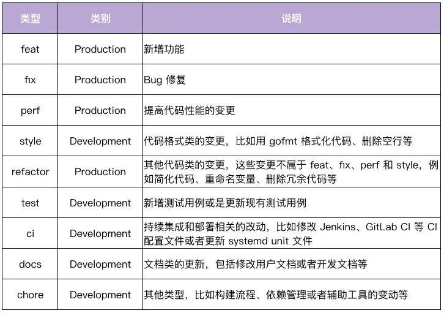
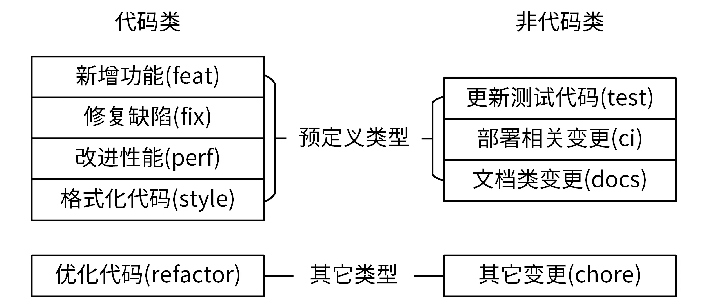
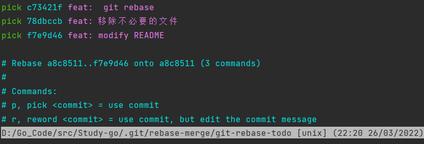
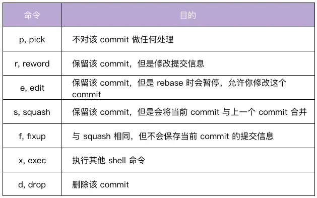

# Commit Message作用

- 清晰地知道每个commit的变更内容。
- 可以基于规范化的Commit Message **生成Change Log**。
- 可以依据某些类型的Commit Message **触发构建或者发布流程**，比如当type类型为feat、fix才触发CI流程。
- **确定语义化版本的版本号**。比如fix类型可以映射为PATCH版本，feat类型可以映射为MINOR版本。带有BREAKING CHANGE的commit可以映射为MAJOR版本。

# Commit Message规范
业界使用最多的是Angular规范，该规范定义Commit Message由三部分构成：Header、Body和Footer。
```shell
<type>[optional scope]: <description> #<scope>必须用括号()括起来，<type>[<scope>]后必须紧跟冒号，冒号后必须紧跟空格。
// 空行
[optional body]
// 空行
[optional footer(s)]
```

## Header(必选)：
**对本次commit的高度概括**。

### Type
用来说明commit的类型，主要分为Development和Production两类。
- Development：一般是项目管理类的变更，不会影响最终用户和生产环境的代码，比如CI流程、构建方式等的修改。这类修改通常也意味着可以免测发布。
- Production：会影响最终用户和生产环境的代码。这种变动，在提交前需要做好充分的测试。



怎样确认一个commit所属的type:变更了应用代码，如果不属于预定义的4类，就都归为refactor类。


### scope
用来说明commit的影响范围，它必须是名词。不同项目会有不同的scope，比如可以按照组件或功能来设置：apiserver、authzserver、user。

scope不宜设置太具体的值。过于具体一方面会导致项目有太多的scope，难以维护。另一方面，开发者也难以确认commit属于哪个具体的scope。

在指定scope时，也需要遵循预先规划的scope，所以需要将scope文档化，放在类似devel文档中。

### description
是commit的简短描述，必须以动词开头、使用现在时，而且这个动词的第一个字母必须是小写，结尾不能加句号。


## Body(可选)：
对本次commit的详细描述，以动词开头，使用现在时。还必须要包括修改的动机，和跟上一版本相比的改动点。
```shell
The body is mandatory for all commits except for those of scope "docs". When the body is required it must be at least 20 characters long.
```
## Footer(可选）：
说明本次commit导致的后果。在实际应用中，通常用来**说明不兼容的改动和关闭的Issue列表**。
```shell
BREAKING CHANGE: <breaking change summary>
// 空行
<breaking change description + migration instructions>
// 空行
// 空行
Closes #<issue number>
```
- 不兼容的改动：如果当前代码跟上一个版本不兼容，需要在Footer部分，以BREAKING CHANGE:开头，后面跟上不兼容改动的摘要。Footer的其他部分需要说明变动的描述、变动的理由和迁移方法，例如：
```shell
BREAKING CHANGE: isolate scope bindings definition has changed and
    the inject option for the directive controller injection was removed.
    To migrate the code follow the example below:
    Before:
    scope: {
      myAttr: 'attribute',
    }
    After:
    scope: {
      myAttr: '@',
    }
    The removed `inject` wasn't generaly useful for directives so there should be no code using it.
```
- 关闭的Issue列表：关闭的Bug需要在Footer部分新建一行，并以Closes开头列出，例如：Closes #123。如果关闭了多个Issue，可以这样列出Closes #123,#432,#886。例如:
```shell 
Closes #1137
```
符合Angular规范的Commit Message：
```shell
fix($compile): couple of unit tests for IE9
# Please enter the Commit Message for your changes. Lines starting
# with '#' will be ignored, and an empty message aborts the commit.
# On branch master
# Changes to be committed:
# ...

Older IEs serialize html uppercased, but IE9 does not...
Would be better to expect case insensitive, unfortunately jasmine does
not allow to user regexps for throw expectations.

Closes #392
Breaks foo.bar api, foo.baz should be used instead
```

# 合并提交
合并提交，就是将多个commit合并为一个commit提交。

## git rebase命令介绍
git rebase最大的作用是重写历史。通过`git rebase -i <commit ID>`命令可以进入交互界面，该界面会列出指定<commit ID>之前的所有commit。
每个commit之前都有一个操作命令(默认pick)。可以根据实际情况，修改commit前面的命令。


