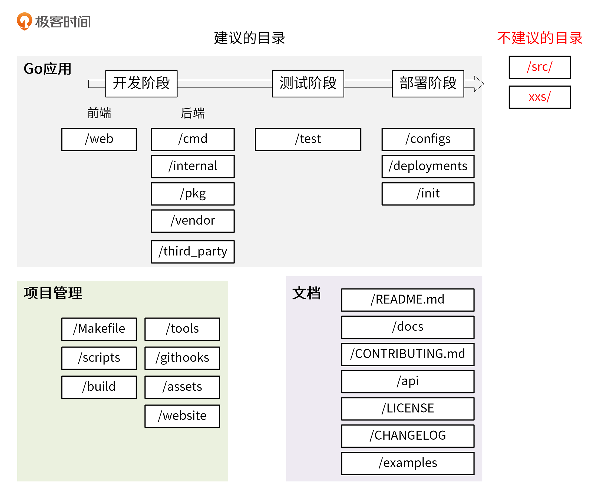

# 引入
根据功能，目录结构分为`平铺式`和`结构化`。
- 平铺式目录：主要用在**Go包**中。
- 结构化目录：主要用在**Go应用**中。

# 平铺式目录
在根目录下存放代码，整个目录看起来像一层。
```shell
$ ls glog/
glog_file.go  glog.go  glog_test.go  LICENSE  README
```
# 结构化目录
IMA目录结构
```shell
├── api
│   ├── openapi
│   └── swagger
├── build
│   ├── ci
│   ├── docker
│   │   ├── iam-apiserver
│   │   ├── iam-authz-server
│   │   └── iam-pump
│   ├── package
├── CHANGELOG
├── cmd
│   ├── iam-apiserver
│   │   └── apiserver.go
│   ├── iam-authz-server
│   │   └── authzserver.go
│   ├── iamctl
│   │   └── iamctl.go
│   └── iam-pump
│       └── pump.go
├── configs
├── CONTRIBUTING.md
├── deployments
├── docs
│   ├── devel
│   │   ├── en-US
│   │   └── zh-CN
│   ├── guide
│   │   ├── en-US
│   │   └── zh-CN
│   ├── images
│   └── README.md
├── examples
├── githooks
├── go.mod
├── go.sum
├── init
├── internal
│   ├── apiserver
│   │   ├── api
│   │   │   └── v1
│   │   │       └── user
│   │   ├── apiserver.go
│   │   ├── options
│   │   ├── service
│   │   ├── store
│   │   │   ├── mysql
│   │   │   ├── fake
│   │   └── testing
│   ├── authzserver
│   │   ├── api
│   │   │   └── v1
│   │   │       └── authorize
│   │   ├── options
│   │   ├── store
│   │   └── testing
│   ├── iamctl
│   │   ├── cmd
│   │   │   ├── completion
│   │   │   ├── user
│   │   └── util
│   ├── pkg
│   │   ├── code
│   │   ├── options
│   │   ├── server
│   │   ├── util
│   │   └── validation
├── LICENSE
├── Makefile
├── _output
│   ├── platforms
│   │   └── linux
│   │       └── amd64
├── pkg
│   ├── util
│   │   └── genutil
├── README.md
├── scripts
│   ├── lib
│   ├── make-rules
├── test
│   ├── testdata
├── third_party
│   └── forked
└── tools
```


## Go应用

### 存放前后端代码相关文件
1. /web：存放Web静态资源。
2. /cmd：存放各个组件的入口文件。
```shell
$ ls cmd/
gendocs  geniamdocs  genman  genswaggertypedocs  genyaml  iam-apiserver  iam-authz-server  iamctl  iam-pump
$ ls cmd/iam-apiserver/
apiserver.go
```
3. /internal：存放私有应用和库代码。
- /internal/appname：存放应用代码。
- /internal/pkg：存放/internal目录下各个应用共享的代码，如：错误码、用户检验等功能。

**IAM项目的internal目录**
```shell
├── apiserver
│   ├── api
│   │   └── v1
│   │       └── user
│   ├── options
│   ├── config
│   ├── service
│   │   └── user.go
│   ├── store
│   │   ├── mysql
│   │   │   └── user.go
│   │   ├── fake
│   └── testing
├── authzserver
│   ├── api
│   │   └── v1
│   ├── options
│   ├── store
│   └── testing
├── iamctl
│   ├── cmd
│   │   ├── cmd.go
│   │   ├── info
└── pkg
    ├── code
    ├── middleware
    ├── options
    └── validation
```
- /internal/pkg：内部共享包存放的目录。
- /internal/apiserver、/internal/authzserver、/internal/iamctl：应用目录。
- /internal/iamctl：客户端工具。

每个应用内部的目录结构，主要根据功能划分：
- /internal/apiserver/api/v1：HTTP API接口实现。
- /internal/apiserver/options：应用的command flag。
- /internal/apiserver/config：根据命令行参数创建应用配置。
- /internal/apiserver/service：存放应用复杂的业务处理代码。
- /internal/apiserver/store：存放与存储(redis、mysql)交互的代码。

/internal/pkg目录通常包含以下目录：
- /internal/pkg/code：业务Code码。
- /internal/pkg/validation：一些通用检验函数。
- /internal/pkg/middleware：HTTP处理链。

4. /pkg：存放可以被外部应用使用的代码库。
5. /vendor：存放项目依赖。
6. /third_party：存放外部帮助工具。比如：fork了一个第三方Go包，并做了一些小的改动，可以放在目录/third_party/forked下。

### 存放测试相关文件和代码
7. /test：存放外部测试应用和测试数据。

### 存放部署相关文件
8. /configs：存放`配置文件模板或默认配置`。
```shell
apiVersion: v1    
user:    
  username: ${CONFIG_USER_USERNAME} # iam 用户名    
  password: ${CONFIG_USER_PASSWORD} # iam 密码
```
9. /deployments：存放容器部署的`配置和模板`。
10. /init：存放**系统初始化**(systemd/upstart/sysv)和**进程管理**配置文件(supervisord/runit)。这类文件，在非容器化部署的项目中会用到。
## 项目管理
11. /Makefile：通常用来执行静态代码检查、单元测试、编译等功能。`make流程：gen -> format -> lint -> test -> build`
12. /scripts：存放脚本文件，实现构建、安装、分析等不同功能。
- /scripts/make-rules：存放makefile文件，实现/Makefile文件中的各个功能。
- /scripts/lib：存放shell脚本，抽象成lib库。
- /scripts/install：存放自动化部署脚本。
13. /build：存放安装包和持续集成相关文件。
- /build/package：存放容器、系统(deb/rpm)的包配置和脚本。
- /build/ci：存放CI(travis/circle/drone)的配置文件和脚本。
- /build/docker：存放各个组件的Dockerfile文件。
14. /tools：存放这个项目的支持工具。这些工具可导入来自 /pkg 和 /internal 目录的代码。
15. /githooks：Git钩子。比如：可以将commit-msg放在该目录。
16. /assets：存放项目使用的其它资源(图片/CSS/JS等)
17. /website：如果你不使用 GitHub 页面，那么可以在这里放置项目网站相关的数据。

## 文档
18. /README.md：项目的介绍、功能、快速安装和使用指引、详细的文档链接以及开发指引等，**可通过脚本或工具自动生成**。
19. /docs：存放`设计、开发、使用`等文档。
- /docs/devel/{en-US,zh-CN}：存放开发、hack等文档。
- /docs/guide/{en-US,zh-CN}：存放用户手册，安装、quickstart、产品文档等。
- /docs/images：存放图片文件。
20. /CONTRIBUTING.md：如果是一个开源就绪的项目，CONTRIBUTING.md文件用来说明如何贡献代码，如何开源协同等等。
21. /api：存放**对外**提供的各种类型的API接口定义文件。
```shell
├── openapi/
│   └── README.md
└── swagger/
    ├── docs/
    ├── README.md
    └── swagger.yaml
```
22. /LICENSE：存放版权文件。
23. /CHANGELOG：存放变更记录文件。
24. /example：存放应用程序或者公共包的示例代码。