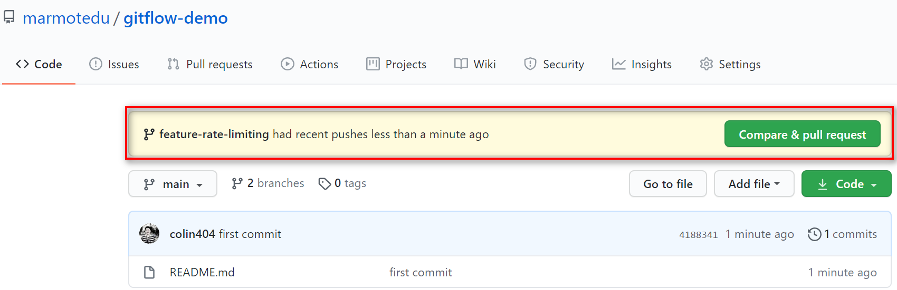

# 引入
在使用Git开发时，有4种常用的工作流：`集中式工作流、功能分支工作流、Git Flow工作流和Forking工作流`。

# 集中式工作流
开发者直接在本地master分支开发代码，开发完成后push到远端仓库master分支。

- 缺点：不同开发人员的提交混合在一起，难以定位问题；合并代码容易产生冲突。
# 功能分支工作流
开发者基于master分支创建一个新分支，在新分支进行开发，开发完成后合并到远端仓库master分支。


- 优点：合并到master分支时，需要提交PR，而不是直接merge。PR不仅可以让团队其它开发人员进行CR(Code Review)，
而且还能在PR页面进行讨论，有助于提升代码质量。

流程：
1. 基于master分支新建一个功能分支。
```shell
$ git checkout -b feature/rate-limiting
```
2. 在功能分支上进行代码开发。
```shell
$ git add limit.go
$ git commit -m "add rate limiting"
```
3. 将本地功能分支push到远程仓库。
```shell
$ git push origin feature/rate-limiting
```
4. 在远程仓库上创建PR。


5. 管理员审核PR。


Merge pull request提供了3种merge方法：
- **Create a merge commit(推荐)**：底层操作是`git merge --no-ff`。feature分支上所有commit都会加到master分支上，并且
会生成一个新的merge commit。
- **Squash and merge**：底层操作是`git merge --squash`。feature分支上的所有commit合并成一个commit，然后加到master
分支上，同时feature分支原有的历史commit会丢失。适合开发人员在feature分支上提交的commit非常随意。
- **Rebase and merge(不推荐)**：底层操作是`git rebase`。将feature分支的所有提交历史按原有顺序添加到master分支的头部。

# Git Flow工作流
Git Flow 工作流**为不同的分支分配一个明确的角色**，并定义分支之间什么时候、如何进行交互，比较适合大型项目的开发。
## Git Flow的5种分支
Git Flow中定义了5种分支，分别是master、develop、feature、release和hotfix。其中master和develop为常驻分支，其它
为非常驻分支，不同阶段会用到不同的分支。


### 例子
场景如下：
1. 当前版本：v0.9.0。
2. 需要开发一个新功能，使程序执行时向标准输出输出“hello world”字符串。
3. 在开发阶段，线上有Bug需紧急修复。

详细开发流程：
1. 创建一个常驻分支：develop
```shell
$ git checkout -b develop master
```
2. 基于develop分支，新建一个功能分支：feature/print-hello-world。
```shell
$ git checkout -b feature/print-hello-world master
```
3. 开发新功能。
```go
package main

import "fmt"

func main()  {
	fmt.Println("callmainfunction")
    fmt.Println("Hello")
}
```
4. 紧急修复Bug。
正在开发新功能还没有完成(暂时输出Hello)，需要立即停止开发，修复线上Bug。
```shell
$ git stash # 1.开发工作只完成一半，还不想提交，可以临时保存修改到堆栈区。
$ git checkout -b hotfix/print-error master # 2.基于master分支建立hotfix分支。
$ vim main.go # 3.修复bug，callmainfunction -> call main function。
$ git commit -a -m "fix print message error bug" # 4.提交修改。
$ git checkout develop # 5.切换到develop分支。
$ git merge --no-ff hotfix/print-error # 6.把hotfix分支合并到develop分支。
$ git checkout master # 7.切换到master分支
$ git merge --no-ff hotfix/print-error # 8.把hotfix分支合并到master分支。
$ git tag -a v0.9.1 -m "fix log bug" # 9.master分支打tag。
$ git build -v . # 10.编译代码，并将二级制包更新到生产环境。
$ git checkout -d hotfix/print-error # 11.修复好后，删除hotfix/print-error分支。
$ git checkout feature/print-hello-world # 12.切换到开发分支下
$ git merge --no-ff develop # 13.因为develop有更新，这里最好同步更新一下。
$ git stash pop # 14.恢复到修复前的工作状态。
```
5. 继续开发。
在main.go中加入`fmt.Println("Hello World")`。
6. 提交commit。
```shell
$ git commit -a -m "print 'Hello World' "
```
7. 提PR。

首先将feature/print-hello-world分支push到远程仓库，如GitHub。
```shell
$ git push origin feature/print-hello-world
```
然后基于feature/print-hello-world创建PR。


创建完PR后，就可以指定Reviewers进行 code review。


8. code review通过后，由代码仓库matainer将功能分支合并到develop分支。
```shell
$ git checkout develop
$ git merge --no-ff feature/print-hello-world
```
9. 基于develop分支，创建release分支，测试代码。
```shell
$ git checkout -b release/1.0.0 develop
$ go build -v . # 编译构建，部署二进制文件，并测试。
```
10. 测试失败，需要打印`hello world`，实际打印`Hello World`。修复的时候直接在release/1.0.0分支修改
代码，修改完成后，提交并编译部署。
```shell
$ git commit -a -m "fix bug"
$ git build -v .
```
11. 通过测试后，将功能分支合并到develop和master分支。
```shell
$ git checkout develop
$ git merge --no-ff release/1.0.0
$ git checkout master
$ git merge --no-ff release/1.0.0
$ git tag -a v1.0.0 -m "add print hello world" # master 分支打 tag
```
12. 删除 feature/print-hello-world 分支，也可以选择性删除 release/1.0.0 分支。
```shell
$ git branch -d feature/print-hello-world
```

# Forking工作流
开发者先fork项目到个人仓库，在个人仓库完成开发后，提交PR到目标远程仓库，远程仓库review后，合并PR到master分支。

# 总结


# 补充
1. 说一下我这边的Git工作流经验：我们会预设三个常驻分支，分别是Prod-生产分支、Pre-Prod-预发布分支、Dev-开发分支，master保留分支未使用。当有**新功能需要开发时，首先是从prod分支进行拉取个人开发分支**，因为此时dev可能会有其他同学开发的其他需求代码，但实际发布
时间未知，为了避免新功能发布时包含其他需求代码，所以要从prod分支新建个人开发分支，保证分支是“干净的”。个人本地开发测试后合并dev分支进行线上测试，没有问题再将分支合并至pre交付客户或非技术部门进行uat测试。最后将个人开发分支合并prod进行发布。