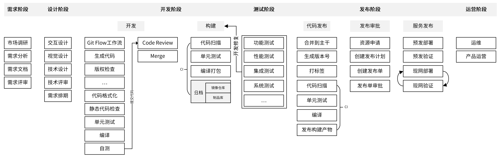
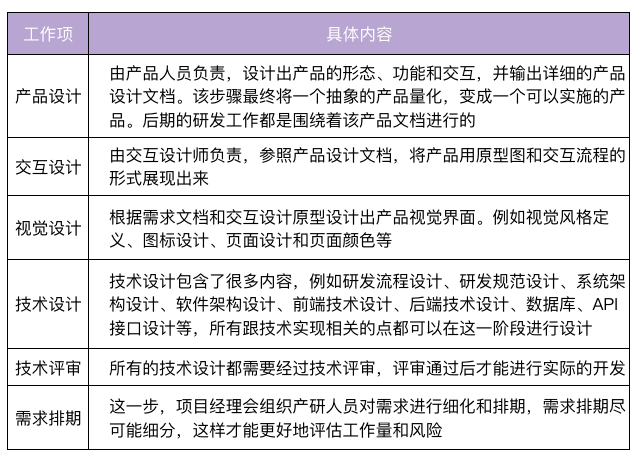
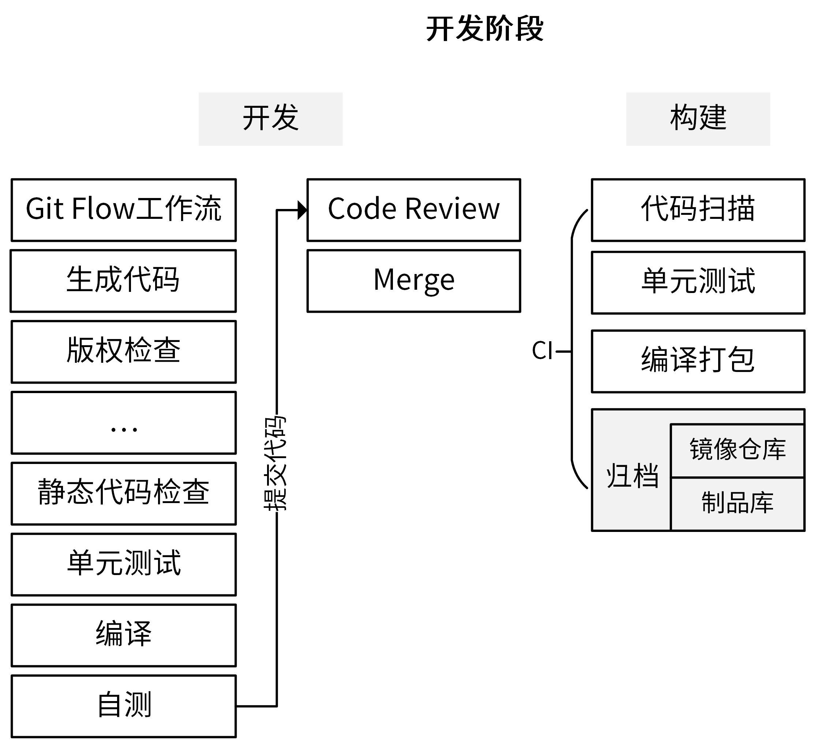
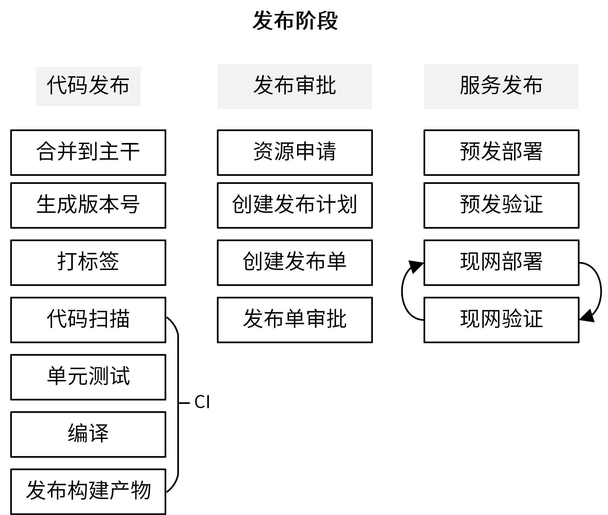
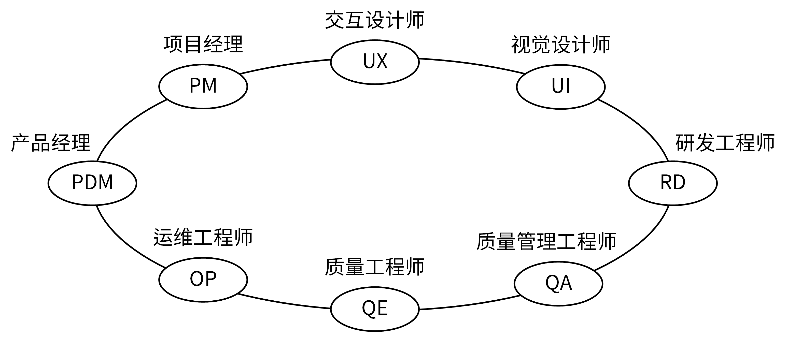
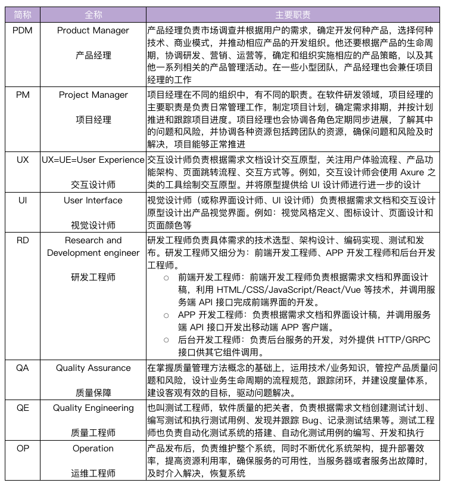
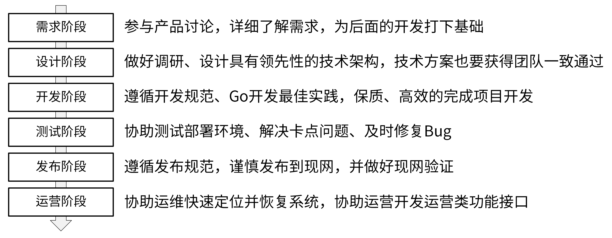

# 业界标准研发流程
研发流程分为六个阶段，分别是**需求阶段、设计阶段、开发阶段、测试阶段、发布阶段、运营阶段**。开发人员需要参与的阶段有 4 个：设计阶段、开发阶段、测试阶段和发布阶段。

每个阶段结束时，都需要有一个最终的产出物，可以是**文档、代码或者部署组件**等。

**研发流程也是一种规范**，很难靠开发者的自觉性去遵守。为了让项目参与人员尽可能地遵守规范，**需要借助一些工具、系统来对他们进行强约束**。

# 需求阶段
将一个抽象的产品思路具化成一个可实施产品。需求阶段的产出物是一个通过评审的**详细需求文档**。

# 设计阶段
是整个产品研发过程中非常重要的阶段，主要包括以下内容：

对于后端开发人员，在设计技术方案之前，要**做好充足的技术调研**。一个技术方案，不仅要调研业界优秀的实现，还有了解友商相同技术的实现。只有这样，才可以确保我们的技术用最佳的方式实现。

该阶段的产出物是一系列的**设计文档**，这些文档会指导后面的整个研发流程。

# 开发阶段
开发阶段是整个项目的核心阶段，包含很多工作内容，不同项目具体的步骤还不一样。以下是开发阶段的常见步骤：

整个开发阶段的步骤很多，而且很高频，如何提升效率？
- 将开发部分的步骤通过`Makefile`实现集中管理；
- 将构建部分的步骤通过`CI/CD平台`实现自动化。

开发阶段的产出物是满足需求的**源代码、开发文档**，以及编译后的**归档文件**。

# 测试阶段
研发人员在交付给测试时，要提供自测报告、自测用例和安装部署文档。

测试阶段的产出物是满足产品需求、达到发布条件的**源代码**，以及编译后的**归档文件**。

# 发布阶段
为了保证发布的效率和质量，我们需要遵循一定的发布流程：

**发布计划**：详细描述本次的变更详情，例如变更范围、发布方案、测试结果、验证和回滚方案等。**在创建发布计划时，一定要全面梳理这次变更的影响点**。例如，是否有不兼容的变更，是否需要变更配置，是否需要变更数据库等。任何一个遗漏，都可能造成现网故障，影响产品声誉和用户使用。

发布阶段的产出物是**正式上线的软件**。

# 运营阶段
该阶段主要分为产品运营和运维两个部分。
- 产品运营：通过一系列的运营活动来推高整个产品的知名度，提高产品的用户数量，并提高月活和日活。
- 运维：核心目标是确保系统稳定的运行。

在运营阶段，研发人员的主要职责就是**协助运维解决现网Bug，优化部署架构**。当然，研发人员可能也需要配合运营人员**开发一些运营接口**，供运营人员使用。

# 职责分工

# 总结

总结：
1. 软件研发流程涉及六个阶段：需求阶段、设计阶段、开发阶段、测试阶段、发布阶段、运营阶段。
2. 需求阶段，基本不关心；
3. 设计阶段：交互设计、视觉设计、技术设计、技术评审、排期；
4. 开发阶段：掌握 Makefile、Git FLow、gitlab CI，结合各种效率工具，打造高效的 CI 过程。
5. 测试阶段：提测报告、自测报告；
6. 发布阶段：资源申请，发布单，催审批、流量灰度或副本粒度灰度，自动化测试用例，回滚。

**《不能自动化的流程，都是阻碍效率的》**