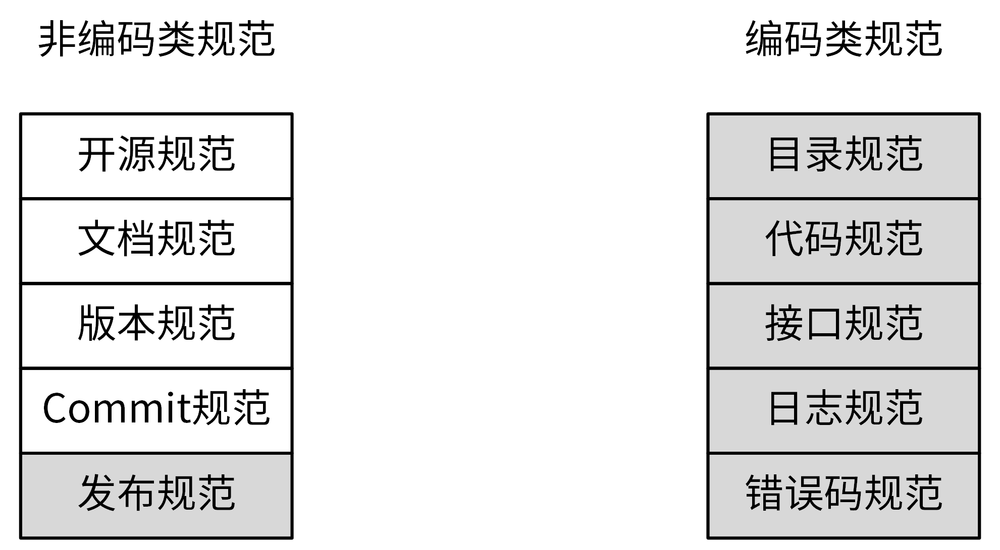
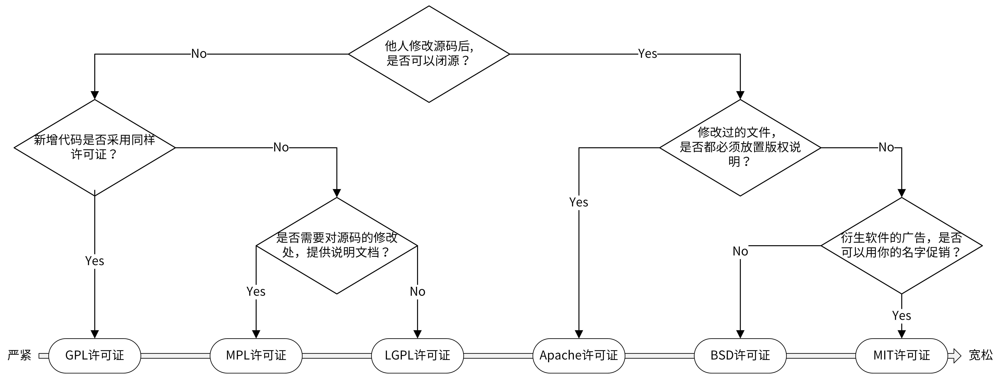
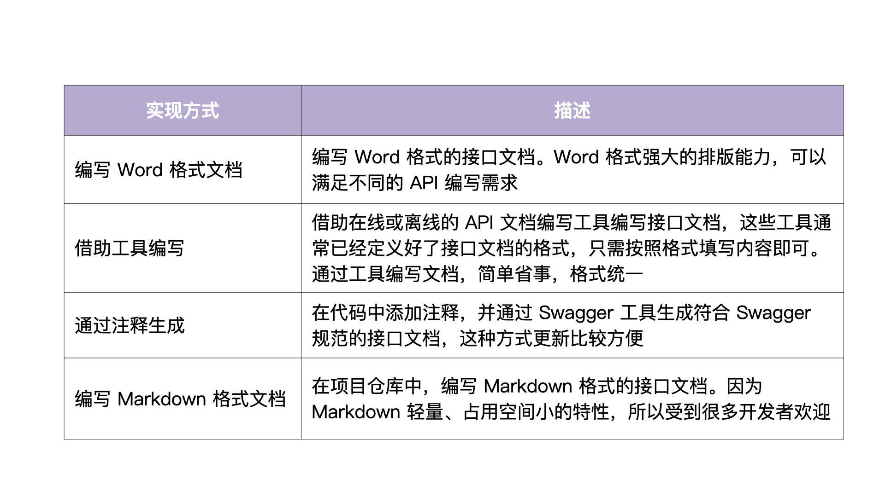

# 开发规范
按照是否与代码相关进行区分。

- 非编码类规范：开源规范、文档规范、版本规范、Commit规范、发布规范。
- 编码类规范：目录规范、代码规范、接口规范、日志规范、错误码规范。



## 开源规范
以开源项目要求来规范自己的项目，可以更好地驱动项目质量。但业界没有统一的开源协议。

### 开源协议
开源项目一定需要开源协议，开源协议规定了在使用开源软件时的权利和责任。

业界有上百种开源协议，常用的就GPL、MPL、LGPL、Apache、BSD和MIT六种。



### 开源规范补充
- 高单元覆盖率：确保第三方开发者在开发完代码之后，能够很方便地对整个项目做详细的单元测试，另一方面也能保证提交代码的质量。
- 提交记录无敏感信息：不能出现内部 IP、内部域名、密码、密钥这类信息。
- 及时反馈问题：及时处理其它开发者的PR、issue。
- 持续维护：持续更新功能，修复Bug。

## 文档规范
文档属于软件交付的重要组成部分，没有文档的项目很难理解、部署和使用。
一个项目中最需要的3类文档包括`README文档、项目文档和API接口文档`。

### README规范
用来介绍项目的功能、安装、部署和使用，它是可规范化的。

```html
项目名称
<!-- 写一段简短的话描述项目 -->
## 功能特性
<!-- 描述该项目的核心功能点 -->
## 软件架构(可选)
<!-- 可以描述下项目的架构 -->
## 快速开始
### 依赖检查
<!-- 描述该项目的依赖，比如依赖的包、工具或者其他任何依赖项 -->
### 构建
<!-- 描述如何构建该项目 -->
### 运行
<!-- 描述如何运行该项目 -->
## 使用指南
<!-- 描述如何使用该项目 -->
## 如何贡献
<!-- 告诉其他开发者如果给该项目贡献源码 -->
## 社区(可选)
<!-- 如果有需要可以介绍一些社区相关的内容 -->
## 关于作者
<!-- 这里写上项目作者 -->
## 谁在用(可选)
<!-- 可以列出使用本项目的其他有影响力的项目，算是给项目打个广告吧 -->
## 许可证
<!-- 这里链接上该项目的开源许可证 -->
更具体的示例，你可
```

### 项目文档规范
项目文档通常集中放在/docs目录下，在制定项目文档规范时，通常考虑以下两类文档。

- 开发文档：说明项目的开发流程。比如：如何搭建开发环境、构建二进制文件、测试、部署等。
- 用户文档：软件的使用文档。比如：API文档、SDK文档、安装文档、功能介绍文档、最佳实践、操作指南、常见问题等。

```bash
docs
├── devel                            # 开发文档，可以提前规划好，英文版文档和中文版文档
│   ├── en-US/                       # 英文版文档，可以根据需要组织文件结构
│   └── zh-CN                        # 中文版文档，可以根据需要组织文件结构
│       └── development.md           # 开发手册，可以说明如何编译、构建、运行项目
├── guide                            # 用户文档
│   ├── en-US/                       # 英文版文档，可以根据需要组织文件结构
│   └── zh-CN                        # 中文版文档，可以根据需要组织文件结构
│       ├── api/                     # API文档
│       ├── best-practice            # 最佳实践，存放一些比较重要的实践文章
│       │   └── authorization.md
│       ├── faq                      # 常见问题
│       │   ├── iam-apiserver
│       │   └── installation
│       ├── installation             # 安装文档
│       │   └── installation.md
│       ├── introduction/            # 产品介绍文档
│       ├── operation-guide          # 操作指南，里面可以根据RESTful资源再划分为更细的子目录，用来存放系统核心/全部功能的操作手册
│       │   ├── policy.md
│       │   ├── secret.md
│       │   └── user.md
│       ├── quickstart               # 快速入门
│       │   └── quickstart.md
│       ├── README.md                # 用户文档入口文件
│       └── sdk                      # SDK文档
│           └── golang.md
└── images                           # 图片存放目录
    └── 部署架构v1.png
```

### API文档规范
API文档的作用：
- 项目初期：解耦前后端。前端只需按API文档实现调用逻辑，后端只需按API文档提供功能。
- 项目中期：前后端直接联调，提高研发效率。
- 项目后期：提供给使用者，降低组件使用门槛，降低沟通成本。

API文档的编写有多种方式，通过注释生成和编写Markdown这2种方式用得最多。


` swagger只提供了接口文档。但是一个项目还有很多其他类型的文档，例如：如何使用、架构介绍等。`

一个规范的API接口文档，通常需要包含一个完整的API接口介绍文档、API 接口变更历史文档、通用说明、数据结构说明、错误码描述和 API 接口使用文档。API 接口使用文档中需要包含接口描述、请求方法、请求参数、输出参数和请求示例。

举例：目录docs/guide/zh-CN/api中
- README.md:API接口介绍文档，分类介绍不同的API接口，并存放相关的API接口文档链接。
- CHANGELOG.md:API接口文档变更历史。
- generic.md:说明通用请求参数、返回参数、认证方法和请求方法等。
- struct.md:说明API接口文档中使用的数据结构。
- user.md、secret.md:API接口文档，相同REST资源接口放在同一个文件中。
- error_code.md:错误码描述，通过程序自动生成。

## 版本规范
业界主流的版本规范是**语义化版本规范**。

### 何为语义化版本规范(SemVer)？
语义化版本规范规定了`版本号的表示、增加和比较方式，以及不同版本号代表的含义`。
它的格式为：`主版本号.次版本号.修订版本号(x.y.z)`，x、y、z为非负整数且禁止在数字前方补零。

版本号可以按以下规则递增：
- 主版本号：做了不兼容的API修改。
- 次版本号：做了向下兼容的功能性新增及修改。不成文规定，偶数为稳定版本，奇数为开发版本。
- 修订号：做了向下兼容的问题修正。

**另一种版本号格式：**

把先行版本号（Pre-release）和编译版本号，作为延伸加到了主版本号.次版本号.修订号的后面，格式为：`x.y.x[-先行版本号][+编译版本号]`


**先行版本号**：表示版本不稳定，可能存在兼容性问题，格式为：`x.y.z-[一串以句点分隔的标识符]`
```bash
1.0.0-alpha
1.0.0-alpha.1
1.0.0-0.3.7
1.0.0-x.7.z.92
```

**编译版本号**：一般是编译器在编译过程中自动生成，我们自定义格式，并不进行认为控制。
```bash
1.0.0-alpha+001
1.0.0+20130313144700
1.0.0-beta+exp.sha.5114f85
```

注意，**先行版本号和编译版本号只能是字母、数字，且不可以有空格**。

### 语义化版本控制规范
- 标记版本号的软件发行后，禁止改变该版本软件的内容，任何修改都必须以新版本发行。
- 主版本号为零（0.y.z）的软件处于开发初始阶段，一切都可能随时被改变，这样的公共 API 不应该被视为稳定版。1.0.0 的版本号被界定为第一个稳定版本，之后的所有版本号更新都基于该版本进行修改。
- 修订号 Z（x.y.Z | x > 0）必须在只做了向下兼容的修正时才递增，这里的修正其实就是 Bug 修复。
- 次版本号 Y（x.Y.z | x > 0）必须在有向下兼容的新功能出现时递增，在任何公共 API 的功能被标记为弃用时也必须递增，当有改进时也可以递增。其中可以包括修订级别的改变。每当次版本号递增时，修订号必须归零。
- 主版本号 X（X.y.z | X > 0）必须在有任何不兼容的修改被加入公共 API 时递增。其中可以包括次版本号及修订级别的改变。每当主版本号递增时，次版本号和修订号必须归零。

### 如何确定版本号？
- 在实际开发的时候，我建议你使用 0.1.0 作为第一个开发版本号，并在后续的每次发行时递增次版本号。
- 当我们的版本是一个稳定的版本，并且第一次对外发布时，版本号可以定为 1.0.0。
- 当我们严格按照 Angular commit message 规范提交代码时，版本号可以这么来确定：
  - fix 类型的 commit 可以将修订号 +1。
  - feat 类型的 commit 可以将次版本号 +1。
  - 带有 BREAKING CHANGE 的 commit 可以将主版本号 +1。