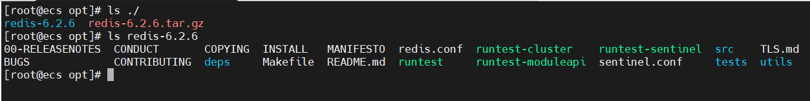
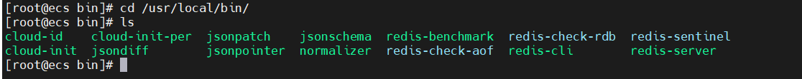
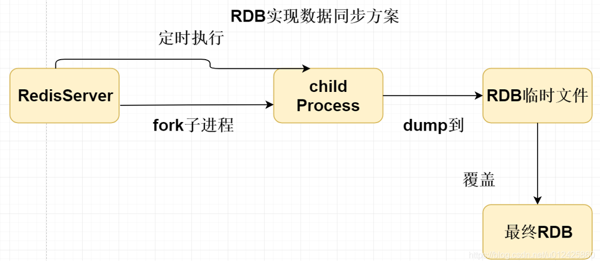

# 概述
>Redis是什么?

Redis(==Re==mote ==Di==ctionary ==S==erver):远程字典服务。

是一个开源的使用ANSI C语言编写、支持网络、可基于内存亦可持久化的日志型、Key-Value数据库，并提供多种语言的API。

redis会周期性的把更新的数据写入磁盘或者把修改操作写入追加的记录文件，并且在此基础上实现了master-slave(主从)同步。

>文档

- https://redis.io
- http://www.redis.cn
- http://www.redis.cn/topics/introduction
- https://www.redis.com.cn/redis-interview-questions.html

# Linux源码安装
1. 下载源码安装包
2. 上传到Linux并解压

3. 安装编译工具
```bash
yum install gcc-c++
```
4. 编译安装
```bash
[root@ecs redis-6.2.6]# make
cd src && make all
...

[root@ecs redis-6.2.6]# make install
cd src && make install
make[1]: Entering directory `/opt/redis-6.2.6/src'
    CC Makefile.dep
make[1]: Leaving directory `/opt/redis-6.2.6/src'
make[1]: Entering directory `/opt/redis-6.2.6/src'

Hint: It's a good idea to run 'make test' ;)

    INSTALL redis-server
    INSTALL redis-benchmark
    INSTALL redis-cli
make[1]: Leaving directory `/opt/redis-6.2.6/src'


```
5.Redis默认安装目录`/usr/local/bin`

```bash
[root@ecs bin]# cd /usr/local/bin/
[root@ecs bin]# ls
cloud-id    cloud-init-per  jsonpatch    jsonschema  redis-benchmark  redis-check-rdb  redis-sentinel
cloud-init  jsondiff        jsonpointer  normalizer  redis-check-aof  redis-cli        redis-server
```
6.拷贝配置文件至`/usr/local/bin`目录下。
```bash
[root@ecs bin]# cp /opt/redis-6.2.6/redis.conf ./
[root@ecs bin]# ls
cloud-id    cloud-init-per  jsonpatch    jsonschema  redis-benchmark  redis-check-rdb  redis.conf      redis-server
cloud-init  jsondiff        jsonpointer  normalizer  redis-check-aof  redis-cli        redis-sentinel
```
7.修改配置文件
```bash
# 将daemonize on 修改为yes，保证后台运行
daemonize yes
```
8.通过配置文件启动
```bash
[root@ecs bin]# ls
cloud-id    cloud-init-per  jsonpatch    jsonschema  redis-benchmark  redis-check-rdb  redis.conf      redis-server
cloud-init  jsondiff        jsonpointer  normalizer  redis-check-aof  redis-cli        redis-sentinel
[root@ecs bin]# redis-server redis.conf
```
9.连接Redis
```bash
[root@ecs bin]# ./redis-cli -h 127.0.0.1 -p 6379
127.0.0.1:6379> ping
PONG
127.0.0.1:6379> set name sunyuan
OK
127.0.0.1:6379> get name
"sunyuan"
127.0.0.1:6379> keys *
1) "name"
```
10.关闭Redis服务
```
[root@ecs bin]# ss -tunlp | grep 6379
tcp    LISTEN     0      128    127.0.0.1:6379                  *:*                   users:(("redis-server",pid=5780,fd=6))
tcp    LISTEN     0      128       [::1]:6379               [::]:*                   users:(("redis-server",pid=5780,fd=7))
[root@ecs bin]# ./redis-cli -h 127.0.0.1 -p 6379
127.0.0.1:6379> SHUTDOWN
not connected> exit
[root@ecs bin]# ss -tunlp | grep 6379
[root@ecs bin]# ps -ef | grep redis
root      5822  1230  0 00:17 pts/0    00:00:00 grep --color=auto redis
```

# 性能测试
redis-benchmark是一个官方自带的压力测试工具

| 选项          | 描述                                | 默认值       |
|-------------|-----------------------------------|-----------|
| -h          | 指定服务器主机名                          | 127.0.0.1 |
| -p          | 指定服务器端口                           | 6379      |
| -s          | 指定服务器 socket                      |           |
| -c          | 指定并发连接数                           | 50        |
| -n          | 指定请求数                             | 10000     |
| -d          | 以字节的形式指定 SET/GET 值的数据大小           | 3         |
| -k          | 1=keep alive 0=reconnect          | 1         |
| -r          | SET/GET/INCR 使用随机 key, SADD 使用随机值 |           |
| -P          | 通过管道传输 <numreq> 请求                | 1         |
| -q          | 强制退出 redis。仅显示 query/sec 值        |           |
| --csv       | 以 CSV 格式输出                        |           |
| -l（L 的小写字母） | 生成循环，永久执行测试                       |           |
| -t          | 仅运行以逗号分隔的测试命令列表                   |           |
| -I（i 的大写字母） | Idle 模式。仅打开 N 个 idle 连接并等待。       |           |

```bash
# 测试：100个并发连接   100000个请求
[root@ecs bin]# redis-benchmark -h localhost -p 6379 -c 100 -n 100000
====== SET ======
  100000 requests completed in 1.19 seconds # 测试10w写入请求
  100 parallel clients  # 100个并发客户端
  3 bytes payload   # 每次写入3个字节
  keep alive: 1     # 只有一台服务器处理这些请求，单机性能
  host configuration "save": 3600 1 300 100 60 10000
  host configuration "appendonly": no
  multi-thread: no

Latency by percentile distribution:
0.000% <= 0.223 milliseconds (cumulative count 2)
50.000% <= 0.599 milliseconds (cumulative count 64368) # 50%的请求在0.599ms内处理完成。
75.000% <= 0.607 milliseconds (cumulative count 75783)
87.500% <= 0.631 milliseconds (cumulative count 88102)
93.750% <= 0.663 milliseconds (cumulative count 93880)
96.875% <= 0.703 milliseconds (cumulative count 97207)
98.438% <= 0.759 milliseconds (cumulative count 98448)
99.219% <= 0.903 milliseconds (cumulative count 99232)
99.609% <= 1.135 milliseconds (cumulative count 99617)
99.805% <= 1.319 milliseconds (cumulative count 99807)
99.902% <= 1.567 milliseconds (cumulative count 99904)
99.951% <= 1.703 milliseconds (cumulative count 99954)
99.976% <= 1.767 milliseconds (cumulative count 99978)
99.988% <= 1.799 milliseconds (cumulative count 99989)
99.994% <= 1.815 milliseconds (cumulative count 99995)
99.997% <= 1.847 milliseconds (cumulative count 99997)
99.998% <= 1.887 milliseconds (cumulative count 99999)
99.999% <= 1.911 milliseconds (cumulative count 100000)
100.000% <= 1.911 milliseconds (cumulative count 100000)
```

# 基础知识
Redis默认有16个数据库,默认使用第0个,可以使用select进行切换。
```bash
# 查看redis配置文件
# Set the number of databases. The default database is DB 0, you can select
# a different one on a per-connection basis using SELECT <dbid> where
# dbid is a number between 0 and 'databases'-1
databases 16

####
[root@ecs bin]# ./redis-cli
127.0.0.1:6379> SELECT 3    # 切换数据库
OK
127.0.0.1:6379[3]> DBSIZE   # 查看数据库大小
(integer) 0
127.0.0.1:6379[3]> set name sunyuan
OK
127.0.0.1:6379[3]> get name
"sunyuan"
127.0.0.1:6379[3]> DBSIZE
(integer) 1
127.0.0.1:6379[3]> SELECT 7
OK
127.0.0.1:6379[7]> DBSIZE
(integer) 0
```

清空数据库`flushdb`和`flushall`
```bash
127.0.0.1:6379[3]> KEYS *   # 查看所有key
1) "name"
127.0.0.1:6379[3]> FLUSHDB  # 清空当前数据库,FLUSHALL清空所有数据库
OK
127.0.0.1:6379[3]> KEYS *
(empty array)
```

>Redis是单线程!

Redis是基于内存操作的，CPU不是Redis的性能瓶颈，Redis的瓶颈在于内存和网络带宽，所以采用单线程来实现。

**Redis单线程为什么还这么快？**

省了多线程的上下文切换


# 五大数据类型
Redis 是一个开源（BSD许可）的，内存中的数据结构存储系统，它可以用作==数据库==、==缓存==和==消息中间件==。 它支持多种类型的数据结构，如 字符串（strings）， 散列（hashes）， 列表（lists）， 集合（sets）， 有序集合（sorted sets） 与范围查询， bitmaps， hyperloglogs 和 地理空间（geospatial） 索引半径查询。 Redis 内置了 复制（replication），LUA脚本（Lua scripting）， LRU驱动事件（LRU eviction），事务（transactions） 和==不同级别的 磁盘持久化（persistence）==， 并通过 Redis哨兵（Sentinel）和自动 分区（Cluster）提供高可用性（high availability）。

## 常用命令
http://redis.cn/commands.html
```bash
127.0.0.1:6379> FLUSHALL
OK
127.0.0.1:6379> KEYS *
(empty array)
127.0.0.1:6379> set name sunyuan
OK
127.0.0.1:6379> set age 18
OK
127.0.0.1:6379> KEYS *
1) "age"
2) "name"
127.0.0.1:6379> EXISTS name # 判断key是否存在
(integer) 1
127.0.0.1:6379> EXISTS name1
(integer) 0
127.0.0.1:6379> MOVE age 1  # 移除第1个(索引为0)数据库的key
(integer) 1
127.0.0.1:6379> KEYS *
1) "name"
127.0.0.1:6379> EXPIRE name 10  # 设置过期时间，单位秒
(integer) 1
127.0.0.1:6379> ttl name    # 查看key的过期时间
(integer) 8
127.0.0.1:6379> ttl name
(integer) 5
127.0.0.1:6379> ttl name
(integer) -2
127.0.0.1:6379> KEYS *
(empty array)

127.0.0.1:6379> set sex male
OK
127.0.0.1:6379> type sex    # 查看Value类型
string
```

## String
http://redis.cn/commands.html#string
```bash
127.0.0.1:6379> set k1 v1
OK
127.0.0.1:6379> get k1
"v1"
127.0.0.1:6379> KEYS *
1) "k1"
127.0.0.1:6379> EXISTS k1
(integer) 1
127.0.0.1:6379> APPEND k1 ",hello" # 追加字符串,如果key不存在，相当于set一个key。
(integer) 8
127.0.0.1:6379> get k1
"v1,hello"
127.0.0.1:6379> STRLEN k1   # 获取字符串的长度
(integer) 8

###################
# 自增/减
127.0.0.1:6379> set views 0
OK
127.0.0.1:6379> incr views
(integer) 1
127.0.0.1:6379> incr views
(integer) 2
127.0.0.1:6379>
127.0.0.1:6379> get views
"2"
127.0.0.1:6379> decr views
(integer) 1
127.0.0.1:6379> decr views
(integer) 0
127.0.0.1:6379> decr views
(integer) -1
127.0.0.1:6379> get views
"-1"

# 指定步长
127.0.0.1:6379> incrby views 10
(integer) 9
127.0.0.1:6379> incrby views 10
(integer) 19
127.0.0.1:6379> get views
"19"
127.0.0.1:6379> decrby views 5
(integer) 14
127.0.0.1:6379> get views
"14"

###########################
# 字符串范围 range
127.0.0.1:6379> set k1 hello,world
OK
127.0.0.1:6379> get k1
"hello,world"
127.0.0.1:6379> GETRANGE k1 0 3 # 截取字符串[0:3]
"hell"
127.0.0.1:6379> GETRANGE k1 0 -1
"hello,world"

# 字符串替换
127.0.0.1:6379> set k2 abcdef
OK
127.0.0.1:6379> get k2
"abcdef"
127.0.0.1:6379> SETRANGE k2 1 xx # 从索引1开始替换(包括索引1)
(integer) 6
127.0.0.1:6379> get k2
"axxdef"

##########
# setex(set with expire)    设置过期时间
# setnx(set if not exist)   不存在才设置(常用于分布式锁)

127.0.0.1:6379> SETEX k3 30 hello # 设置k3，并且30s过期
OK
127.0.0.1:6379> ttl k3
(integer) 25
127.0.0.1:6379> get k3
"hello"
127.0.0.1:6379> SETNX k4 redis
(integer) 1
127.0.0.1:6379> KEYS *
1) "k4"
127.0.0.1:6379> ttl k3
(integer) -2
127.0.0.1:6379> setnx k4 mongodb # k4存在，创建失败
(integer) 0
127.0.0.1:6379> get k4
"redis"

##############
# mset 批量设置
# mget 批量获取
# msetnx 批量设置(如果key不存在)
127.0.0.1:6379> KEYS *
(empty array)
127.0.0.1:6379> mset k1 v1 k2 v2 k3 v3
OK
127.0.0.1:6379> keys *
1) "k3"
2) "k2"
3) "k1"
127.0.0.1:6379> mget k1 k2 k3
1) "v1"
2) "v2"
3) "v3"

127.0.0.1:6379> KEYS *
1) "k3"
2) "k2"
3) "k1"
127.0.0.1:6379> msetnx k1 test k4 v4 # k1已经存在,尽管k4不存在，但依然会失败。即msetnx是一个原子操作，要么都成功，要么都失败。
(integer) 0
127.0.0.1:6379> KEYS *
1) "k3"
2) "k2"
3) "k1"

#################
# getset 先查询再设置
127.0.0.1:6379> getset db redis # 如果key不存在,返回nil
(nil)
127.0.0.1:6379> get db
"redis"
127.0.0.1:6379> getset db mongodb # 如果key存在,返回原值并设置新的值
"redis"
127.0.0.1:6379> get db
"mongodb"
```

## List
http://redis.cn/commands.html#list
### 增
- LPUSH：在队列头部加入一个或多个元素。
- LPUSHX：只有当key已存在且是一个List时,才在头部插入元素。
```bash
127.0.0.1:6379> lpush k1 v1 v2
(integer) 2
127.0.0.1:6379> lrange k1 0 -1
1) "v2"
2) "v1"
```
- RPUSH：在队列尾加入一个或多个元素。
- RPUSHX：只有当key已存在且是一个List时,才在尾部插入元素。
```bash
127.0.0.1:6379> rpush k1 v3 v4
(integer) 4
127.0.0.1:6379> LRANGE k1 0 -1
1) "v2"
2) "v1"
3) "v3"
4) "v4"
```

- LINSERT：在指定元素前或后插入值。
```bash
127.0.0.1:6379> lpush k1 a b c
(integer) 3
127.0.0.1:6379> lrange 0 -1
1) "c"
2) "b"
3) "a"
127.0.0.1:6379> LINSERT k1 after c d
(integer) 4
127.0.0.1:6379> LINSERT k1 before a x
(integer) 5
127.0.0.1:6379> lrange k1 0 -1
1) "c"
2) "d"
3) "b"
4) "x"
5) "a"

```
### 删
- LPOP：移除并返回队列头部元素
```bash
127.0.0.1:6379> lrange k1 0 -1
1) "v2"
2) "v1"
3) "v3"
4) "v4"
127.0.0.1:6379> lpop k1
"v2"
127.0.0.1:6379> lrange k1 0 -1
1) "v1"
2) "v3"
3) "v4"
```
- RPOP：移除并返回队列尾部元素
```bash
127.0.0.1:6379> lrange k1 0 -1
1) "v1"
2) "v3"
3) "v4"
127.0.0.1:6379> rpop k1
"v4"
127.0.0.1:6379> lrange k1 0 -1
1) "v1"
2) "v3"
```
- LREM：移除前count个值为value的元素。
    - count=0：移除所有
    - count>0：从头开始
    - count<0：从尾开始
```bash
127.0.0.1:6379> RPUSH mylist "hello"
(integer) 1
127.0.0.1:6379> RPUSH mylist "hello"
(integer) 2
127.0.0.1:6379> RPUSH mylist "foo"
(integer) 3
127.0.0.1:6379> RPUSH mylist "hello"
(integer) 4
127.0.0.1:6379> lrange mylist 0 -1
1) "hello"
2) "hello"
3) "foo"
4) "hello"
127.0.0.1:6379> LREM mylist -2 hello
(integer) 2
127.0.0.1:6379> lrange mylist 0 -1
1) "hello"
2) "foo"
```
### 查
- LRANGE：返回指定范围内的元素。
- LINDEX：返回指定下标的元素。
- LLEN：返回List长度
```bash
127.0.0.1:6379> LRANGE k1 0 -1
1) "v1"
2) "v3"
127.0.0.1:6379> LINDEX k1 0
"v1"
```
### 改
- LSET：设置index位置的元素为value。
```bash
127.0.0.1:6379> FLUSHALL
OK
127.0.0.1:6379> rpush k1 a b c d
(integer) 4
127.0.0.1:6379> lrange k1 0 -1
1) "a"
2) "b"
3) "c"
4) "d"
127.0.0.1:6379> LSET k1 0 hello
OK
127.0.0.1:6379> lrange k1 0 -1
1) "hello"
2) "b"
3) "c"
4) "d"
127.0.0.1:6379> lset k1 4 world # 超出索引范围，报错。
(error) ERR index out of range
```
- LTRIM：剪切List
```bash
127.0.0.1:6379> lrange k1 0 -1
1) "hello"
2) "b"
3) "c"
4) "d"
127.0.0.1:6379> LTRIM k1 1 2
OK
127.0.0.1:6379> lrange k1 0 -1
1) "b"
2) "c"
```

### 特殊操作
- BLPOP：删除并获取第一个元素，或阻塞直到有一个可用。
- BRPOP：删除并获取最后一个元素，或阻塞直到有一个可用。
- RPOPLPUSH：删除一个列表的最后一个元素，将其放到另一个列表的头部。
- BRPOPLUSH：RPOPLPUSH的阻塞版本。

> 总结

List 底层实现是一个链表。

## Hash

### 增
- hset：如果key 指定的哈希表不存在，会创建一个新的哈希表并与key 关联。如果字段在哈希表中存在，它将被重写。
- hmset：与hset作用一样。
```bash
127.0.0.1:6379> hset m k1 v1 k2 v2
(integer) 2
127.0.0.1:6379> hget m k1
"v1"
127.0.0.1:6379> hset m k1 hello
(integer) 0
127.0.0.1:6379> hget m k1
"hello"
```

### 删
- hdel：删除一个或多个hash的field。
```bash
127.0.0.1:6379> hset m k1 v1
(integer) 1
127.0.0.1:6379> HGETALL m
1) "k1"
2) "v1"
127.0.0.1:6379> HDEL m k1
(integer) 1
127.0.0.1:6379> hgetall m
(empty array)
```
### 查
- hgetall：获取key指定的哈希表中所有的字段和值。
- hget：获取key指定的哈希表中该字段所关联的值。
- hmget：获取多个值。
- hkeys：获取hash的所有字段。
- hvals：获取hash的所有值。
- hlen：获取hash的字段数。
- hstrlen：返回hash指定field的value的字符串长度，如果hash或者field不存在，返回0。
```bash
127.0.0.1:6379> HSET m k1 v1 k2 v2 k3 v3
(integer) 3
127.0.0.1:6379> hgetall m
1) "k1"
2) "v1"
3) "k2"
4) "v2"
5) "k3"
6) "v3"
127.0.0.1:6379> hget m k1
"v1"
127.0.0.1:6379> hmget m k1 k2
1) "v1"
2) "v2"
127.0.0.1:6379> hkeys m
1) "k1"
2) "k2"
3) "k3"
127.0.0.1:6379> hvals m
1) "v1"
2) "v2"
3) "v3"
127.0.0.1:6379> HGETALL m
1) "k1"
2) "v1"
3) "k2"
4) "v2"
5) "k3"
6) "vvvv3"
127.0.0.1:6379> hstrlen m k3
(integer) 5
```
### 改
- hincrby：增key指定的哈希表中指定字段的数值。
- hincrbyfloat：为指定key的hash的field字段值执行float类型的increment加。
```bash
127.0.0.1:6379> FLUSHALL
OK
127.0.0.1:6379>
127.0.0.1:6379> hset m k1 5
(integer) 1
127.0.0.1:6379> HINCRBY m k1 10
(integer) 15
127.0.0.1:6379> HGETALL m
1) "k1"
2) "15"
127.0.0.1:6379> HINCRBYFLOAT m k2 2.2
"2.2"
127.0.0.1:6379> HGETALL m
1) "k1"
2) "15"
3) "k2"
4) "2.2"
```

### 特殊操作
- hexists：返回hash里面field是否存在。
```bash
127.0.0.1:6379> hgetall m
1) "k1"
2) "v1"
3) "k2"
4) "v2"
5) "k3"
6) "vvvv3"
127.0.0.1:6379> HEXISTS m k1
(integer) 1
127.0.0.1:6379> HEXISTS m k10
(integer) 0
```
- hsetnx：只在key指定的哈希集中不存在指定的字段时，设置字段的值。如果key指定的哈希集不存在，会创建一个新的哈希集并与 key 关联。
```bash
127.0.0.1:6379> hgetall m
1) "k1"
2) "v1"
3) "k2"
4) "v2"
5) "k3"
6) "vvvv3"
127.0.0.1:6379> hsetnx m k1 vv1
(integer) 0
127.0.0.1:6379> hgetall m
1) "k1"
2) "v1"
3) "k2"
4) "v2"
5) "k3"
6) "vvvv3"
127.0.0.1:6379> hsetnx m k4 v4
(integer) 1
127.0.0.1:6379> hgetall m
1) "k1"
2) "v1"
3) "k2"
4) "v2"
5) "k3"
6) "vvvv3"
7) "k4"
8) "v4"
```

## Set

## ZSet

# 事务
Redis事务的本质：一组命令的集合！一个事务中的所有命令都会被序列化，在事务执行过程中，会按照==顺序==执行！

Redis事务==没有隔离级别==的概念。单条命令保证原子性，但事务==不保证原子性==。

Redis事务执行流程：
- 开启事务(mutil)
- 命令入队(...)
- 执行事务(exec)

### 命令
- MULTI：标记一个事务块的开始。
- EXEC：执行所有MUTIL之后的命令。
- DISCARD：丢弃所有MUTIL之后的命令。
- WATCH：标记所有指定的key 被监视起来，在事务中有条件的执行（==乐观锁==）。
- UNWATCH：取消 WATCH 命令对所有 key 的监视。
  如果执行EXEC 或者DISCARD， 则不需要手动执行UNWATCH 。
```bash
127.0.0.1:6379> MULTI
OK
127.0.0.1:6379(TX)> set k1 v1
QUEUED
127.0.0.1:6379(TX)> set k2 v2
QUEUED
127.0.0.1:6379(TX)> get k2
QUEUED
127.0.0.1:6379(TX)> set k3 v3
QUEUED
127.0.0.1:6379(TX)> exec
1) OK
2) OK
3) "v2"
4) OK
```

```bash
127.0.0.1:6379> KEYS *
(empty array)
127.0.0.1:6379> MULTI
OK
127.0.0.1:6379(TX)> set k1 v1
QUEUED
127.0.0.1:6379(TX)> set k2 v2
QUEUED
127.0.0.1:6379(TX)> get k1
QUEUED
127.0.0.1:6379(TX)> DISCARD
OK
127.0.0.1:6379> KEYS *
(empty array)
```

### 事务中出现错误
- 编译时错误(代码/命令问题)，所有命令都不会被执行。
```bash
127.0.0.1:6379> MULTI
OK
127.0.0.1:6379(TX)> set k1 v1
QUEUED
127.0.0.1:6379(TX)> set k2 v2
QUEUED
127.0.0.1:6379(TX)> getset k2   # 错误的命令！
(error) ERR wrong number of arguments for 'getset' command
127.0.0.1:6379(TX)> set k3 v3
QUEUED
127.0.0.1:6379(TX)> exec    # 执行事务报错！
(error) EXECABORT Transaction discarded because of previous errors.
```
- 运行时错误，其它命令可以正常执行，错误命令会抛出异常！
```bash
127.0.0.1:6379> set k1 v1
OK
127.0.0.1:6379> multi
OK
127.0.0.1:6379(TX)> INCR k1   #不能对字符串进行自增操作！
QUEUED
127.0.0.1:6379(TX)> set k2 v2
QUEUED
127.0.0.1:6379(TX)> get k2
QUEUED
127.0.0.1:6379(TX)> exec
1) (error) ERR value is not an integer or out of range
2) OK
3) "v2"
```

### Redis 监视操作
>单线程测试
```bash
127.0.0.1:6379> set money 100
OK
127.0.0.1:6379> set out 0
OK
127.0.0.1:6379> watch money     # 监视money对象
OK
127.0.0.1:6379> multi
OK
127.0.0.1:6379(TX)> DECRBY money 20
QUEUED
127.0.0.1:6379(TX)> INCRBY out 20
QUEUED
127.0.0.1:6379(TX)> exec    # 数据期间没有发生变动，事务正常结束！
1) (integer) 80
2) (integer) 20
127.0.0.1:6379> MGET money out
1) "80"
2) "20"
```
>多线程测试
```bash
# 线程1
127.0.0.1:6379> mget money out
1) "80"
2) "20"
127.0.0.1:6379> watch money
OK
127.0.0.1:6379> multi
OK
127.0.0.1:6379(TX)> DECRBY money 10
QUEUED
127.0.0.1:6379(TX)> INCRBY moeny 10
QUEUED
127.0.0.1:6379(TX)> exec    #事务提交时，数据被线程2修改，事务执行失败！
(nil)
127.0.0.1:6379> MGET money out
1) "1000"
2) "20"


# 线程2
127.0.0.1:6379> get money
"80"
127.0.0.1:6379> set money 1000
OK
```

# Redis配置文件
>通用配置

```bash
daemonize yes   # 以守护进程方式运行，默认为no。

pidfile /var/run/redis_6379.pid # 如果以守护进程方式运行，我们需要指定一个pid文件！

# 日志级别
# Specify the server verbosity level.
# This can be one of:
# debug (a lot of information, useful for development/testing)
# verbose (many rarely useful info, but not a mess like the debug level)
# notice (moderately verbose, what you want in production probably)
# warning (only very important / critical messages are logged)
loglevel notice

logfile ""      # 日志文件位置，""表示标准输出

databases 16    # 数据库的数量，默认是16

always-show-logo no # 是否总是显示Log
```

>SNAPSHOTTING 快照

持久化：在规定时间内，执行了多少次操作，则会持久化到文件(.rdb、.aof)。
```bash
# 持久化规则
# save 3600 1       3600s内，至少有1个key发生改变。
# save 300 100      300s内，至少有100个key发生改变。
# save 60 10000

stop-writes-on-bgsave-error yes # 持久化出错，是否继续工作。

rdbcompression yes  # 是否压缩rdb文件，需要消耗cpu资源！

rdbchecksum yes     # 保存rdb文件时，是否进行校验！

dbfilename dump.rdb # 持久化文件名

dir ./              # rdb文件保存目录！
```

>REPLICATION 复制

>CLIENTS 客户端配置
```bash
maxclients 10000    # 能连接Server的最大客户端数量
```

>MEMORY MANAGEMENT 内存管理

```bash
maxmemory <bytes>   # 设置Redis的最大内存容量

maxmemory-policy noeviction # 内存上限处理策略
```

>APPEND ONLY MODE  aof配置

```bash
appendonly no   # 默认不开启aof模式，默认使用rdb方式持久化

appendfilename "appendonly.aof" # 持久化文件名

# appendfsync always    # 每次修改都会同步，消耗性能。
appendfsync everysec    # 每秒执行一次同步，可能会丢失1s的数据。
# appendfsync no        # 不执行同步
```

# Redis持久化
## RDB(Redis DataBase)
>什么是RDB


在指定的时间间隔内，将内存中的数据集快照(全量)写入磁盘，它恢复时是将快照文件直接读到内存里。

Redis会单独创建(fork)一个子进程来进行持久化，会先将数据写入到一个临时文件中，待持久化过程都结束了，再用这个临时文件替换上次持久化好的文件。整个过程，主进程是不进行任何IO操作的。这就保证了极高的性能。如果需要进行大规模数据的恢复，且对于数据恢复的完整性不是非常敏感，那RDB方式要比AOF方式更加的高效。RDB的缺点是最后一次持久化后的数据可能丢失。

==RDB的持久化文件是dump.rdb==

### RDB测试
1. 修改配置文件
```bash
save 60 5   # 60s内至少修改5个key，进行持久化！
```
2. 在redis-cli执行修改操作(暂不清楚为啥不需要重启服务重新加载配置文件？)
```bash
127.0.0.1:6379> set k1 v1
OK
127.0.0.1:6379> set k2 v2
OK
127.0.0.1:6379> set k3 v3
OK
127.0.0.1:6379> set k4 v4
OK
127.0.0.1:6379> set k5 v5
OK
127.0.0.1:6379> exit
[root@ecs bin]# ls
cloud-id    cloud-init-per  dump.rdb  jsonpatch    jsonschema  redis-benchmark  redis-check-rdb  redis-sentinel
cloud-init  conf            jsondiff  jsonpointer  normalizer  redis-check-aof  redis-cli        redis-server
```

>RDB持久化触发规则

1、满足save规则的情况下，会自动触发
2、执行flushall命令，也会自动触发。
3、关闭Redis服务，也会自动触发。

优点：
- 适合大规模的数据恢复。
- 适合对数据的完整性要求不高的场景。

缺点：
- 需要一定的时间间隔进行操作。
- fork子进程会占用一定的资源。
