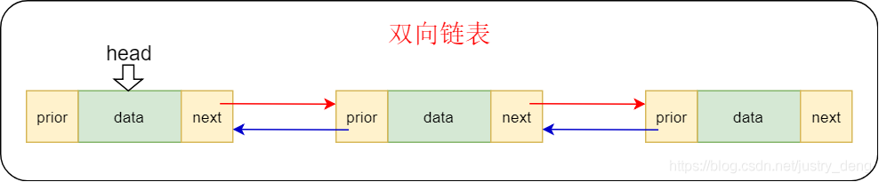

# List

List是一个双向链表,可以被当作***栈***或***队列***使用.


```go
// Element: 链表的节点结构

type Element struct {
	next, prev *Element  // 前驱和后驱 
	list *List           // 所在List
	Value interface{}    // 节点值
}

type List struct {
	root Element         // 链表的根节点 
	len  int             // 链表的长度
}
```

## 遍历List

```go
// l 是一个 *List
for e := l.Front(); e != nil; e = e.Next() { 
	// do something with e.Value
}
```

## 操作List

### 增加节点
```go
// 向队头添加一个节点
func (l *List) PushFront(v interface{}) *Element {...}

// 向队尾添加一个节点
func (l *List) PushBack(v interface{}) *Element {...}

```

### 删除节点
```go
// 如果e是l的节点,Remove将会移除节点,并返回e.Value
func (l *List) Remove(e *Element) interface{} {...}
```

### 获取节点
```go
// 返回头节点;如果l为空返回nil
func (l *List) Front() *Element {...}

// 返回尾节点;如果l为空返回nil
func (l *List) Back() *Element {...}
```

### 计算List长度
```go
func (l *List) Len() int {...}
```

### 清空List
```go
func (l *List) Init() *List {...}
```

## 操作节点
```go
// 访问节点的后驱
func (e *Element) Next() *Element {...}

// 访问节点的前驱
func (e *Element) Prev() *Element {...}
```