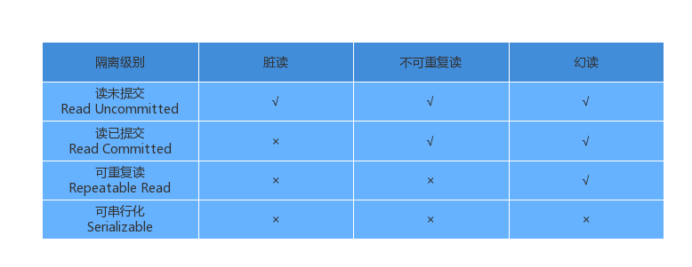
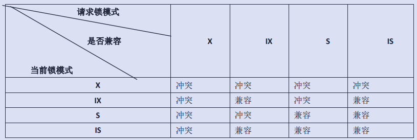

# 事务常见问题
### users
| id | name | age |
| :--- | :--- | :--- |
| 1 | Joe | 20 |
| 2 | Jill | 25 |

**并发事务**情况下，***读操作***可能存在的三类问题：
- **脏读**：当一个事务(A)允许读取另外一个事务(B)修改但未提交的数据时，就可能发生脏读（dirty reads）。下面这个例子中，事务2回滚后就没有id是1，age是21的数据行了。

    | 时间 | 事务A | 事务B |
    | ---- | ---- | ---- |
    |  T0  |  begin; | begin; |
    |  T1  |  SELECT age FROM users WHERE id = 1; /* will read 20 */  |
    |  T2  |    | UPDATE users SET age = 21 WHERE id = 1; /* No commit here */ |
    |  T3  |  SELECT age FROM users WHERE id = 1; /* will read 21 */  |
    |  T4  |    | rollback; /* lock-based DIRTY READ */ |

- **不可重复读**：在同一事务(A)中，***先后两次***读取同一个数据得到的结果不同，表示发生了不可重复读（non-repeatable reads）。

    与脏读的**区别**：脏读读到的是其他事务**未提交**的数据，不可重复读读到的是其他事务**已提交**的数据。
  
    | 时间 | 事务A | 事务B |
    | ---- | ---- | ---- |
    |  T0  |  begin; | begin; |
    |  T1  |  SELECT * FROM users WHERE id = 1; /*will read 20*/| |
    |  T2  |    | UPDATE users SET age = 21 WHERE id = 1; COMMIT;  /* in multiversion concurrency control, or lock-based READ COMMITTED */ |
    |  T3  | SELECT * FROM users WHERE id = 1; /*will read 21*/ COMMIT; /* lock-based REPEATABLE READ */|  |

- **幻读**：在事务(A)中，***先后两次***执行相同的查询语句，两次查询结果的***条数不同***，这种现象称为幻读。

    幻读是不可重复读的一种特殊场景，可以通俗的理解为：前者是数据的***行数***变了，后者是***数据***变了。

    | 时间 | 事务A | 事务B |
    | ---- | ---- | ---- |
    |  T0  |  begin; | begin; |
    |  T1  |  SELECT * FROM users WHERE age BETWEEN 10 AND 30; /*will read 20，25*/| |
    |  T2  |    | INSERT INTO users VALUES ( 3, 'Bob', 27 ); COMMIT;|
    |  T3  | SELECT * FROM users WHERE age BETWEEN 10 AND 30; /* will read 20，25，27 */|  |

# 隔离级别

**读未提交**：事务(A)可以看到其他事务(B)"***尚未提交***"的修改。

**读已提交**：对选定对象的***写锁***直到事务结束后才能释放，但***读锁***在select操作完成后立即释放。

**可重复读**：对选定对象的***读锁和写锁***直到事务结束后才能释放，但不要求"范围锁"。

**可串行化**：对选定对象上的***读锁和写锁***直到事务结束后才能释放，在SELECT的查询中使用一个“WHERE”子句来描述一个范围时应该获得一个"***范围锁***"（range-locks）。

# 数据库锁

当有一个用户对数据库内的数据进行操作时，在读取数据前***先锁住数据***，这样其他用户就***无法访问和修改***该数据，直到这一数据修改并写回数据库解除封锁为止。

## 按照颗粒度分：
- 表锁
- 页锁(page-level lock)
- 行锁

## 按照使用方式分：
- 排他锁（exclusive lock，写锁）
- 共享锁（sharing lock，读锁）

一般说来，添加锁并不是禁止其他事务对已加锁的数据的读/写，而是阻塞其他事务对这些数据的加锁操作。例如，如果一般的select语句不需要加锁，所以能直接读取其他事务已经加了共享锁或排他锁的数据。

# InnoDB行级锁和表级锁
InnoDB 存储引擎既支持行级锁（row-level locking），也支持表级锁，**默认**采用***行级锁***。

## InnoDB锁模式
InnoDB 实现了以下两种类型的行锁：
- 共享锁(S)：事务
- 允许一个事务去读一行，阻止其他事务获得相同数据集的排它锁。
- 排他锁(X)：事务(A)对选定记录加锁成功后可以进行修改，阻塞其他事务(B)对该记录添加共享锁或排斥锁，但可以查询该记录。

InnoDB 实现了以下两种表锁：
- 意向共享锁（IS）：
- 意向排他锁（IX）
  
### 锁模式的兼容情况：

## InnoDB加锁方法
- 意向锁是 InnoDB 自动加的， 不需用户干预。
- 对于 UPDATE、 DELETE 和 INSERT 语句， InnoDB
会自动给涉及数据集加排他锁（X)。
- 对于**普通 SELECT 语句**，InnoDB ***不会加任何锁***。但可以通过以下语句显式给记录集加共享锁或排他锁
  - 共享锁(S)：select * from table_name where ... lock in share mode。其他事务可以对该记录添加共享锁，也可以查询该记录，如果当前事务需要更新该记录，则很有可能造成死锁。但会阻塞其他事务对该记录添加排他锁。
  - 排他锁(X)：select * from table_name where ... for update。其他事务**可以查询该记录**，但会阻塞对该记录添加共享锁或排他锁。

## Reference
[一张图彻底搞懂 MySQL 的锁机制](https://learnku.com/articles/39212?order_by=vote_count&)

