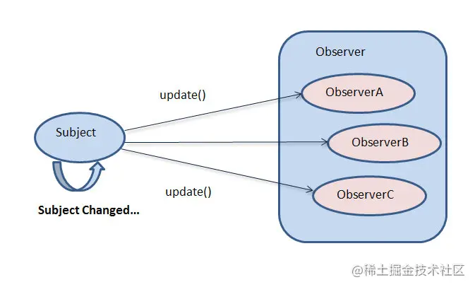
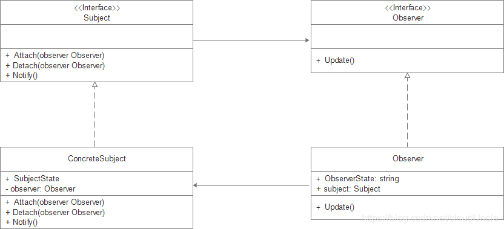

# 简介
观察者是一种**行为**设计模式,允许一个对象将其状态的改变通知其他对象。

# 概念示例

在电商网站中， 商品时不时地会出现缺货情况。 可能会有客户对于缺货的特定商品表现出兴趣。 这一问题有三种解决方案：

- 客户以一定的频率查看商品的可用性。
- 电商网站向客户发送有库存的所有新商品。
- 客户只订阅其感兴趣的特定商品， 商品可用时便会收到通知。 同时， 多名客户也可订阅同一款产品。

选项 3 是最具可行性的， 这其实就是观察者模式的思想。 观察者模式的**主要组成**部分有：
- 事件主体(subject)。
- 订阅了事件的观察者(observer)。

观察者模式的别名包括**发布-订阅**（Publish/Subscribe）模式、模型-视图（Model/View）模式、源-监听器（Source/Listener）模式或从属者（Dependents）模式。



# 角色
- Subject(抽象目标):指被观察的对象。
- ConcreteSubject(具体目标):抽象目标的子类，通常包含有经常发生改变的数据，当它的状态发生改变时，向其各个观察者发出通知
- Observer(抽象观察者):观察者将对观察目标的改变做出反应
- ConcreteObserver(具体观察者):具体观察者中维持一个指向具体目标对象的引用，它用于存储具体观察者的有关状态，这些状态和具体目标的状态保持一致


```go
type subject interface {
	register(Observer observer)
	deregister(Observer observer)
	notifyAll()
}
```

```go
package main

import "fmt"

type item struct {
	observerList []observer
	name         string
	inStock      bool
}

func newItem(name string) *item {
	return &item{
		name: name,
	}
}

func (i *item) updateAvailability() {
	fmt.Printf("Item %s is now in stock\n",i.name)
	i.inStock = true
	i.notifyAll()
}

func (i *item) register(o observer) {
	i.observerList = append(i.observerList,o)
}

func (i *item) deregister(o observer) {
    i.observerList = removeFromSlice(i.observerList,o)
}

func (i *item) notifyAll() {
    for _,observer := range i.observerList {
		observer.update(i.name)
    }
}

func removeFromSlice(observerList []observer,observerToRemove observer) []observer {
	observerListLength := len(observerList)
	for i, observer := range observerList {
		if observerToRemove.getID() == observer.getID() {
			observerList[observerListLength-1], observerList[i] = observerList[i], observerList[observerListLength-1]
			return observerList[:observerListLength-1]
		}
	}
	return observerList
}
```