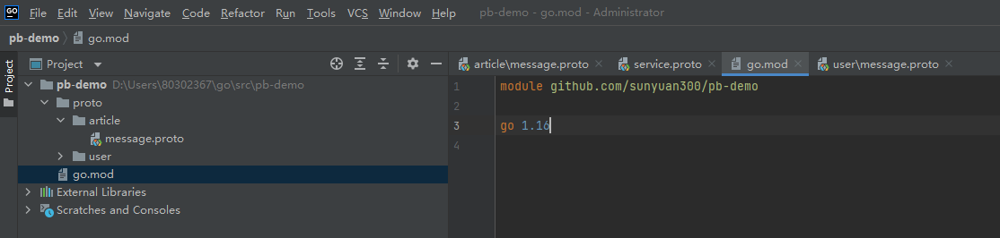

# 1.安装protoc编译器
安装用于生成gRPC服务代码的协议编译器，最简单的方法是从下面的链接：https://github.com/google/protobuf/releases 下载适合你平台的预编译好的二进制文件。

下载完之后，执行下面的步骤：
1. 解压下载好的文件
2. 把protoc二进制文件的路径加到环境变量中(确保终端在任何位置能找到它)


# 2. protoc命令参数详解
```shell
$ protoc --help
Usage:protoc [OPTION] PROTO_FILES

OPTION:
  -IPATH, --proto_path=PATH   指定import的搜索路径，可多次指定，默认为当前目录。
  ...
  --plugin=EXECUTABLE         指定要使用的插件。
  
                                                              
 语言插件参数：protoc已经内置以下语言的编译插件，无需安装。其他语言需要额外安装，
 比如：Golang...
  --cpp_out=OUT_DIR           Generate C++ header and source.
  --csharp_out=OUT_DIR        Generate C# source file.
  --java_out=OUT_DIR          Generate Java source file.
  --js_out=OUT_DIR            Generate JavaScript source.
  --kotlin_out=OUT_DIR        Generate Kotlin file.
  --objc_out=OUT_DIR          Generate Objective-C header and source.
  --php_out=OUT_DIR           Generate PHP source file.
  --python_out=OUT_DIR        Generate Python source file.
  --ruby_out=OUT_DIR          Generate Ruby source file.
  
  
  @<filename>                 从文件中读取options和filenames。
```

`--proto_path`或者`-I`参数：指定编译时的搜索路径，**protoc文件使用***import***关键字导入的路径一定是基于该参数指定的路径**。默认值为pwd，可以多次使用，以包含所需的文件。

该参数会影响生成文件的位置。

## 举例1：
### 项目结构

该项目模块名为`github.com/sunyuan300/pb-demo`,proto/article文件夹下包含一个article服务。
```protobuf
syntax = "proto3";

package article;

option go_package = "github.com/sunyuan300/pd-demo/proto/article";

message Articles {
    repeated Article articles = 1;
    message Article {
        int64 id = 1;
        string title = 2;
    }
}
```
- 在项目根目录下执行：
    ```shell
    protoc --go_out=paths=source_relative:. proto/article/message.proto
    # 代码自动生成到pb-demo/proto/article目录下。

    proto -I=proto --go_out=paths=source_relative:. proto/article/message.proto
    # 代码自动生成到 pb-demo/article目录下。(会在项目根目录下新建一个article目录)

   ```
- 不在项目根目录下执行(进到proto目录)：
  ```shell
  protoc --go_out=paths=source_relative:. article/message.proto
  # 代码自动生成到pb-demo/proto/article目录下。

  protoc -I=article --go_out=paths=source_relative:. article/message.proto
  # 代码自动生成到pd-demo/proto目录下
  ```
个人理解：protoc编译时，会将go_option的指定目录进行屏蔽(屏蔽掉-I指定的目录)。

为了避免未知bug，建议统一从***项目根目录***进行构建。
# 3.安装go插件protoc-gen-go

protoc-gen-go有两个不同的版本，分别是：
- `github.com/golang/protobuf/protoc-gen-go`
- `google.golang.org/protobuf/cmd/protoc-gen-go`

前者是旧版本，后者是google接管后的新版本，他们之间的API不同，也就是说用于生成的命令，以及生成的文件都是不一样的。

编译插件`protoc-gen-go`将会安装到$GOBIN，默认是$GOPATH/bin，**它必须在$PATH中以便编译器protoc能够找到它**。

## 3.1 安装github版本
```shell
$ go get -u github.com/golang/protobuf/protoc-gen-go
```

## 3.2 安装google版本
参考官方[文档](https://grpc.io/docs/languages/go/quickstart/) ：
```shell
# 安装protoc-gen-go插件
$ go install google.golang.org/protobuf/cmd/protoc-gen-go@v1.26

# 安装protoc-gen-go-grpc插件
$ go install google.golang.org/grpc/cmd/protoc-gen-go-grpc@v1.1
```

### github版本与google版本的差异
1. **兼容性**：

使用google版本的插件会出现不兼容问题，比如：运行命令
```shell
$ protoc --proto_path=. --go_out=plugins=grpc,paths=source_relative:. internal/scheduler/*.proto
```
会出现以下错误：
```shell
--go_out: protoc-gen-go: plugins are not supported; use 'protoc --go-grpc_out=...' to generate gRPC
```
原因：google版本的protoc-gen-go已经**不再支持gRPC插件**，需要使用`protoc-gen-go-grpc`来生成gRPC相关代码。
```shell
$ protoc --proto_path=. --go-grpc_out=paths=source_relative:. internal/scheduler/*.proto
```
2. **生成文件**：
  - github版本：只会生成xxx.bp.go文件
  ```shell
  $ protoc --proto_path=. --go_out=plugins=grpc,paths=source_relative:. internal/scheduler/*.proto
  ```
  - google版本：需要使用不同的命令生成xxx_grpc.pb.go与xxx.pb.go两个文件。
  ```shell
  $ protoc --proto_path=. --go_out=paths=source_relative:. internal/scheduler/*.proto
  $ protoc --proto_path=. --go-grpc_out=paths=source_relative:. internal/scheduler/*.proto
  ```


# 4. --go_out参数详解
--go_out的主要两个参数为`plugins`和`paths`，用来表示使用的插件和代码生成位置。参数之间用逗号隔开，最后加上冒号来指定代码的生成位置，比如`--go_out=plugins=grpc,paths=import:.`。

**plugins参数**
- 不带grpc：会缺少gRPC相关代码。
- 带grpc：会多一些跟gRPC相关的代码，实现gRPC通信。

**paths参数**：
- import(默认值)：按照生成Go代码包的全路径去创建目录层级。
- source_relative：按照 proto源文件的目录层级去创建Go代码的目录层级，如果目录已存在则不用创建。


# Reference
[gRPC-go入门](https://www.cnblogs.com/hongjijun/p/13724738.html)

[Protobuf 的 import 功能在 Go 项目中的实践](https://segmentfault.com/a/1190000021456180)