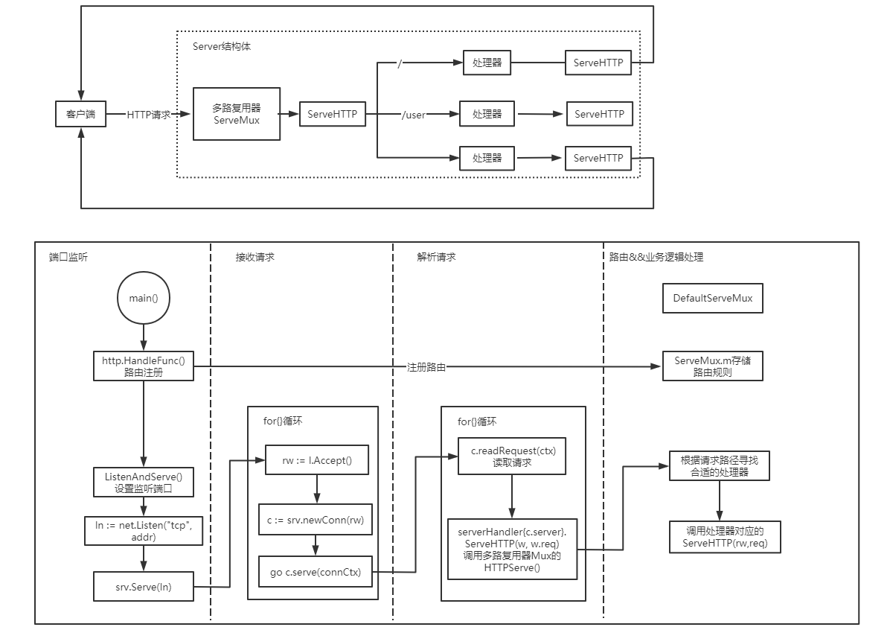
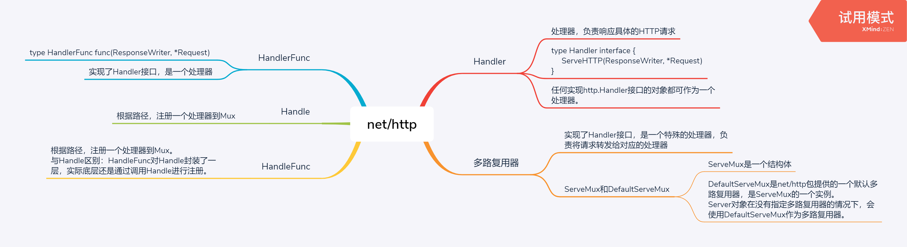

```go
package main

import (
	"fmt"
	"log"
	"net/http"
)

func main() {
	helloHandler := func(w http.ResponseWriter, req *http.Request) {
		fmt.Fprintf(w, "Hello, world!\n")
	}

	http.HandleFunc("/", helloHandler)

	log.Fatal(http.ListenAndServe(":8080", nil))
}
```



## 源码解析

```go
package http

/*
  server底层一直监听着,当有新的请求来时,多路复用器ServeMux会调用ServeHTTP()函数来处理请求,通过mux.Handler()
来寻找合适的处理器(HandlerFunc函数),并调用处理器的ServeHTTP()函数进行请求处理。ServeHTTP()函数会调用
HandlerFunc 函数本身。

  总结: 所有HTTP请求都会交给处理器进行处理,处理器会调用ServeHTTP()函数进行处理并响应。
*/

type Handler interface {
	ServeHTTP(ResponseWriter, *Request)
}

func (mux *ServeMux) ServeHTTP(w ResponseWriter, r *Request) {
	if r.RequestURI == "*" {
		if r.ProtoAtLeast(1, 1) {
			w.Header().Set("Connection", "close")
		}
		w.WriteHeader(StatusBadRequest)
		return
	}
	h, _ := mux.Handler(r)
	h.ServeHTTP(w, r)
}

// HandlerFunc 实现了Handler接口,是一个处理器。
type HandlerFunc func(ResponseWriter, *Request)

func (f HandlerFunc) ServeHTTP(w ResponseWriter, r *Request) {
	f(w, r)
}
```

