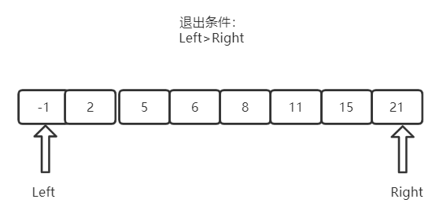

# 二分查找
- 数组元素有序
- 数组元素`不重复`

```go
//nums = [-1,0,3,5,9,12], target = 9
func search(nums []int, target int) int {
    left,right,answer := 0,len(nums)-1,-1
    for left <= right {
        mid := (left+right)/2
        if target == nums[mid] {
            answer = mid
        } else if  target > nums[mid]{
            left = mid+1
        } else {
            right = mid-1
        }
    }
    return answer
}
```

# 二分查找变种
- 数组元素`重复`

```go
// 获取最左边的值
//nums = [5,7,7,8,8,10], target = 8

func searchLeft(nums []int, target int) int {
    left,right,answer := 0,len(nums)-1,-1
    for left <= right {
        mid := (left+right)/2
        if target == nums[mid]  {
            answer = mid
            right  = mid - 1
        } else if  target > nums[mid]{
            left = mid+1
        } else {
            right = mid-1
        }
    }
    return answer
}
```

```go
// 获取最右边的值
//nums = [5,7,7,8,8,10], target = 8
func searchLeft(nums []int, target int) int {
    left,right,answer := 0,len(nums)-1,-1
    for left <= right {
        mid := (left+right)/2
        if target == nums[mid]  {
            answer = mid
            left  = mid + 1
        } else if  target > nums[mid]{
            left = mid+1
        } else {
            right = mid-1
        }
    }
    return answer
}
```