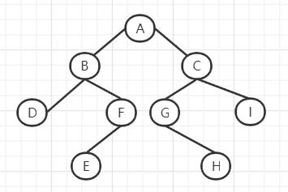

# 二叉树

# 遍历方式
- 前序遍历：根节点————左子树————右子树
- 中序遍历：左子树————根节点————右子树
- 后序遍历：左子树————右子树————根节点
- 层序遍历：从根节点自上而下逐层遍历，在同一层按从左到右逐个访问


```go
type TreeNode struct {
	Val   int
	Left  *TreeNode
	Right *TreeNode
}
```

## 前序遍历

```go
package main

import "fmt"

type TreeNode struct {
	Val   int
	Left  *TreeNode
	Right *TreeNode
}
func Traverse(root *TreeNode) {
	fmt.Println(root.Val)
	Traverse(root.Left)
	Traverse(root.Right)
}
func main() {
	Traverse(root)
}

```
output：ABDFECGHI
## 中序遍历
```go
func Traverse(root *TreeNode) {
	Traverse(root.Left)
	fmt.Println(root.Val)
	Traverse(root.Right)
}
```
output: BDFEACGHI
## 后序遍历
```go
func Traverse(root *TreeNode) {
	Traverse(root.Left)
	Traverse(root.Right)
	fmt.Println(root.Val)
}
```
output: BDFECGHIA

## 层序遍历

```go
// 二叉树遍历框架
func traverse(Root TreeNode) {
	// 前序遍历
	traverse(Root.Left)
	// 中序遍历
	traverse(Root.Right)
	// 后序遍历
}
```


