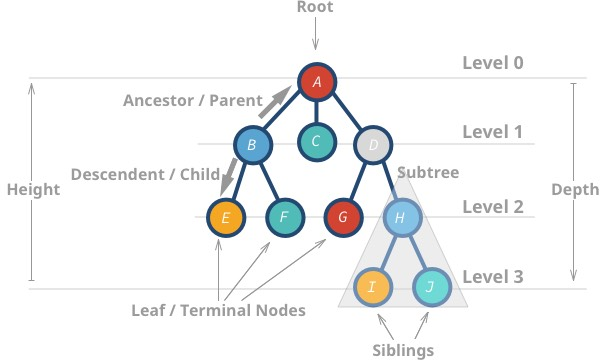
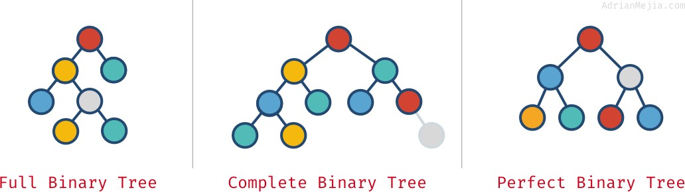
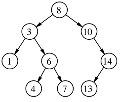
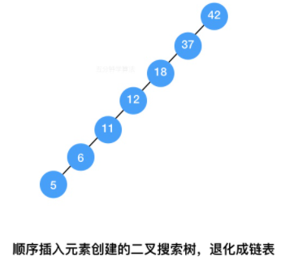
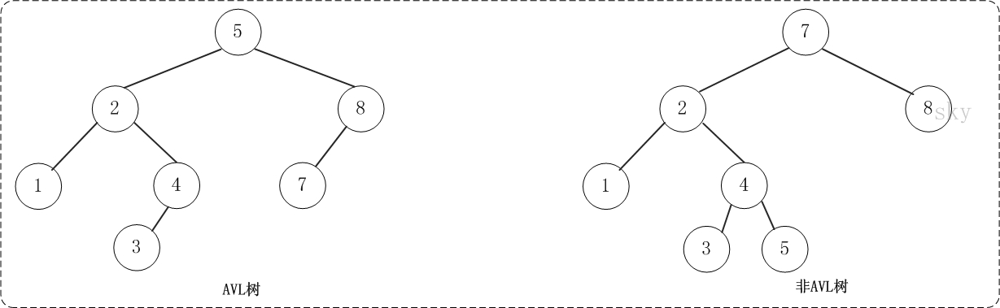

# 树的基本概念
树是一种数据结构，每个节点可以包含*零个或多个*子节点，每个节点都包含一个值。节点与节点之间的连接称为***边***。树是图的一种，但并不是所有图都是树（只有无环无向图才是树）。

这种数据类型之所以被称为树，是因为它长得很像一棵**倒置的**树 🌳。每颗树都有一个**根节点**，同一层的节点是**兄弟节点**，上下层节点是**父子节点**，最后一层的节点叫**叶节点**。

## 树的相关属性
- 节点高度： 该节点到叶节点的最大距离(即边的数量)。***树高***是根节点root到叶节点的最大距离。
  - 节点A的高度为3。
  - 节点I的高度为0。
- 节点深度：该节点到根节点root的距离
  - 节点H的深度为2。
  - 节点A的深度为1。

## 基本术语
| Terminology | description | 术语 | 描述 |
| ---  | ---                    | --- | --- |
| Root | The top node in a tree| 根节点 | 树的顶端节点|
| Leaf | A node with no children| 叶节点 | 没有孩子的节点(也就是度为0的节点)|
| Degree | The number of sub trees of a node| 度 | 节点所拥有的子树个数称为结点的度|
| Edge |The connection between one node and another| 边|一个节点和另一个节点之间的连接被称之为边|
| Path | A sequence of nodes and edges connecting a node with a descendant | 路径 | 连接节点和其后代节点之间的(节点,边)的序列|
| Level| The level of a node is defined by ０ + (the number of connections between the node and the root) | 层次 | 节点的层次(Level)从根(Root)开始定义起，根为第0层，根的孩子为第1层。以此类推，若某结点在第i层，那么其子树的根就在第i+1层| 
| Height of node | the number of edges on the longest path between that node and a leaf | 节点高度 | 该节点和某个叶子之间存在的最长路径上边的个数|
| Height of tree | The height of a tree is the height of its root node | 树高度 | 根结点的高度 |
| Depth of node  | The depth of a node is the number of edges from the tree's root node to the node | 节点深度 | 从根节点到该结点边的个数（注：树的深度指的是树中结点的最大层次。）  

# 二叉树
每个节点***最多拥有两颗子树***的树被称为二叉树。根据节点的组织方式，二叉树又可以分为**完美二叉树**、**完全二叉树**、**满二叉树**。

## 完美二叉树(Perfect Binary Tree)
除叶节点外的每个节点都有两颗子树，且每一层(包括)都被完全填充。

## 完全二叉树(Complete Binary Tree)
从根结点到倒数第二层满足完美二叉树，最后一层可以不完全填充，其叶子结点都靠左对齐。

## 满二叉树(Full Binary Tree)
所有非叶子结点的度都是2。（只要你有孩子，你就必然是有两个孩子。） 

# 二叉搜索树(BST)
二叉搜索树是二叉树的特定应用。左子节点的值必须小于父节点的值，右子节点的值必须大于父节点的值。

基于二叉树的特点，可以采用**二分查找**的思想查找某个节点。n个节点的二叉搜索树，正常的情况下，查询的时间复杂度为 O（logn）。

在某些极端情况下，二叉搜索树会退化成链表，此时的查询时间复杂度为O(n)。为了解决这个问题，引出了***平衡二叉搜索树***。

# 平衡树(Balance Tree)
**任意节点的子树高度差都小于等于1**。常见的平衡树有：
- B树(B-树)（多路平衡搜索树）
- AVL树（平衡二叉搜索树）

# 平衡二叉搜索树
平衡二叉搜索树：在二叉搜索树的定义上又增加了1点，规定二叉搜索树中任意一个节点的左右子树的高度相差不能大于 1。

# 红黑树

# B树

# B+树
# Reference
[完美二叉树, 完全二叉树和完满二叉树](https://www.cnblogs.com/idorax/p/6441043.html)

[有了二叉查找树、平衡树为啥还需要红黑树？](https://blog.nowcoder.net/n/e4c2e6a497894737aab23474840e6fe9)