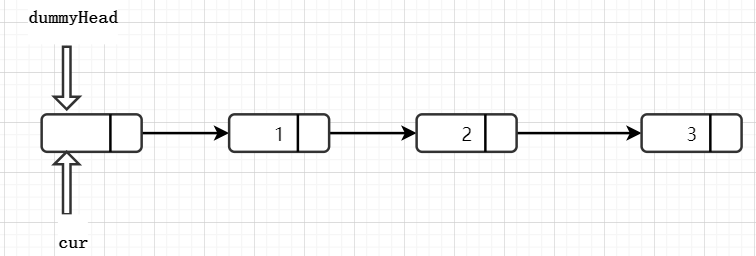

# 移除链表元素

[203. 移除链表元素](https://leetcode-cn.com/problems/remove-linked-list-elements/)


```go
/**
 * Definition for singly-linked list.
 * type ListNode struct {
 *     Val int
 *     Next *ListNode
 * }
 */
func removeElements(head *ListNode, val int) *ListNode {
    dummyHead := &ListNode{}
    dummyHead.Next = head
    cur := dummyHead
    for cur != nil && cur.Next != nil {
        if cur.Next.Val == val {
            cur.Next = cur.Next.Next
        } else {
            cur = cur.Next
        }
    }
    return dummyHead.Next
}
```

因为链表的增加、删除节点`都是通过前一个节点来操作当前节点`,所以这里涉及两种方式：
- 直接使用原来的链表来进行操作。
  - 由于头结点没有前一个节点，所以需要单独写一段逻辑来处理移除头结点的情况。
- 设置一个`虚拟头(哨兵)`结点，再进行增加、删除操作。
  - 这样原链表的所有节点都可以按照统一的方式进行移除了。