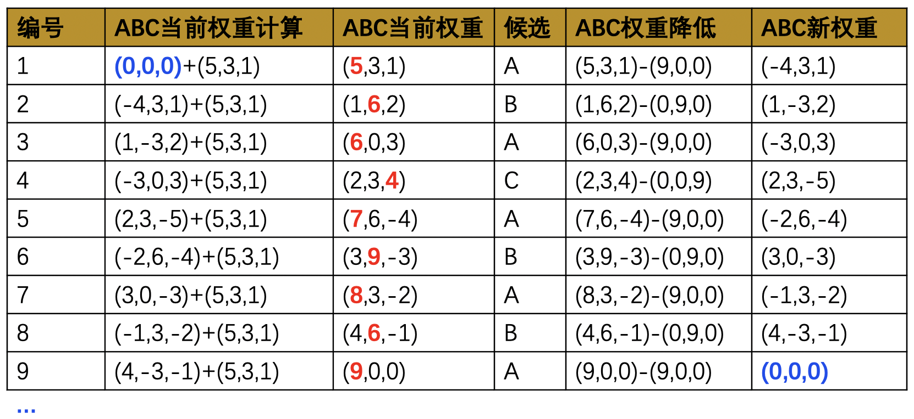

# 负载均衡算法
- 轮询
- 加权轮询
- 随机
- 哈希

# 轮询
```shell
upstream cluster {
    server 192.168.0.14;
    server 192.168.0.15;
    server 192.168.0.16;
}

location / {
   proxy_set_header X-Real-IP $remote_addr;
   proxy_pass http://cluster;
}
```

```go
type Server struct {
    Addr  string
}

type RoundRobinBalance struct {
    CurIndex    int
    Rss         []*Server
}

func (r *RoundRobinBalance) Add(addr string) {
    r.Rss = append(r.Rss,&Server{
        Addr:addr
    })
}

func (r *RoundRobinBalance) Next() Server {
    r.CurIndex = (r.CurIndex+1)%len(r.Rss)
    return r.Rss[r.CurIndex]
}
```

# 加权轮询
```shell
http {  
    upstream cluster {  
        server 192.168.1.2 weight=5;  
        server 192.168.1.3 weight=3;  
        server 192.168.1.4 weight=1;  
    }  

location / {
       proxy_set_header X-Real-IP $remote_addr;
       proxy_pass http://cluster;
   }
```

## 算法说明
在`加权轮询`算法中，每个节点都有`3个权重变量`:
- Weight:配置权重，根据配置文件初始化每个服务器节点的权重。
- CurWeight:节点当前权重，后会一直变化。
- EffWeight:节点有效权重，**初始值是Weight**，通信过程中发现节点异常，则-1 ，之后再次选择本节点，调用成功一次则+1 ，直到恢复到Weight。

## 逻辑实现
1. 轮询所有节点，计算当前状态下所有节点的`effectiveWeight之和`,**作为totalWeight**；
2. 更新每个节点的`currentWeight`,currentWeight = currentWeight + effectiveWeight;选出所有节点 currentWeight 中最大的一个节点作为选中节点；
3. 选择中的节点再次更新 currentWeight, currentWeight = currentWeight - totalWeight；

```go
type Server struct {
    Addr        string  // 服务器地址
    Weight      int     // 节点配置权重
    CurWeight   int     // 节点当前权重
    EffWeight   int     // 节点有效权重
}

type WeightRoundRobinBalance struct {
    TotalWeight int
    Rss         []*Server
}

func (w *WeightRoundRobinBalance) Add(addr string,weight int) {
    w.TotalWeight += weight
    w.Rss = append(w.Rss,&Server{
        Addr:addr,
        Weight:weight,
        CurWeight:0,
        EffWeight:weight,
    })
}

func (w *WeightRoundRobinBalance) Next() *Server {
    var expectServer *Server 
    // 1.更新CurWeight && 选出最大权重节点
    for _,server := range w.Rss {
        server.CurWeight += server.EffWeight
        if expectServer == nil {
            expectServer = server
        }
        if server.CurWeight > expectServer.CurWeight {
            expectServer = server
        }
    }
    // 2.更新最大权重节点的CurWeight(减去TotalWeight)
    expectServer.CurWeight -= w.TotalWeight
    return expectServer
}
```

# 随机
```go
type Server struct {
	Addr    string
}

type RandomBalance struct {
	Rss     []*Server
}

func (r *RandomBalance) Add(addr string) {
	r.Rss = append(r.Rss,&Server{Addr:addr})
}

func (r *RandomBalance) Next() *Server {
	index := rand.Intn(len(r.Rss))
	return r.Rss[index]
}
```