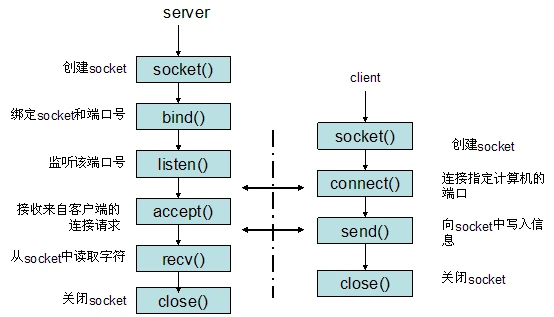

# Socket

socket 是在应用层和传输层之间的一个抽象层，它把TCP/IP层复杂的操作抽象为几个简单的接口，供应用层调用来实现进程在网络中的通信。

socket是一种`打开—读/写—关闭`模式的实现，服务器和客户端各自维护一个`文件`，在建立连接后，可以向自己文件写入内容供对方读取或者读取对方内容，通讯结束时关闭文件。



# TPC 实现

```go
package main

import (
	"fmt"
	"log"
	"net"
)

func main() {
	// 1.监听本地的9090端口
	listener, err := net.Listen("tcp", ":9090")
	if err != nil {
		log.Fatalf("faild to listen:%v", err)
	}

	for {
		// 2.接收来自客户端的请求连接
		conn, err := listener.Accept()
		if err != nil {
			log.Printf("accept failed,err:%v", err)
			continue
		}
		// 3.将请求连接交给一个goroutine处理
		go process(conn)
	}
}

func process(conn net.Conn) {
	// 1.处理完成后关闭连接
	defer conn.Close()
	for {
		// 2.读取请求连接数据
		var buf []byte
		_,err := conn.Read(buf)
		if err != nil {
			log.Printf("read from conn failed,err:%v\n", err)
			break
		}
		fmt.Println("收到的数据:%v\n",string(buf))
		
		// 3.向请求连接发送数据
        _,err = conn.Write([]byte("ok"))
		if err != nil {
            log.Printf("write data to conn failed,err:%v",err)
            break
		}
	}

}
```
