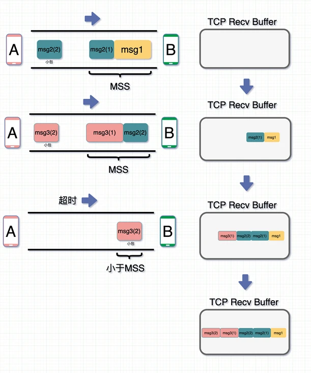
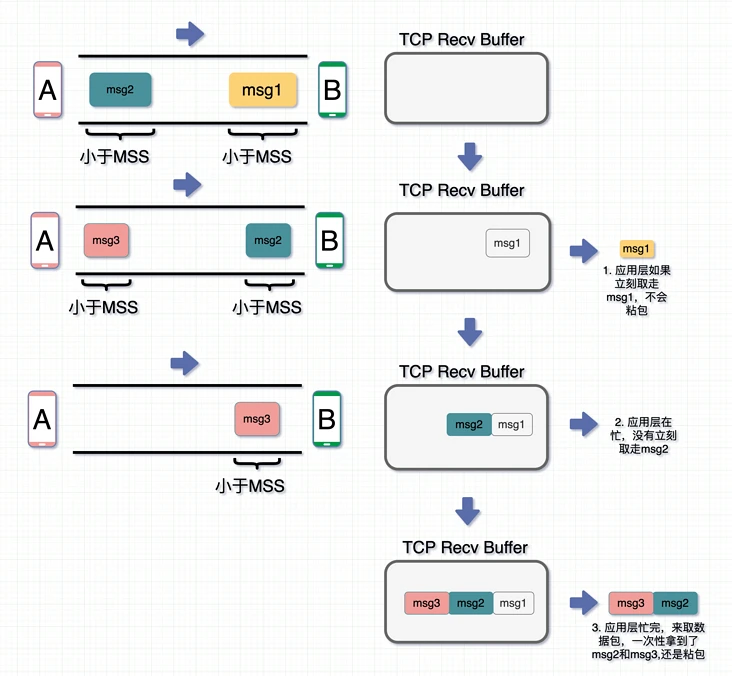

# 粘包问题

## TCP协议
TCP 协议能够保证**数据段**（Segment）的可靠性和顺序，有了可靠的传输层协议之后，应用层协议就可以直接使用 TCP 协议传输数据，不在需要关心数据段的丢失和重复问题。

## IP协议
IP 协议解决了**数据包**（Packet）的路由和传输，上层的 TCP 协议不再关注路由和寻址，那么 TCP 协议解决的是传输的可靠性和顺序问题，上层不需要关心数据能否传输到目标进程，只要写入**TCP协议缓冲区**的数据，协议栈几乎都能保证数据的送达。

## MTU与MMS

MTU: Maximum Transmit Unit，最大传输单元。 由网络接口层（数据链路层）提供给网络层最大一次传输数据的大小；一般 MTU=1500 Byte。 假设IP层有 <= 1500 byte 需要发送，只需要一个 IP 包就可以完成发送任务；假设 IP 层有> 1500 byte 数据需要发送，需要分片才能完成发送，分片后的 IP Header ID 相同。

MSS：Maximum Segment Size 。 TCP 提交给 IP 层最大分段大小，不包含 TCP Header 和 TCP Option，只包含 TCP Payload ，MSS 是 TCP 用来限制应用层最大的发送字节数。 假设 MTU= 1500 byte，那么 MSS = 1500- 20(IP Header) -20 (TCP Header) = 1460 byte，如果应用层有 2000 byte 发送，那么需要两个切片才可以完成发送，第一个 TCP 切片 = 1460，第二个 TCP 切片 = 540。

## 面向字节流
应用层交给 TCP 协议的数据并不会以消息为单位向目的主机传输，这些数据会被放入**TCP协议缓冲区**,然后组合成一个**数据段**发送给目标的主机。

### Nagle算法
Nagle 算法是一种减少数据包传输，提高TCP传输性能的算法。因为网络带宽有限，它不会将小的数据块直接发送到目的主机，而是会在**TCP协议缓冲区**中等待更多待发送的数据，这种批量发送数据的策略虽然会影响实时性和网络延迟，但是能够降低网络拥堵的可能性并减少额外开销。

当应用层协议通过TCP协议传输数据时，实际上待发送的数据先被写入**TCP协议缓冲区**，如果启用了Nagle算法，TCP协议不会立刻发送数据，它会等待缓冲区中数据超过最大数据段（**MSS**）或者上一个数据段被 **ACK** 时才会发送缓冲区中的数据。

在 Nagle 算法开启的状态下，数据包在以下两个情况会被发送：

- 如果包长度达到MSS（或含有Fin包），立刻发送，否则等待下一个包到来；如果下一包到来后两个包的总长度超过MSS的话，就会进行拆分发送；

- 等待超时（一般为200ms），第一个包没到MSS长度，但是又迟迟等不到第二个包的到来，则立即发送。



### 关掉 Nagle 算法就不会粘包了吗？
- 接受端应用层在收到 msg1 时立马就取走了，那此时 msg1 没粘包问题
- msg2 到了后，应用层在忙，没来得及取走，就呆在 TCP Recv Buffer 中了
- msg3 此时也到了，跟 msg2 和 msg3 一起放在了 TCP Recv Buffer 中
- 这时候应用层忙完了，来取数据，图里是两个颜色作区分，但实际场景中都是 01 串，此时一起取走，发现还是粘包。


因此，就算关闭 Nagle 算法，接收数据端的应用层没有及时读取 TCP Recv Buffer 中的数据，还是会发生粘包。

## 消息边界
TCP 协议是基于字节流的，这其实就意味着应用层协议要自己划分消息的边界。如果我们能在应用层协议中定义消息的边界，那么无论 TCP 协议如何对应用层协议的数据包进程拆分和重组，接收方都能根据协议的规则恢复对应的消息。在应用层协议中，最常见的两种解决方案就是**基于长度**或者**基于终结符**（Delimiter）。

### 基于长度
基于长度的实现有两种方式，一种是使用固定长度，所有的应用层消息都使用统一的大小，另一种方式是使用不固定长度，但是需要在应用层协议的协议头中增加表示负载长度的字段，这样接收方才可以从字节流中分离出不同的消息，HTTP 协议的消息边界就是基于长度实现的。

### 基于终结符
当 HTTP 使用块传输（Chunked Transfer）机制时，HTTP 头中就不再包含 Content-Length 了，它会使用负载大小为 0 的 HTTP 消息作为终结符表示消息的边界。

## 粘包原因
“粘包”可发生在***发送端***也可发生在***接收端***：
- 由Nagle算法造成的发送端的粘包：Nagle算法是一种改善网络传输效率的算法。简单来说就是当我们提交一段数据给TCP发送时，TCP并不立刻发送此段数据，而是等待一小段时间看看在等待期间是否还有要发送的数据，若有则会一次把这两段数据发送出去。

- 接收端接收不及时造成的接收端粘包：TCP会把接收到的数据存在自己的缓冲区中，然后通知应用层取数据。当应用层由于某些原因不能及时的把TCP的数据取出来，就会造成TCP缓冲区中存放了几段数据。

## 总结
1.TCP协议是基于字节流的传输层协议，其中不存在消息和数据包的概念。

2.应用层协议没有使用基于长度或者基于终结符的消息边界，导致多个消息的粘连。

### 粘包示例
```go
// Server端
package main

import (
	"bufio"
	"fmt"
	"io"
	"net"
)

func main() {
	listen, err := net.Listen("tcp", "127.0.0.1:30000")
	if err != nil {
		fmt.Println("listen failed, err:", err)
		return
	}
	defer listen.Close()
	for {
		conn, err := listen.Accept()
		if err != nil {
			fmt.Println("accept failed, err:", err)
			continue
		}
		go process(conn)
	}
}

func process(conn net.Conn) {
	defer conn.Close()
	reader := bufio.NewReader(conn)
	var buf [1024]byte
	for {
		n, err := reader.Read(buf[:])
		if err == io.EOF {
			break
		}
		if err != nil {
			fmt.Println("read from client failed, err:", err)
			break
		}
		recvStr := string(buf[:n])
		fmt.Println("收到client发来的数据：", recvStr)
	}
}

/*
收到client发来的数据： Hello, Hello. How are you?
收到client发来的数据： Hello, Hello. How are you?Hello, Hello. How are you?Hello, Hello. How are you?Hello, Hello. How are you?Hello, Hello. How are you?Hello, Hello. How are you?Hello, Hello. How are you?Hello, Hello. How are you?
收到client发来的数据： Hello, Hello. How are you?Hello, Hello. How are you?Hello, Hello. How are you?Hello, Hello. How are you?Hello, Hello. How are you?Hello, Hello. How are you?Hello, Hello. How are you?Hello, Hello. How are you?Hello, Hello. How are you?
收到client发来的数据： Hello, Hello. How are you?Hello, Hello. How are you?
*/
```

```go
// Client端
package main

import (
	"fmt"
	"net"
)

func main() {
	conn, err := net.Dial("tcp", "127.0.0.1:30000")
	if err != nil {
		fmt.Println("dial failed, err", err)
		return
	}
	defer conn.Close()
	for i := 0; i < 20; i++ {
		msg := `Hello, Hello. How are you?`
		conn.Write([]byte(msg))
	}
}
```

### 解决示例
给一段数据加上包头，这样一来数据包就分为包头和包体两部分内容了。包头部分的长度是固定的，并且它存储了包体的长度，根据包头长度固定以及包头中含有包体长度的变量就能正确的拆分出一个完整的数据包。

```go
package proto

import (
	"bufio"
	"bytes"
	"encoding/binary"
)

// Encode 将消息编码
func Encode(message string) ([]byte, error) {
	// 读取消息的长度，转换成int32类型（占4个字节）
	var length = int32(len(message))
	var pkg = new(bytes.Buffer)
	// 写入消息头
	err := binary.Write(pkg, binary.LittleEndian, length)
	if err != nil {
		return nil, err
	}
	// 写入消息实体
	err = binary.Write(pkg, binary.LittleEndian, []byte(message))
	if err != nil {
		return nil, err
	}
	return pkg.Bytes(), nil
}

func Decode(reader *bufio.Reader) (string, error) {
	// 读取消息的长度
	lengthByte, _ := reader.Peek(4) // 读取前4个字节的数据
	lengthBuff := bytes.NewBuffer(lengthByte)
	var length int32
	err := binary.Read(lengthBuff, binary.LittleEndian, &length)
	if err != nil {
		return "", err
	}
	// Buffered返回缓冲中现有的可读取的字节数。
	if int32(reader.Buffered()) < length+4 {
		return "", err
	}

	// 读取真正的消息数据
	pack := make([]byte, int(4+length))
	_, err = reader.Read(pack)
	if err != nil {
		return "", err
	}
	return string(pack[4:]), nil
}
```

```go
// Server端

package main

import (
	"bufio"
	"fmt"
	"io"
	"net"
)

func main() {

	listen, err := net.Listen("tcp", "127.0.0.1:30000")
	if err != nil {
		fmt.Println("listen failed, err:", err)
		return
	}
	defer listen.Close()
	for {
		conn, err := listen.Accept()
		if err != nil {
			fmt.Println("accept failed, err:", err)
			continue
		}
		go process(conn)
	}
}

func process(conn net.Conn) {
	defer conn.Close()
	reader := bufio.NewReader(conn)
	for {
		msg, err := proto.Decode(reader)
		if err == io.EOF {
			return
		}
		if err != nil {
			fmt.Println("decode msg failed, err:", err)
			return
		}
		fmt.Println("收到client发来的数据：", msg)
	}
}
```

```go
// Client端

package main

import (
	"fmt"
	"net"
)
func main() {
	conn, err := net.Dial("tcp", "127.0.0.1:30000")
	if err != nil {
		fmt.Println("dial failed, err", err)
		return
	}
	defer conn.Close()
	for i := 0; i < 20; i++ {
		msg := `Hello, Hello. How are you?`
		data, err := proto.Encode(msg)
		if err != nil {
			fmt.Println("encode msg failed, err:", err)
			return
		}
		conn.Write(data)
	}
}
```

### 参考
[为什么 TCP 协议有粘包问题](https://draveness.me/whys-the-design-tcp-message-frame/)

[图解粘包](https://segmentfault.com/a/1190000039691657)
